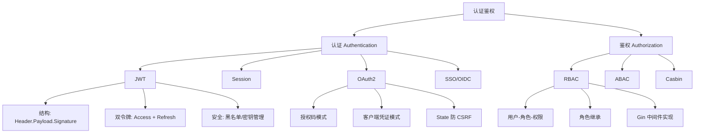

# 认证鉴权面试指南

## 面试知识图谱

## 高频面试题

### Q1: JWT 和 Session 的区别？各自适用场景？

**难度**：⭐⭐ | **频率**：🔥🔥🔥

**答题思路**：

1. 从存储位置对比：JWT 存客户端，Session 存服务端
2. 从扩展性对比：JWT 天然支持分布式，Session 需要共享存储
3. 从安全性对比：JWT 注销困难，Session 注销简单
4. 说明各自适用场景

**标准答案**：

JWT 是无状态认证方案，Token 存储在客户端，服务端不保存状态，天然支持分布式部署，适合微服务、移动端、第三方 API 场景。Session 是有状态认证方案，Session 数据存储在服务端（内存或 Redis），分布式环境需要共享 Session 存储，适合传统 Web 应用。JWT 的主要缺点是注销困难（需要黑名单机制），Session 的主要缺点是扩展性差（需要共享存储）。

**深入追问**：

- JWT Token 泄露了怎么办？
- 如何实现 JWT 的强制注销？
- 分布式 Session 有哪些方案？

### Q2: OAuth2 授权码模式的完整流程？

**难度**：⭐⭐⭐ | **频率**：🔥🔥🔥

**答题思路**：

1. 用户点击第三方登录
2. 应用重定向到授权服务器（携带 client_id + redirect_uri + state）
3. 用户授权后，授权服务器回调应用（携带 code + state）
4. 应用验证 state，用 code + client_secret 换取 access_token
5. 应用用 access_token 获取用户信息

**标准答案**：

授权码模式是 OAuth2 最安全的模式。流程：(1) 用户点击"使用 GitHub 登录"，应用将用户重定向到 GitHub 授权页面，URL 中包含 client_id、redirect_uri、scope 和随机 state 参数；(2) 用户在 GitHub 登录并授权；(3) GitHub 将用户重定向回应用的 redirect_uri，URL 中携带授权码 code 和 state；(4) 应用验证 state 参数防止 CSRF 攻击，然后在后端用 code + client_id + client_secret 向 GitHub 换取 access_token；(5) 应用用 access_token 调用 GitHub API 获取用户信息。

**深入追问**：

- 为什么不直接返回 access_token 而是先返回 code？（code 在浏览器 URL 中传输，如果直接传 token 容易泄露；code 只能使用一次且有效期很短）
- state 参数的作用？（防止 CSRF 攻击）
- OAuth2 和 OIDC 的区别？（OAuth2 是授权框架，OIDC 在其基础上增加了身份认证，额外返回 id_token）

### Q3: Token 安全存储方案？

**难度**：⭐⭐⭐ | **频率**：🔥🔥🔥

**答题思路**：

1. 对比三种存储方案的安全性
2. 说明推荐方案

**标准答案**：

| 存储方案 | XSS 风险 | CSRF 风险 | 推荐度 |
|---------|---------|---------|--------|
| LocalStorage | ⚠️ 高（JS 可读取） | ✅ 无 | ❌ |
| SessionStorage | ⚠️ 高（JS 可读取） | ✅ 无 | ❌ |
| HttpOnly Cookie | ✅ 无（JS 不可读取） | ⚠️ 需防护 | ✅ 推荐 |

推荐使用 HttpOnly + Secure + SameSite=Strict 的 Cookie 存储 Token，同时配合 CSRF Token 防护。对于移动端 APP，可以使用安全存储（如 iOS Keychain、Android Keystore）。

### Q4: RBAC 权限模型如何设计？

**难度**：⭐⭐⭐ | **频率**：🔥🔥🔥

**答题思路**：

1. 解释用户-角色-权限三层模型
2. 说明角色继承
3. 说明在 Go 中的实现方式

**标准答案**：

RBAC 核心是用户-角色-权限三层模型：用户关联角色，角色关联权限，用户通过角色间接获得权限。数据库设计需要 5 张表：users、roles、permissions、user_roles（多对多）、role_permissions（多对多）。在 Go Web 项目中，通常通过 Gin 中间件实现：JWT 中间件解析 Token 获取用户角色，RBAC 中间件检查角色是否有访问当前路由的权限。可以使用 Casbin 框架简化实现。

### Q5: 如何实现 JWT Token 的强制注销？

**难度**：⭐⭐⭐ | **频率**：🔥🔥

**标准答案**：

JWT 是无状态的，服务端不存储 Token，因此无法直接注销。常见方案：(1) **Token 黑名单**：将已注销的 Token 存入 Redis，每次请求时检查 Token 是否在黑名单中，黑名单条目的 TTL 设为 Token 的剩余有效期；(2) **Token 版本号**：在用户表中维护 token_version 字段，签发 Token 时写入版本号，注销时递增版本号，验证时检查版本号是否匹配；(3) **缩短有效期**：将 Access Token 有效期设为很短（如 5 分钟），配合 Refresh Token 使用。

### Q6: Gin 中间件的执行顺序和洋葱模型？

**难度**：⭐⭐ | **频率**：🔥🔥🔥

**标准答案**：

Gin 中间件按注册顺序执行，遵循洋葱模型。`c.Next()` 会暂停当前中间件，执行后续中间件和 Handler，然后回到当前中间件继续执行 `c.Next()` 之后的代码。`c.Abort()` 会阻止后续中间件和 Handler 的执行。典型的中间件链：CORS → RequestID → Logger → Recovery → RateLimiter → JWT Auth → RBAC → Handler。

## 面试重点总结

| 知识点 | 初级岗位 | 中级岗位 | 高级岗位 |
|--------|---------|---------|---------|
| JWT 结构和原理 | ✅ 必须 | ✅ 必须 | ✅ 必须 |
| JWT vs Session | ✅ 必须 | ✅ 必须 | ✅ 必须 |
| 双令牌机制 | ⚠️ 了解 | ✅ 必须 | ✅ 必须 |
| OAuth2 授权码流程 | ⚠️ 了解 | ✅ 必须 | ✅ 必须 |
| Token 安全存储 | ⚠️ 了解 | ✅ 必须 | ✅ 必须 |
| RBAC 模型设计 | ⚠️ 了解 | ✅ 必须 | ✅ 必须 |
| Casbin/Keycloak | ❌ 不要求 | ⚠️ 了解 | ✅ 必须 |
| OIDC 协议 | ❌ 不要求 | ⚠️ 了解 | ✅ 必须 |
