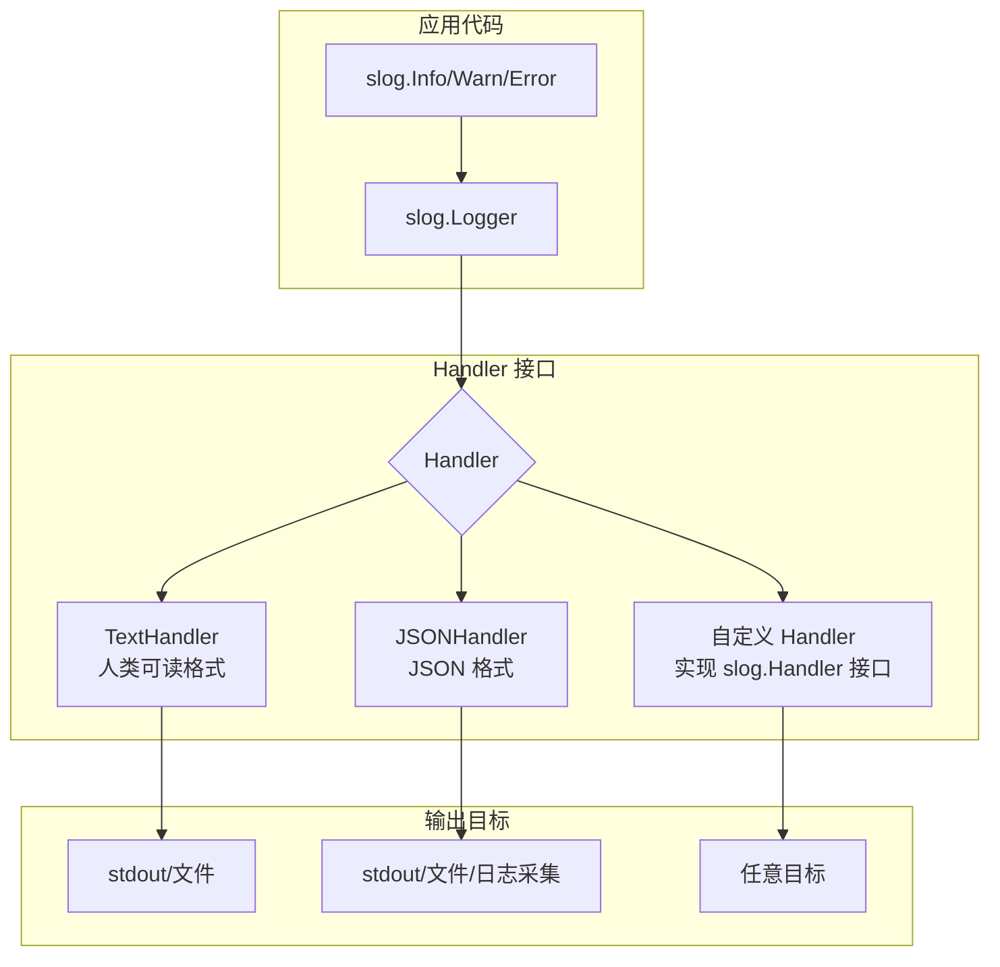

# Go 标准库 slog

## 概念说明

`log/slog` 是 Go 1.21 引入的**结构化日志**标准库，解决了传统 `log` 包只能输出纯文本、无法被机器解析的问题。slog 将日志视为结构化的键值对数据，支持 JSON/Text 两种内置格式，并通过 `Handler` 接口实现高度可扩展性。

**为什么需要结构化日志？**

| 维度 | 非结构化日志 | 结构化日志（slog） |
|------|------------|------------------|
| 格式 | `"user login failed: bad password"` | `{"level":"ERROR","msg":"login failed","user":"alice","reason":"bad_password"}` |
| 解析 | 需要正则匹配，容易出错 | JSON 直接解析，精确提取字段 |
| 聚合 | 难以按字段聚合统计 | 可按 user/reason 等字段聚合 |
| 告警 | 只能基于关键词匹配 | 可基于字段值精确告警 |
| 工具 | grep/awk | ELK/Loki/CloudWatch Logs Insights |

## 核心原理

### slog 架构



### Handler 接口

slog 的核心扩展点是 `slog.Handler` 接口：

```go
type Handler interface {
    Enabled(context.Context, Level) bool   // 判断是否需要处理该级别日志
    Handle(context.Context, Record) error  // 处理日志记录
    WithAttrs(attrs []Attr) Handler        // 添加属性，返回新 Handler
    WithGroup(name string) Handler         // 添加分组，返回新 Handler
}
```

### 日志级别

| 级别 | 数值 | 用途 |
|------|------|------|
| `DEBUG` | -4 | 开发调试信息 |
| `INFO` | 0 | 常规运行信息 |
| `WARN` | 4 | 警告，需要关注 |
| `ERROR` | 8 | 错误，需要处理 |

## 标准库方案

### 基本使用

```go
package main

import "log/slog"

func main() {
    // 默认 TextHandler，输出到 stderr
    slog.Info("服务启动", "port", 8080, "env", "production")
    // 输出: time=2025-01-01T00:00:00.000Z level=INFO msg=服务启动 port=8080 env=production

    // 使用 JSONHandler
    logger := slog.New(slog.NewJSONHandler(os.Stdout, nil))
    logger.Info("用户登录", "user_id", 42, "ip", "192.168.1.1")
    // 输出: {"time":"...","level":"INFO","msg":"用户登录","user_id":42,"ip":"192.168.1.1"}
}
```

### 上下文传播（slog.With）

```go
// 创建带固定字段的 Logger，适合在请求处理链中传递
requestLogger := slog.With(
    "request_id", "abc-123",
    "user_id", 42,
)

requestLogger.Info("处理订单", "order_id", 1001)
// 每条日志都自动携带 request_id 和 user_id
```

### 日志分组（Group）

```go
logger.Info("请求完成",
    slog.Group("request",
        slog.String("method", "GET"),
        slog.String("path", "/api/users"),
    ),
    slog.Group("response",
        slog.Int("status", 200),
        slog.Duration("latency", 42*time.Millisecond),
    ),
)
// JSON 输出: {"request":{"method":"GET","path":"/api/users"},"response":{"status":200,"latency":"42ms"}}
```

### 自定义 Handler

```go
// 实现一个带颜色输出的控制台 Handler
type ColorHandler struct {
    slog.Handler
    w io.Writer
}

func (h *ColorHandler) Handle(ctx context.Context, r slog.Record) error {
    // 根据日志级别设置颜色
    // 详见代码示例：code-examples/02-web-data/observability/slog-custom/
    return nil
}
```

## 代码示例

> 💻 完整可运行代码：[code-examples/02-web-data/observability/slog-custom/](https://github.com/your-repo/code-examples/02-web-data/observability/slog-custom/)
> 🏷️ Demo 模式：纯 Go（直接运行）

## 常见面试题

### Q1: slog 和传统 log 包有什么区别？

**难度**：⭐⭐ | **频率**：🔥🔥🔥

**答题思路**：

1. 结构化 vs 非结构化
2. Handler 接口的可扩展性
3. 日志级别支持
4. 上下文传播能力

**标准答案**：

传统 `log` 包只支持纯文本输出，没有日志级别概念，无法被机器解析。`slog` 是 Go 1.21 引入的结构化日志标准库，以键值对形式输出日志，支持 JSON/Text 格式，内置 DEBUG/INFO/WARN/ERROR 四个级别，通过 Handler 接口支持自定义输出格式和目标，通过 `slog.With` 支持上下文传播。slog 的设计目标是成为 Go 生态的日志标准接口，第三方库可以通过实现 Handler 接口与 slog 集成。

**深入追问**：

- slog.Handler 接口有哪些方法？各自的作用？
- 如何实现一个自定义的 slog Handler？
- slog 的性能和 zerolog/zap 相比如何？

## 常见陷阱

1. **忘记设置全局 Logger**：`slog.SetDefault(logger)` 设置全局默认 Logger，否则使用的是默认 TextHandler
2. **日志级别配置**：生产环境应设置为 INFO 级别，避免 DEBUG 日志影响性能
3. **属性类型安全**：优先使用 `slog.String`/`slog.Int` 等类型安全的属性构造函数，避免 `slog.Any`

## 参考资料

- [Go 官方 slog 文档](https://pkg.go.dev/log/slog)
- [slog 设计提案](https://go.googlesource.com/proposal/+/master/design/56345-structured-logging.md)
- [Go Blog: Structured Logging with slog](https://go.dev/blog/slog)
