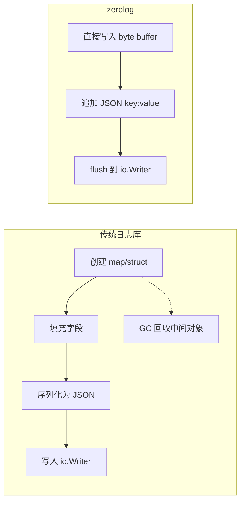

# zerolog 高性能日志

## 概念说明

[zerolog](https://github.com/rs/zerolog) 是 Go 生态中性能最高的结构化日志库，核心特点是**零内存分配（zero allocation）**。它通过链式 API 直接将日志序列化为 JSON 字节流，避免了中间对象的创建和 GC 压力，非常适合高吞吐量的生产环境。

**zerolog 核心优势：**

| 特性 | 说明 |
|------|------|
| 零分配 | 日志写入过程中不产生堆内存分配，减少 GC 压力 |
| 链式 API | `log.Info().Str("key", "val").Msg("hello")` 流畅的链式调用 |
| JSON 原生 | 直接输出 JSON 格式，无需额外序列化 |
| 上下文日志 | 支持 `log.With()` 创建带固定字段的子 Logger |
| Gin 集成 | 提供 Gin 中间件，自动记录请求日志 |

## 核心原理

### 零分配原理



zerolog 内部维护一个 `[]byte` 缓冲区，链式调用的每个方法（如 `.Str()`、`.Int()`）直接将 JSON 片段追加到缓冲区，`.Msg()` 调用时一次性 flush，全程无堆分配。

### 链式 API 设计

```go
// 每个方法返回 *Event，支持链式调用
log.Info().                          // 创建 INFO 级别事件
    Str("method", "GET").            // 添加字符串字段
    Int("status", 200).              // 添加整数字段
    Dur("latency", 42*time.Millisecond). // 添加时间段字段
    Msg("请求完成")                    // 写入消息并 flush
```

## 标准库方案

Go 标准库 `log/slog` 是结构化日志的标准方案，参见 [slog 文档](./01-slog.md)。

## 第三方库方案

### 基本使用

```go
import "github.com/rs/zerolog/log"

// 全局 Logger
log.Info().Msg("服务启动")

// 带字段的日志
log.Info().
    Str("service", "user-api").
    Int("port", 8080).
    Msg("HTTP 服务器启动")
```

### 上下文日志

```go
// 创建带固定字段的子 Logger
logger := log.With().
    Str("service", "order-api").
    Str("request_id", "abc-123").
    Logger()

logger.Info().Str("order_id", "1001").Msg("创建订单")
// {"level":"info","service":"order-api","request_id":"abc-123","order_id":"1001","message":"创建订单"}
```

### Gin 集成中间件

```go
// zerolog Gin 请求日志中间件
func ZerologMiddleware(logger zerolog.Logger) gin.HandlerFunc {
    return func(c *gin.Context) {
        start := time.Now()
        requestID := uuid.New().String()
        c.Set("request_id", requestID)

        c.Next()

        logger.Info().
            Str("request_id", requestID).
            Str("method", c.Request.Method).
            Str("path", c.Request.URL.Path).
            Int("status", c.Writer.Status()).
            Dur("latency", time.Since(start)).
            Msg("HTTP 请求")
    }
}
```

### 错误日志与堆栈

```go
err := doSomething()
if err != nil {
    log.Error().
        Err(err).                    // 自动添加 "error" 字段
        Stack().                     // 添加堆栈信息
        Str("user_id", "42").
        Msg("处理失败")
}
```

## 代码示例

> 💻 完整可运行代码：[code-examples/02-web-data/observability/zerolog-gin/](https://github.com/your-repo/code-examples/02-web-data/observability/zerolog-gin/)
> 🏷️ Demo 模式：纯 Go（直接运行）

## 常见面试题

### Q1: zerolog 为什么能做到零分配？

**难度**：⭐⭐⭐ | **频率**：🔥🔥

**答题思路**：

1. 内部使用 `[]byte` 缓冲区直接构建 JSON
2. 链式调用的每个方法直接追加字节到缓冲区
3. 避免创建中间 map/struct 对象
4. 减少 GC 压力，适合高吞吐场景

**标准答案**：

zerolog 通过直接操作字节缓冲区来避免堆内存分配。每次链式调用（如 `.Str()`、`.Int()`）直接将 JSON 格式的键值对追加到内部 `[]byte` 缓冲区，而不是先创建 map 或 struct 再序列化。`.Msg()` 调用时将缓冲区内容一次性写入 `io.Writer`。这种设计避免了中间对象的创建，减少了 GC 压力，在高吞吐量场景下性能优势明显。

**深入追问**：

- zerolog 和 zap 的性能差异在哪里？
- 零分配在什么场景下特别重要？

## 常见陷阱

1. **忘记调用 `.Msg()` 或 `.Send()`**：链式调用必须以 `.Msg("")` 或 `.Send()` 结尾，否则日志不会输出
2. **全局 Logger 未初始化**：生产环境应显式配置 `zerolog.TimeFieldFormat` 和日志级别
3. **开发环境可读性**：JSON 格式在终端不易阅读，开发环境可使用 `zerolog.ConsoleWriter`

## 参考资料

- [zerolog GitHub](https://github.com/rs/zerolog)
- [zerolog 性能基准测试](https://github.com/rs/zerolog#benchmarks)
