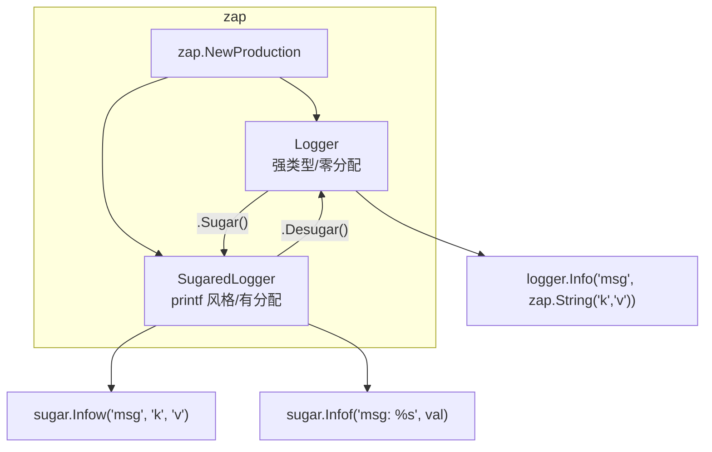

# zap 日志库

## 概念说明

[zap](https://github.com/uber-go/zap) 是 Uber 开源的高性能结构化日志库，在 Go 生态中使用广泛。zap 提供两种 Logger：**Logger**（强类型、零分配）和 **SugaredLogger**（printf 风格、略有分配但更易用），开发者可以根据性能需求选择。

**zap 核心特点：**

| 特性 | 说明 |
|------|------|
| 双 Logger | Logger（强类型高性能）+ SugaredLogger（易用灵活） |
| 字段类型安全 | `zap.String()`、`zap.Int()` 等强类型字段构造 |
| 预设配置 | `zap.NewProduction()`、`zap.NewDevelopment()` 开箱即用 |
| 采样 | 内置日志采样，高频日志自动降频 |
| Hook | 支持日志 Hook，可集成 Sentry 等外部系统 |

## 核心原理

### Logger vs SugaredLogger



| 维度 | Logger | SugaredLogger |
|------|--------|---------------|
| API 风格 | 强类型 `zap.String("key", "val")` | 松散类型 `"key", "val"` |
| 内存分配 | 零分配 | 每次调用有少量分配 |
| 性能 | 最高 | 略低（约 10-20%） |
| 易用性 | 需要显式类型 | 更接近 printf 习惯 |
| 适用场景 | 热路径/高吞吐 | 一般业务代码 |

## 标准库方案

Go 标准库 `log/slog` 是结构化日志的标准方案，参见 [slog 文档](./01-slog.md)。

## 第三方库方案

### 基本使用

```go
import "go.uber.org/zap"

// 生产环境 Logger（JSON 格式、INFO 级别、采样）
logger, _ := zap.NewProduction()
defer logger.Sync()

// Logger：强类型字段
logger.Info("服务启动",
    zap.String("service", "user-api"),
    zap.Int("port", 8080),
)

// SugaredLogger：松散类型
sugar := logger.Sugar()
sugar.Infow("服务启动",
    "service", "user-api",
    "port", 8080,
)
```

### 预设配置

```go
// 开发环境：人类可读格式、DEBUG 级别、堆栈追踪
devLogger, _ := zap.NewDevelopment()

// 生产环境：JSON 格式、INFO 级别、采样、调用者信息
prodLogger, _ := zap.NewProduction()

// 自定义配置
cfg := zap.Config{
    Level:       zap.NewAtomicLevelAt(zap.InfoLevel),
    Development: false,
    Encoding:    "json",
    OutputPaths: []string{"stdout", "/var/log/app.log"},
}
customLogger, _ := cfg.Build()
```

### 字段类型安全

```go
// zap 提供丰富的类型安全字段构造函数
logger.Info("请求完成",
    zap.String("method", "GET"),
    zap.String("path", "/api/users"),
    zap.Int("status", 200),
    zap.Duration("latency", 42*time.Millisecond),
    zap.Error(err),           // 自动处理 nil error
    zap.Any("metadata", map[string]string{"k": "v"}),
)
```

## 代码示例

> 💻 完整可运行代码：[code-examples/02-web-data/observability/](https://github.com/your-repo/code-examples/02-web-data/observability/)
> 🏷️ Demo 模式：纯 Go（直接运行）

## 常见面试题

### Q1: zap 的 Logger 和 SugaredLogger 有什么区别？

**难度**：⭐⭐ | **频率**：🔥🔥

**答题思路**：

1. API 风格差异：强类型 vs 松散类型
2. 性能差异：零分配 vs 有分配
3. 适用场景：热路径 vs 一般业务

**标准答案**：

Logger 使用强类型字段（`zap.String()`、`zap.Int()`），在日志写入过程中实现零内存分配，适合高吞吐量的热路径代码。SugaredLogger 使用松散类型的键值对（`"key", value`），每次调用会有少量内存分配（用于接口装箱），但 API 更易用，适合一般业务代码。两者可以通过 `.Sugar()` 和 `.Desugar()` 互相转换。性能差异约 10-20%，大多数场景下 SugaredLogger 已经足够。

**深入追问**：

- zap 的采样机制是怎么工作的？
- 如何在 zap 中实现日志轮转？

## 常见陷阱

1. **忘记 `defer logger.Sync()`**：zap 使用缓冲写入，程序退出前必须调用 Sync 刷新缓冲区
2. **SugaredLogger 键值对不匹配**：`sugar.Infow("msg", "key")` 缺少 value 会导致日志格式异常
3. **生产环境使用 Development 配置**：Development 配置会输出 DEBUG 级别和堆栈追踪，影响性能

## 参考资料

- [zap GitHub](https://github.com/uber-go/zap)
- [zap 性能基准测试](https://github.com/uber-go/zap#performance)
