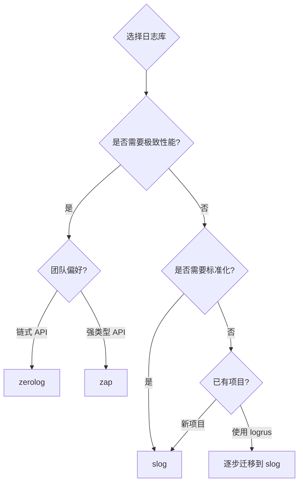

# 日志库选型对比

## 概念说明

Go 生态有多个成熟的日志库，选型时需要综合考虑性能、API 风格、生态集成和团队习惯。本文从多个维度对比 slog、zerolog、zap 和 logrus 四个主流方案。

## 核心对比

### 综合对比表

| 维度 | slog | zerolog | zap | logrus |
|------|------|---------|-----|--------|
| **来源** | Go 标准库（1.21+） | 社区（rs） | Uber 开源 | 社区（sirupsen） |
| **API 风格** | 键值对 | 链式调用 | 强类型字段 | 链式调用 |
| **内存分配** | 少量 | 零分配 | 零分配（Logger） | 较多 |
| **JSON 输出** | ✅ 内置 | ✅ 原生 | ✅ 内置 | ✅ 需配置 |
| **日志级别** | 4 级 | 7 级 | 6 级 | 7 级 |
| **Handler/Hook** | Handler 接口 | Hook | Hook | Hook |
| **上下文传播** | slog.With | log.With | logger.With | WithFields |
| **维护状态** | Go 团队维护 | 活跃 | 活跃 | 维护模式 |
| **Go 版本要求** | 1.21+ | 1.15+ | 1.19+ | 1.13+ |

### 性能对比（基准测试参考）

| 操作 | slog | zerolog | zap | logrus |
|------|------|---------|-----|--------|
| 10 字段日志 | ~800ns | ~200ns | ~300ns | ~3000ns |
| 内存分配/次 | 2-3 | 0 | 0 | 5-10 |
| 吞吐量 | 中 | 最高 | 高 | 低 |

> 注：性能数据仅供参考，实际表现取决于具体场景和配置。

### API 风格对比

```go
// slog — 键值对风格
slog.Info("用户登录", "user_id", 42, "ip", "192.168.1.1")

// zerolog — 链式调用风格
log.Info().Int("user_id", 42).Str("ip", "192.168.1.1").Msg("用户登录")

// zap Logger — 强类型字段风格
logger.Info("用户登录", zap.Int("user_id", 42), zap.String("ip", "192.168.1.1"))

// zap SugaredLogger — 松散键值对风格
sugar.Infow("用户登录", "user_id", 42, "ip", "192.168.1.1")

// logrus — 链式 WithFields 风格
logrus.WithFields(logrus.Fields{"user_id": 42, "ip": "192.168.1.1"}).Info("用户登录")
```

## 选型建议



### 推荐方案

| 场景 | 推荐 | 理由 |
|------|------|------|
| **新项目/标准化** | slog | 标准库，零依赖，生态兼容性最好 |
| **高性能/高吞吐** | zerolog | 零分配，性能最高 |
| **Uber 技术栈/大厂** | zap | 成熟稳定，大厂广泛使用 |
| **已有 logrus 项目** | 逐步迁移到 slog | logrus 已进入维护模式 |

### logrus 为什么不推荐新项目使用？

1. **维护模式**：作者已声明 logrus 进入维护模式，不再添加新功能
2. **性能较差**：大量使用反射和 map，内存分配多
3. **API 设计过时**：基于 map 的 Fields 设计不如结构化键值对高效
4. **标准库替代**：slog 已经提供了标准化的结构化日志方案

## 常见面试题

### Q1: 如何选择 Go 日志库？

**难度**：⭐⭐⭐ | **频率**：🔥🔥🔥

**答题思路**：

1. 先说选型维度：性能、API 风格、生态、维护状态
2. 再说各库特点和适用场景
3. 给出推荐方案

**标准答案**：

Go 日志库选型主要考虑四个维度：性能（内存分配和吞吐量）、API 风格（团队习惯）、生态集成（中间件支持）、维护状态。新项目推荐 slog（标准库、零依赖、生态兼容性好）；高性能场景推荐 zerolog（零分配、吞吐量最高）；大厂技术栈推荐 zap（成熟稳定、Uber 背书）；logrus 已进入维护模式，不推荐新项目使用。slog 作为标准库的优势在于，第三方库可以通过实现 Handler 接口与 slog 集成，未来可能成为 Go 生态的日志标准接口。

**深入追问**：

- 如果项目已经使用 logrus，如何迁移到 slog？
- zerolog 和 zap 的性能差异主要在哪里？

## 参考资料

- [Go Blog: Structured Logging with slog](https://go.dev/blog/slog)
- [zerolog Benchmarks](https://github.com/rs/zerolog#benchmarks)
- [zap Benchmarks](https://github.com/uber-go/zap#performance)
