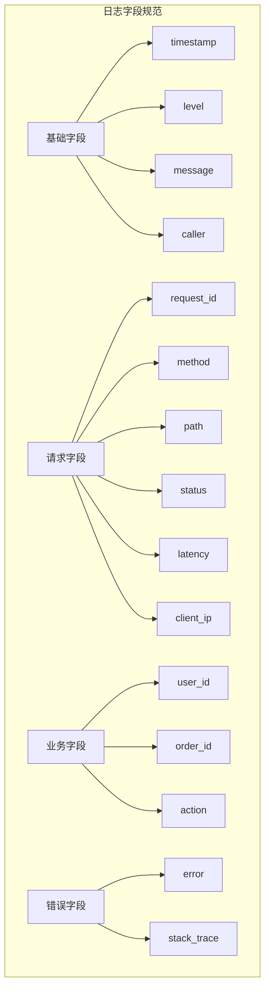
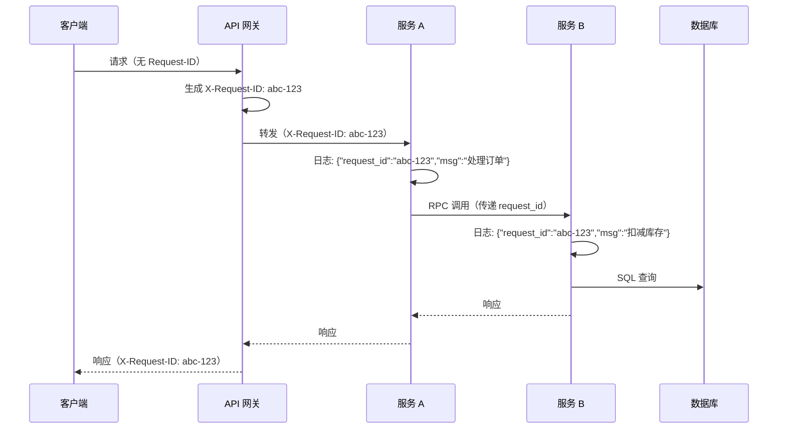

# 日志最佳实践

## 概念说明

日志是排查线上问题的第一手资料，好的日志实践能大幅提升问题定位效率。本文总结 Go 项目中的日志最佳实践，涵盖结构化规范、级别指南、请求 ID 链路追踪、敏感信息脱敏和日志轮转。

## 核心原理

### 结构化日志规范



### 日志级别使用指南

| 级别 | 用途 | 示例 | 生产环境 |
|------|------|------|---------|
| **DEBUG** | 开发调试信息，详细的内部状态 | SQL 查询、缓存命中/未命中 | ❌ 关闭 |
| **INFO** | 常规运行信息，关键业务事件 | 服务启动、用户登录、订单创建 | ✅ 开启 |
| **WARN** | 异常但可恢复的情况 | 重试成功、降级处理、配置缺失使用默认值 | ✅ 开启 |
| **ERROR** | 错误，需要关注和处理 | API 调用失败、数据库连接断开 | ✅ 开启 |
| **FATAL** | 致命错误，服务无法继续运行 | 配置文件缺失、端口被占用 | ✅ 开启 |

### 请求 ID 链路追踪



通过 Request ID，可以在日志系统中搜索 `request_id=abc-123`，串联一次请求在所有服务中的完整日志链路。

### 敏感信息脱敏

```go
// ❌ 错误：日志中包含敏感信息
log.Info().Str("password", user.Password).Msg("用户注册")
log.Info().Str("token", accessToken).Msg("Token 签发")
log.Info().Str("card_number", "6222021234567890").Msg("支付")

// ✅ 正确：脱敏处理
log.Info().Str("password", "***").Msg("用户注册")
log.Info().Str("token", maskToken(accessToken)).Msg("Token 签发")
log.Info().Str("card_number", "6222****7890").Msg("支付")
```

**需要脱敏的字段：**
- 密码、Token、API Key
- 身份证号、手机号、银行卡号
- 邮箱地址（部分脱敏）
- 用户地址等 PII 信息

### 日志轮转（lumberjack）

```go
import "gopkg.in/natefinch/lumberjack.v2"

// lumberjack 实现日志文件轮转
writer := &lumberjack.Logger{
    Filename:   "/var/log/app.log",
    MaxSize:    100,  // 单文件最大 100MB
    MaxBackups: 5,    // 保留 5 个备份
    MaxAge:     30,   // 保留 30 天
    Compress:   true, // 压缩旧文件
}
```

## 最佳实践清单

### 1. 使用结构化日志

```go
// ❌ 非结构化
log.Printf("user %s login from %s", username, ip)

// ✅ 结构化
slog.Info("用户登录", "username", username, "ip", ip)
```

### 2. 统一日志格式

```json
{
  "timestamp": "2025-01-01T00:00:00.000Z",
  "level": "INFO",
  "message": "HTTP 请求完成",
  "request_id": "abc-123",
  "method": "GET",
  "path": "/api/users",
  "status": 200,
  "latency_ms": 42,
  "caller": "handler/user.go:42"
}
```

### 3. 避免日志过多或过少

```go
// ❌ 过多：循环内打日志
for _, item := range items {
    log.Info().Str("item", item.ID).Msg("处理中")
}

// ✅ 适量：汇总打日志
log.Info().Int("count", len(items)).Msg("批量处理完成")
```

### 4. 错误日志包含上下文

```go
// ❌ 缺少上下文
log.Error().Err(err).Msg("失败")

// ✅ 包含上下文
log.Error().
    Err(err).
    Str("user_id", userID).
    Str("order_id", orderID).
    Str("action", "create_order").
    Msg("创建订单失败")
```

## 常见面试题

### Q1: 生产环境的日志最佳实践有哪些？

**难度**：⭐⭐⭐ | **频率**：🔥🔥🔥

**答题思路**：

1. 结构化日志（JSON 格式）
2. 合理的日志级别
3. 请求 ID 链路追踪
4. 敏感信息脱敏
5. 日志轮转和归档

**标准答案**：

生产环境日志最佳实践包括五个方面：一是使用结构化日志（JSON 格式），便于日志采集和分析；二是合理设置日志级别，生产环境关闭 DEBUG，只保留 INFO 及以上；三是通过 Request ID 实现请求链路追踪，在分布式系统中串联一次请求的所有日志；四是对密码、Token、身份证号等敏感信息进行脱敏处理；五是使用 lumberjack 等工具实现日志轮转，防止磁盘写满。

**深入追问**：

- 如何在微服务间传递 Request ID？
- 日志量太大怎么处理？（采样、异步写入、日志分级存储）

## 参考资料

- [The Twelve-Factor App: Logs](https://12factor.net/logs)
- [lumberjack GitHub](https://github.com/natefinch/lumberjack)
