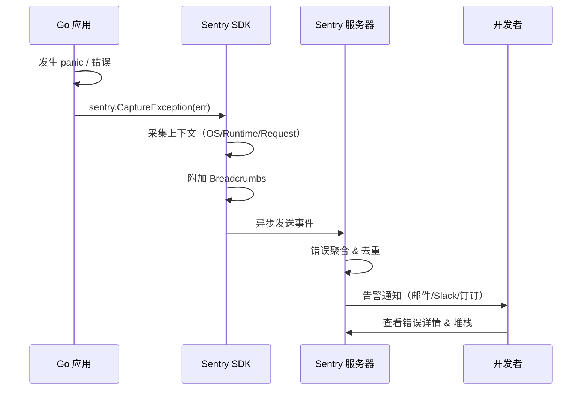

# Sentry Go SDK

## 概念说明

[Sentry](https://sentry.io) 是一个实时错误追踪和性能监控平台，帮助开发者发现、分类和修复生产环境中的错误。Sentry Go SDK 可以自动捕获 panic、手动上报错误、记录面包屑（Breadcrumbs）、追踪性能事务（Transaction），并与 Gin 等 Web 框架深度集成。

**Sentry vs 日志的区别：**

| 维度 | 日志（zerolog/zap） | Sentry |
|------|-------------------|--------|
| 定位 | 记录所有运行信息 | 专注错误和异常 |
| 聚合 | 需要 ELK/Loki 等工具 | 内置错误聚合和去重 |
| 告警 | 需要额外配置 | 内置告警规则 |
| 上下文 | 手动添加字段 | 自动采集环境信息 |
| 追踪 | 无 | 支持 Release 版本追踪 |

## 核心原理

### Sentry 工作流程



### 核心概念

| 概念 | 说明 |
|------|------|
| **DSN** | Data Source Name，标识项目的唯一地址 |
| **Event** | 一次错误或异常事件 |
| **Breadcrumb** | 面包屑，记录错误发生前的操作轨迹 |
| **Scope** | 作用域，附加额外上下文信息 |
| **Transaction** | 性能事务，追踪请求的完整耗时 |
| **Release** | 版本标识，关联错误与代码版本 |

## 第三方库方案

### SDK 初始化

```go
import "github.com/getsentry/sentry-go"

err := sentry.Init(sentry.ClientOptions{
    Dsn:              "https://examplePublicKey@o0.ingest.sentry.io/0",
    Environment:      "production",
    Release:          "user-api@1.2.0",
    TracesSampleRate: 0.2,  // 采样 20% 的性能事务
    BeforeSend: func(event *sentry.Event, hint *sentry.EventHint) *sentry.Event {
        // 可在发送前过滤或修改事件
        return event
    },
})
if err != nil {
    log.Fatalf("Sentry 初始化失败: %s", err)
}
defer sentry.Flush(2 * time.Second)
```

### 错误捕获

```go
// 手动捕获错误
if err := doSomething(); err != nil {
    sentry.CaptureException(err)
}

// 手动捕获消息
sentry.CaptureMessage("用户尝试访问未授权资源")

// 带上下文的错误捕获
sentry.WithScope(func(scope *sentry.Scope) {
    scope.SetUser(sentry.User{ID: "42", Email: "alice@example.com"})
    scope.SetTag("module", "payment")
    scope.SetExtra("order_id", "1001")
    sentry.CaptureException(err)
})
```

### Panic Recovery

```go
// 全局 Panic Recovery
defer sentry.Recover()

// 或者手动恢复
defer func() {
    if r := recover(); r != nil {
        sentry.CurrentHub().Recover(r)
        sentry.Flush(2 * time.Second)
    }
}()
```

### Gin 集成

```go
import sentrygin "github.com/getsentry/sentry-go/gin"

r := gin.New()

// Sentry 中间件：自动捕获 panic 和错误
r.Use(sentrygin.New(sentrygin.Options{
    Repanic:         true,  // panic 后继续向上传播
    WaitForDelivery: false, // 异步发送，不阻塞请求
}))

r.GET("/panic", func(c *gin.Context) {
    panic("something went wrong") // 自动被 Sentry 捕获
})
```

### Breadcrumbs（面包屑）

```go
sentry.AddBreadcrumb(&sentry.Breadcrumb{
    Category: "auth",
    Message:  "用户登录成功",
    Level:    sentry.LevelInfo,
    Data:     map[string]interface{}{"user_id": 42},
})
```

## 代码示例

> 💻 完整可运行代码：[code-examples/02-web-data/observability/sentry-gin/](https://github.com/your-repo/code-examples/02-web-data/observability/sentry-gin/)
> 🏷️ Demo 模式：纯 Go（直接运行，使用空 DSN 演示流程）

## 常见面试题

### Q1: Sentry 和日志系统的区别？各自适用场景？

**难度**：⭐⭐ | **频率**：🔥🔥

**答题思路**：

1. 日志记录所有信息，Sentry 专注错误
2. Sentry 内置聚合、去重、告警
3. 两者互补，不是替代关系

**标准答案**：

日志系统（zerolog/zap + ELK/Loki）记录所有运行信息，适合详细排查和审计；Sentry 专注错误和异常，内置错误聚合、去重、告警和 Release 追踪，适合快速发现和定位生产问题。两者是互补关系：日志提供详细上下文，Sentry 提供错误概览和告警。最佳实践是同时使用两者——Sentry 发现问题，日志定位根因。

**深入追问**：

- Sentry 的采样率如何设置？
- 如何避免 Sentry 上报过多噪音事件？

## 常见陷阱

1. **DSN 硬编码**：DSN 应通过环境变量注入，不要硬编码在代码中
2. **忘记 `sentry.Flush()`**：程序退出前必须调用 Flush，否则最后的事件可能丢失
3. **采样率设置过高**：TracesSampleRate 设为 1.0 会采集所有请求，影响性能和费用

## 参考资料

- [Sentry Go SDK 文档](https://docs.sentry.io/platforms/go/)
- [Sentry Gin 集成](https://docs.sentry.io/platforms/go/guides/gin/)
