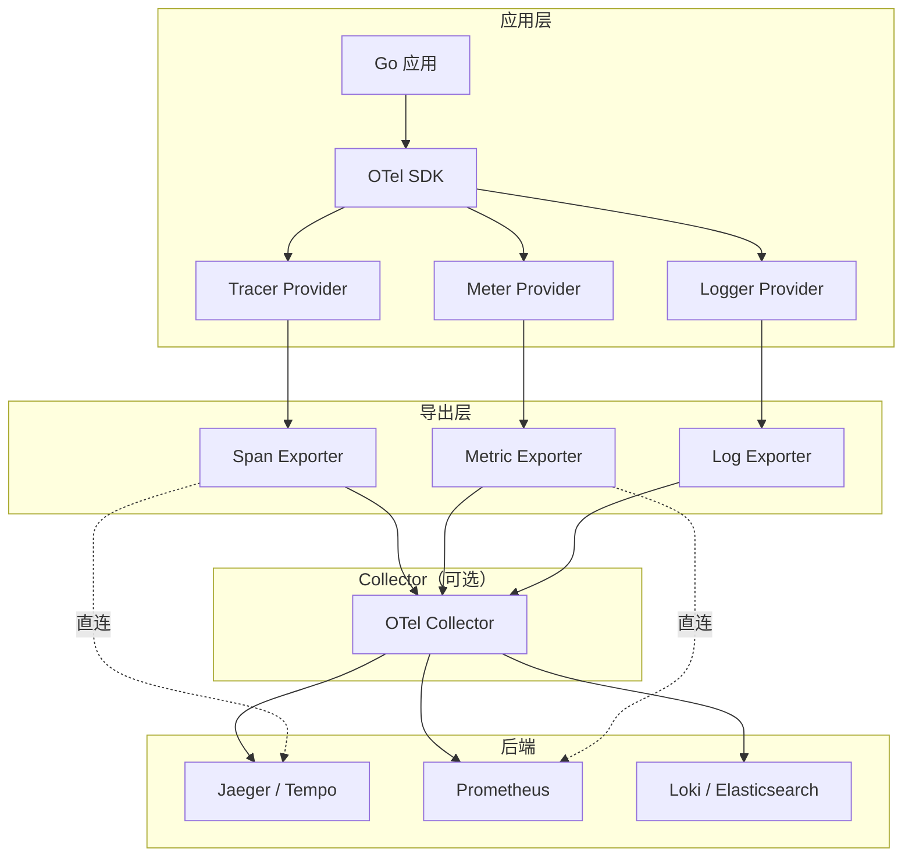
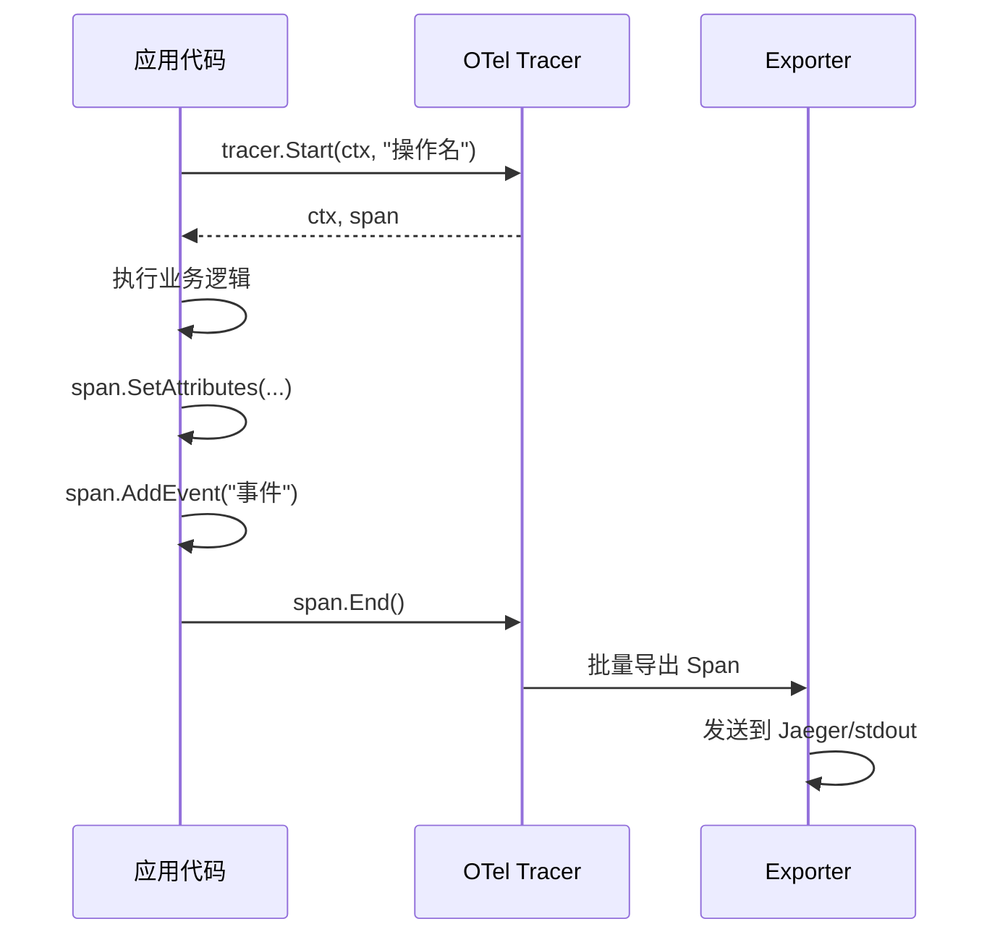

# OpenTelemetry

## 概念说明

[OpenTelemetry](https://opentelemetry.io)（简称 OTel）是 CNCF 的可观测性框架，统一了 Traces（链路追踪）、Metrics（指标）、Logs（日志）三大信号的采集、处理和导出标准。OTel 的目标是成为可观测性领域的"标准接口"——应用只需接入 OTel SDK，就可以将数据导出到 Jaeger、Prometheus、Grafana、Datadog 等任意后端。

**为什么需要 OpenTelemetry？**

在 OTel 之前，Traces 用 Jaeger/Zipkin SDK，Metrics 用 Prometheus client，Logs 用 zerolog/zap，三者各自独立，无法关联。OTel 统一了三大信号的 API 和 SDK，实现了 TraceID 在日志、指标、链路中的贯通。

## 核心原理

### OTel 架构



### 核心概念

| 概念 | 说明 |
|------|------|
| **Trace** | 一次请求的完整调用链路 |
| **Span** | Trace 中的一个操作单元（如 HTTP 请求、DB 查询） |
| **SpanContext** | Span 的上下文信息（TraceID、SpanID），用于跨服务传播 |
| **Tracer Provider** | 创建和管理 Tracer 的工厂 |
| **Exporter** | 将数据导出到后端（Jaeger/Prometheus/stdout） |
| **Collector** | 独立部署的数据采集代理，接收、处理、转发遥测数据 |
| **Propagator** | 上下文传播器，在 HTTP Header 中传递 TraceID |

### Span 生命周期



### 自动埋点 vs 手动埋点

| 方式 | 说明 | 适用场景 |
|------|------|---------|
| **自动埋点** | 通过 OTel 中间件自动为 HTTP/gRPC 请求创建 Span | 框架层面的请求追踪 |
| **手动埋点** | 在业务代码中手动创建 Span | 关键业务逻辑的细粒度追踪 |

## 第三方库方案

### Go SDK 基本使用

```go
import (
    "go.opentelemetry.io/otel"
    "go.opentelemetry.io/otel/exporters/stdout/stdouttrace"
    "go.opentelemetry.io/otel/sdk/trace"
)

// 初始化 Tracer Provider
exporter, _ := stdouttrace.New(stdouttrace.WithPrettyPrint())
tp := trace.NewTracerProvider(trace.WithBatcher(exporter))
otel.SetTracerProvider(tp)
defer tp.Shutdown(context.Background())

// 创建 Tracer
tracer := otel.Tracer("my-service")

// 创建 Span
ctx, span := tracer.Start(ctx, "处理订单")
defer span.End()

// 添加属性
span.SetAttributes(
    attribute.String("order.id", "1001"),
    attribute.Int("order.amount", 9900),
)

// 添加事件
span.AddEvent("库存扣减完成")
```

### 上下文传播

```go
// 父子 Span 关系：通过 context 自动建立
func handleRequest(ctx context.Context) {
    ctx, span := tracer.Start(ctx, "handleRequest")
    defer span.End()

    // 子 Span 自动成为 handleRequest 的子节点
    processOrder(ctx)
}

func processOrder(ctx context.Context) {
    ctx, span := tracer.Start(ctx, "processOrder")
    defer span.End()
    // ...
}
```

## 代码示例

> 💻 完整可运行代码：[code-examples/02-web-data/observability/otel-tracing/](https://github.com/skyhe58/guide-go/tree/main/code-examples/02-web-data/observability/otel-tracing/)
> 🏷️ Demo 模式：纯 Go（直接运行，使用 stdout exporter）

## 常见面试题

### Q1: OpenTelemetry 的三大信号是什么？它们之间如何关联？

**难度**：⭐⭐⭐ | **频率**：🔥🔥🔥

**答题思路**：

1. 三大信号：Traces、Metrics、Logs
2. 通过 TraceID 关联
3. 各自的作用和适用场景

**标准答案**：

OpenTelemetry 的三大信号是 Traces（链路追踪）、Metrics（指标）和 Logs（日志）。Traces 记录请求在分布式系统中的完整调用路径，由多个 Span 组成；Metrics 记录聚合的数值数据（如请求计数、延迟分布）；Logs 记录离散的事件信息。三者通过 TraceID 关联——在日志中记录 TraceID，可以从一条错误日志跳转到对应的完整链路追踪；在 Metrics 告警中关联 TraceID，可以快速定位具体的问题请求。

**深入追问**：

- OTel Collector 的作用是什么？
- 自动埋点和手动埋点的区别？

## 常见陷阱

1. **忘记 `span.End()`**：Span 必须调用 End() 才会被导出，建议使用 `defer span.End()`
2. **Context 传播断裂**：必须将带 Span 的 ctx 传递给下游函数，否则链路会断开
3. **采样率配置**：生产环境不要采样所有请求（100%），建议 10-20%

## 参考资料

- [OpenTelemetry 官方文档](https://opentelemetry.io/docs/)
- [OpenTelemetry Go SDK](https://opentelemetry.io/docs/languages/go/)
- [OTel Collector 文档](https://opentelemetry.io/docs/collector/)
