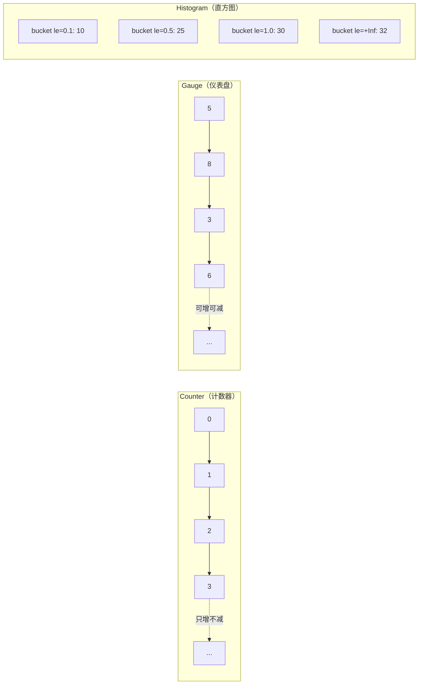

# Prometheus 指标采集

## 概念说明

[Prometheus](https://prometheus.io) 是 CNCF 毕业项目，是云原生领域事实标准的监控系统。Prometheus 本身就是用 Go 编写的，Go 生态对 Prometheus 的支持非常成熟。Go 服务通过 `prometheus/client_golang` 库暴露 `/metrics` 端点，Prometheus Server 定期拉取（Pull）指标数据。

**Prometheus 核心特点：**

| 特性 | 说明 |
|------|------|
| Pull 模型 | Prometheus 主动拉取指标，而非应用推送 |
| 多维数据模型 | 指标 + 标签（Label）组合，灵活查询 |
| PromQL | 强大的查询语言，支持聚合、速率计算 |
| 告警 | 内置 Alertmanager，支持多种告警渠道 |
| 生态 | Grafana 可视化、大量 Exporter |

## 核心原理

### Prometheus 架构

```mermaid
graph TB
    subgraph "Go 服务"
        A[业务代码] --> B[Prometheus Client]
        B --> C[/metrics 端点]
    end
    
    subgraph "Prometheus"
        D[Prometheus Server] -->|Pull /metrics| C
        D --> E[TSDB 时序数据库]
        D --> F[PromQL 查询引擎]
        D --> G[Alertmanager]
    end
    
    subgraph "可视化"
        F --> H[Grafana 看板]
        G --> I[告警通知<br/>邮件/Slack/钉钉]
    end
```

### 四种指标类型

| 类型 | 说明 | 典型场景 | 示例 |
|------|------|---------|------|
| **Counter** | 只增不减的计数器 | 请求总数、错误总数 | `http_requests_total` |
| **Gauge** | 可增可减的仪表盘 | 当前连接数、内存使用量 | `goroutines_current` |
| **Histogram** | 直方图，统计分布 | 请求延迟分布 | `http_request_duration_seconds` |
| **Summary** | 摘要，计算分位数 | 请求延迟 P50/P99 | `http_request_duration_summary` |

### Counter vs Gauge vs Histogram



## 第三方库方案

### 基本使用

```go
import (
    "github.com/prometheus/client_golang/prometheus"
    "github.com/prometheus/client_golang/prometheus/promhttp"
)

// 定义 Counter
var httpRequestsTotal = prometheus.NewCounterVec(
    prometheus.CounterOpts{
        Name: "http_requests_total",
        Help: "HTTP 请求总数",
    },
    []string{"method", "path", "status"},
)

// 定义 Histogram
var httpRequestDuration = prometheus.NewHistogramVec(
    prometheus.HistogramOpts{
        Name:    "http_request_duration_seconds",
        Help:    "HTTP 请求延迟分布",
        Buckets: prometheus.DefBuckets,
    },
    []string{"method", "path"},
)

func init() {
    prometheus.MustRegister(httpRequestsTotal)
    prometheus.MustRegister(httpRequestDuration)
}

// 暴露 /metrics 端点
http.Handle("/metrics", promhttp.Handler())
```

### Gin 中间件指标采集

```go
func PrometheusMiddleware() gin.HandlerFunc {
    return func(c *gin.Context) {
        start := time.Now()
        c.Next()
        duration := time.Since(start).Seconds()

        status := strconv.Itoa(c.Writer.Status())
        httpRequestsTotal.WithLabelValues(c.Request.Method, c.FullPath(), status).Inc()
        httpRequestDuration.WithLabelValues(c.Request.Method, c.FullPath()).Observe(duration)
    }
}
```

### 自定义 Gauge

```go
var activeConnections = prometheus.NewGauge(
    prometheus.GaugeOpts{
        Name: "active_connections",
        Help: "当前活跃连接数",
    },
)

// 连接建立时
activeConnections.Inc()
// 连接关闭时
activeConnections.Dec()
```

## 代码示例

> 💻 完整可运行代码：[code-examples/02-web-data/observability/prometheus/](https://github.com/your-repo/code-examples/02-web-data/observability/prometheus/)
> 🏷️ Demo 模式：纯 Go（直接运行）

## 常见面试题

### Q1: Prometheus 的四种指标类型分别适用什么场景？

**难度**：⭐⭐⭐ | **频率**：🔥🔥🔥

**答题思路**：

1. Counter：只增不减，适合计数
2. Gauge：可增可减，适合当前状态
3. Histogram：分布统计，适合延迟
4. Summary：分位数计算

**标准答案**：

Counter 是只增不减的计数器，适合统计请求总数、错误总数等累计值，通过 `rate()` 函数计算速率。Gauge 是可增可减的仪表盘，适合表示当前状态值，如活跃连接数、内存使用量、goroutine 数量。Histogram 将观测值分配到预定义的桶（bucket）中，适合统计延迟分布，可以计算任意分位数（P50/P99），推荐用于 HTTP 请求延迟。Summary 在客户端计算分位数，适合精确的分位数需求，但不支持聚合，一般推荐使用 Histogram。

**深入追问**：

- Histogram 和 Summary 的区别？
- 如何用 PromQL 计算 P99 延迟？

## 常见陷阱

1. **Label 基数爆炸**：避免使用高基数标签（如 user_id），会导致时序数据量暴增
2. **忘记注册指标**：`prometheus.MustRegister()` 必须在使用前调用
3. **Histogram Bucket 配置**：默认 Bucket 可能不适合你的延迟分布，需要根据实际情况调整

## 参考资料

- [Prometheus 官方文档](https://prometheus.io/docs/)
- [prometheus/client_golang](https://github.com/prometheus/client_golang)
- [PromQL 查询语言](https://prometheus.io/docs/prometheus/latest/querying/basics/)
