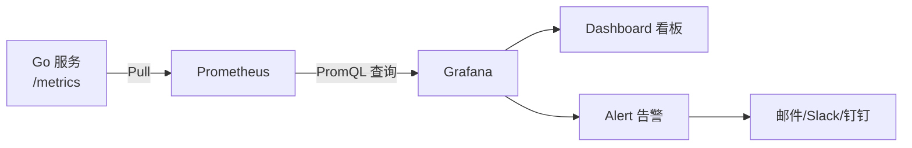

# Grafana 看板配置

## 概念说明

[Grafana](https://grafana.com) 是最流行的开源可视化平台，支持 Prometheus、Loki、Jaeger 等多种数据源。对于 Go 服务，Grafana 通常与 Prometheus 配合使用，将指标数据可视化为看板（Dashboard），并配置告警规则。

## 核心原理

### Grafana + Prometheus 架构



## Go 服务常用看板

### RED 方法（Rate/Errors/Duration）

| 指标 | PromQL | 说明 |
|------|--------|------|
| **请求速率** | `rate(http_requests_total[5m])` | 每秒请求数 |
| **错误率** | `rate(http_requests_total{status=~"5.."}[5m]) / rate(http_requests_total[5m])` | 5xx 错误占比 |
| **延迟 P99** | `histogram_quantile(0.99, rate(http_request_duration_seconds_bucket[5m]))` | 99% 请求的延迟 |

### Go Runtime 指标

| 指标 | PromQL | 说明 |
|------|--------|------|
| **Goroutine 数量** | `go_goroutines` | 当前 goroutine 数量 |
| **内存使用** | `go_memstats_alloc_bytes` | 当前堆内存分配 |
| **GC 暂停时间** | `go_gc_duration_seconds` | GC 暂停时间分布 |
| **GC 次数** | `go_gc_cycles_total` | GC 执行次数 |

### 推荐看板模板

| 看板 | Grafana ID | 说明 |
|------|-----------|------|
| Go Metrics | 10826 | Go Runtime 指标（goroutine/内存/GC） |
| Gin HTTP | 自定义 | HTTP 请求 RED 指标 |
| Node Exporter | 1860 | 主机指标（CPU/内存/磁盘/网络） |

## 告警规则配置

### 常用告警规则

::: v-pre
```yaml
# Prometheus 告警规则示例
groups:
  - name: go-service-alerts
    rules:
      # 错误率超过 5%
      - alert: HighErrorRate
        expr: rate(http_requests_total{status=~"5.."}[5m]) / rate(http_requests_total[5m]) > 0.05
        for: 5m
        labels:
          severity: critical
        annotations:
          summary: "服务错误率过高"
          description: "{{ $labels.instance }} 的 5xx 错误率超过 5%，当前值: {{ $value }}"

      # P99 延迟超过 1 秒
      - alert: HighLatency
        expr: histogram_quantile(0.99, rate(http_request_duration_seconds_bucket[5m])) > 1
        for: 5m
        labels:
          severity: warning
        annotations:
          summary: "服务延迟过高"
          description: "{{ $labels.instance }} 的 P99 延迟超过 1 秒"

      # Goroutine 泄漏
      - alert: GoroutineLeak
        expr: go_goroutines > 10000
        for: 10m
        labels:
          severity: warning
        annotations:
          summary: "Goroutine 数量异常"
          description: "{{ $labels.instance }} 的 goroutine 数量超过 10000"
```
:::

### 告警分级

| 级别 | 触发条件 | 响应时间 | 通知方式 |
|------|---------|---------|---------|
| **P0 Critical** | 服务不可用、错误率 > 10% | 立即 | 电话 + 短信 + 钉钉 |
| **P1 Warning** | 延迟升高、错误率 > 5% | 15 分钟 | 钉钉 + 邮件 |
| **P2 Info** | Goroutine 异常、内存升高 | 1 小时 | 邮件 |

## 常见面试题

### Q1: 如何监控一个 Go 服务的健康状态？

**难度**：⭐⭐⭐ | **频率**：🔥🔥

**答题思路**：

1. RED 方法：Rate/Errors/Duration
2. Go Runtime 指标：goroutine/内存/GC
3. 业务指标：订单量、支付成功率
4. 告警规则配置

**标准答案**：

监控 Go 服务健康状态采用 RED 方法：Rate（请求速率）、Errors（错误率）、Duration（延迟分布）。通过 Prometheus client_golang 暴露 /metrics 端点，采集 HTTP 请求计数、错误计数和延迟直方图。同时监控 Go Runtime 指标：goroutine 数量（检测泄漏）、堆内存分配（检测内存泄漏）、GC 暂停时间（检测 GC 压力）。在 Grafana 中配置看板可视化，并设置告警规则：错误率 > 5% 触发 Warning，> 10% 触发 Critical。

**深入追问**：

- 如何检测 goroutine 泄漏？
- PromQL 如何计算 P99 延迟？

## 参考资料

- [Grafana 官方文档](https://grafana.com/docs/)
- [Grafana Dashboard 模板库](https://grafana.com/grafana/dashboards/)
- [Prometheus Alerting Rules](https://prometheus.io/docs/prometheus/latest/configuration/alerting_rules/)
