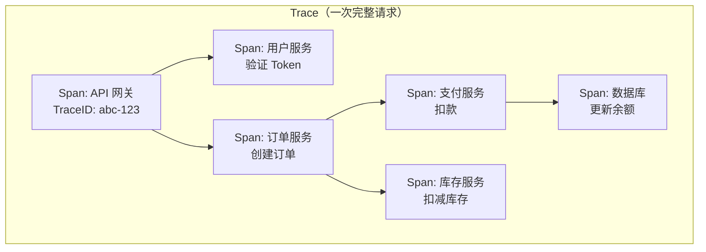
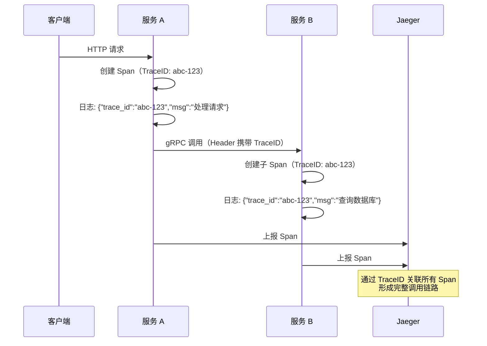

# 分布式链路追踪

## 概念说明

分布式链路追踪（Distributed Tracing）记录一次请求在分布式系统中经过的所有服务和操作，帮助开发者理解请求的完整路径、定位性能瓶颈和故障点。Jaeger 和 Zipkin 是两个主流的链路追踪后端，均支持 OpenTelemetry 协议。

**为什么需要链路追踪？**

在微服务架构中，一次用户请求可能经过 API 网关 → 用户服务 → 订单服务 → 支付服务 → 库存服务等多个服务。当请求变慢或失败时，仅靠日志很难定位是哪个服务、哪个操作出了问题。链路追踪通过 TraceID 将所有服务的调用串联起来，形成完整的调用链路图。

## 核心原理

### 链路追踪模型



### Jaeger vs Zipkin

| 维度 | Jaeger | Zipkin |
|------|--------|--------|
| **来源** | Uber 开源，CNCF 毕业项目 | Twitter 开源 |
| **语言** | Go | Java |
| **存储** | Cassandra/Elasticsearch/Kafka | MySQL/Elasticsearch/Cassandra |
| **UI** | 功能丰富，支持 DAG 图 | 简洁实用 |
| **OTel 支持** | 原生支持 OTLP 协议 | 支持 Zipkin 格式 |
| **推荐** | ✅ Go 项目首选 | 适合 Java 生态 |

### TraceID 日志关联



**关键实践：在日志中记录 TraceID**

```go
// 从 context 中提取 TraceID，写入日志
spanCtx := trace.SpanContextFromContext(ctx)
if spanCtx.HasTraceID() {
    logger = logger.With().
        Str("trace_id", spanCtx.TraceID().String()).
        Str("span_id", spanCtx.SpanID().String()).
        Logger()
}
```

这样在日志系统（ELK/Loki）中搜索 `trace_id=abc-123`，就能找到这次请求在所有服务中的日志，再跳转到 Jaeger 查看完整链路图。

## 第三方库方案

### Jaeger 集成（通过 OTel）

```go
import (
    "go.opentelemetry.io/otel"
    "go.opentelemetry.io/otel/exporters/otlp/otlptrace/otlptracehttp"
    "go.opentelemetry.io/otel/sdk/trace"
)

// 使用 OTLP HTTP Exporter 发送到 Jaeger
exporter, _ := otlptracehttp.New(ctx,
    otlptracehttp.WithEndpoint("localhost:4318"),
    otlptracehttp.WithInsecure(),
)

tp := trace.NewTracerProvider(
    trace.WithBatcher(exporter),
    trace.WithResource(resource.NewWithAttributes(
        semconv.SchemaURL,
        semconv.ServiceNameKey.String("my-service"),
    )),
)
otel.SetTracerProvider(tp)
```

### HTTP 上下文传播

```go
import "go.opentelemetry.io/otel/propagation"

// 设置全局传播器（W3C TraceContext 标准）
otel.SetTextMapPropagator(propagation.TraceContext{})

// HTTP 客户端：自动注入 TraceID 到请求头
// HTTP 服务端：自动从请求头提取 TraceID
```

## 代码示例

> 💻 完整可运行代码：[code-examples/02-web-data/observability/otel-tracing/](https://github.com/skyhe58/guide-go/tree/main/code-examples/02-web-data/observability/otel-tracing/)
> 🏷️ Demo 模式：纯 Go（直接运行，使用 stdout exporter）

## 常见面试题

### Q1: 分布式链路追踪的原理是什么？

**难度**：⭐⭐⭐ | **频率**：🔥🔥🔥

**答题思路**：

1. TraceID + SpanID 的概念
2. 上下文传播机制（HTTP Header）
3. 父子 Span 关系
4. 与日志的关联

**标准答案**：

分布式链路追踪的核心是 TraceID 和 SpanID。每次请求生成一个全局唯一的 TraceID，请求经过的每个操作创建一个 Span（包含 SpanID、父 SpanID、操作名、耗时、属性等）。TraceID 通过 HTTP Header（W3C TraceContext 标准的 `traceparent` 头）在服务间传播，确保所有服务的 Span 共享同一个 TraceID。链路追踪后端（Jaeger/Zipkin）收集所有 Span，通过 TraceID 聚合，形成完整的调用链路图。在日志中记录 TraceID，可以实现日志和链路追踪的关联。

**深入追问**：

- W3C TraceContext 标准的 traceparent 头格式是什么？
- 如何在 gRPC 中传播 TraceID？
- 链路追踪的采样策略有哪些？

## 常见陷阱

1. **Context 传播断裂**：跨服务调用时必须传递 context，否则链路会断开
2. **采样率过高**：100% 采样会产生大量数据，影响性能和存储成本
3. **异步操作丢失链路**：goroutine 中需要显式传递 context

## 参考资料

- [Jaeger 官方文档](https://www.jaegertracing.io/docs/)
- [W3C Trace Context 标准](https://www.w3.org/TR/trace-context/)
- [OpenTelemetry Tracing](https://opentelemetry.io/docs/concepts/signals/traces/)
