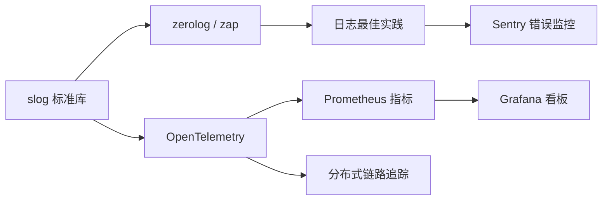
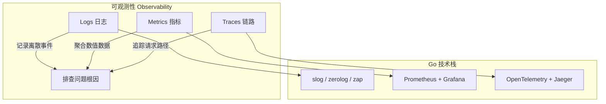

# 日志与可观测性

> **前置依赖：** [Go 基础语法](/1-go-core/1.1-go-basics/) | [网络编程与 Web 框架](/2-web-data/2.1-web-framework/)

## 模块概述

可观测性（Observability）是现代分布式系统的核心能力，由三大支柱组成：**日志（Logs）**、**指标（Metrics）**、**链路追踪（Traces）**。Go 在可观测性领域有天然优势——Prometheus 和 OpenTelemetry Collector 本身就是用 Go 编写的，Go 1.21 引入的 `log/slog` 标准库更是将结构化日志提升为语言级别的一等公民。

本模块系统讲解 Go 项目中的日志管理（slog/zerolog/zap）、错误监控（Sentry）、指标采集（Prometheus）、链路追踪（OpenTelemetry/Jaeger）和可视化看板（Grafana），覆盖从本地开发到生产环境的完整可观测性方案。

## 知识点索引

### 日志管理

| 序号 | 知识点 | 难度 | 面试频率 | 预计时间 |
|------|--------|------|---------|---------|
| 01 | [Go 标准库 slog](./01-slog.md) | ⭐⭐ | 🔥🔥🔥 | 40min |
| 02 | [zerolog 高性能日志](./02-zerolog.md) | ⭐⭐ | 🔥🔥🔥 | 40min |
| 03 | [zap 日志库](./03-zap.md) | ⭐⭐ | 🔥🔥 | 35min |
| 04 | [日志库选型对比](./04-log-comparison.md) | ⭐⭐⭐ | 🔥🔥🔥 | 30min |
| 05 | [日志最佳实践](./05-log-best-practices.md) | ⭐⭐⭐ | 🔥🔥🔥 | 45min |

### 错误监控

| 序号 | 知识点 | 难度 | 面试频率 | 预计时间 |
|------|--------|------|---------|---------|
| 06 | [Sentry Go SDK](./06-sentry.md) | ⭐⭐ | 🔥🔥 | 40min |

### 可观测性三大支柱

| 序号 | 知识点 | 难度 | 面试频率 | 预计时间 |
|------|--------|------|---------|---------|
| 07 | [OpenTelemetry](./07-otel.md) | ⭐⭐⭐ | 🔥🔥🔥 | 50min |
| 08 | [Prometheus 指标采集](./08-prometheus.md) | ⭐⭐⭐ | 🔥🔥🔥 | 45min |
| 09 | [Grafana 看板配置](./09-grafana.md) | ⭐⭐ | 🔥🔥 | 35min |
| 10 | [分布式链路追踪](./10-tracing.md) | ⭐⭐⭐ | 🔥🔥🔥 | 45min |

### 面试指南

| 📝 | [面试指南](./interview.md) | - | 🔥🔥🔥 | 60min |
|------|--------|------|---------|---------|

## 代码示例

> 💻 完整可运行代码：[code-examples/02-web-data/observability/](https://github.com/skyhe58/guide-go/tree/main/code-examples/02-web-data/observability/)

| 示例目录 | 对应知识点 | 运行方式 | Demo 模式 |
|---------|-----------|---------|----------|
| `zerolog-gin/` | zerolog + Gin 集成（请求日志/错误日志/链路 ID） | `go run ./zerolog-gin/` | 纯 Go |
| `slog-custom/` | slog 自定义 Handler 示例 | `go run ./slog-custom/` | 纯 Go |
| `sentry-gin/` | Sentry + Gin 集成（错误上报/Panic Recovery） | `go run ./sentry-gin/` | 纯 Go |
| `prometheus/` | Prometheus 指标暴露 + 采集演示 | `go run ./prometheus/` | 纯 Go |
| `otel-tracing/` | OpenTelemetry 链路追踪示例 | `go run ./otel-tracing/` | 纯 Go |

## 学习路径建议

1. **先学 slog**：理解 Go 标准库的结构化日志方案，这是基础
2. **再学 zerolog/zap**：掌握生产级日志库的使用和性能优势
3. **然后学日志最佳实践**：结构化规范、请求 ID 链路、敏感信息脱敏
4. **接着学 Sentry**：掌握错误监控和 Panic Recovery
5. **最后学 OTel + Prometheus + Grafana**：构建完整的可观测性体系

## 可观测性三大支柱

