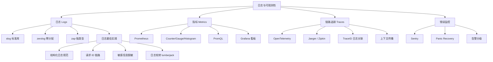

# 日志与可观测性面试指南

## 面试知识图谱

## 高频面试题

### Q1: 结构化日志和非结构化日志的区别？

**难度**：⭐⭐ | **频率**：🔥🔥🔥

**答题思路**：

1. 格式差异：纯文本 vs JSON 键值对
2. 解析方式：正则匹配 vs 直接解析
3. 聚合能力：难以聚合 vs 按字段聚合
4. 工具支持：grep vs ELK/Loki

**标准答案**：

非结构化日志是纯文本格式（如 `"user alice login failed: bad password"`），需要正则表达式解析，难以按字段聚合和告警。结构化日志以键值对形式输出（如 `{"level":"ERROR","msg":"login failed","user":"alice","reason":"bad_password"}`），可以被日志采集工具（ELK/Loki）直接解析，支持按字段精确查询、聚合统计和告警。Go 1.21 引入的 slog 标准库原生支持结构化日志，生产环境应始终使用结构化日志。

**深入追问**：

- Go 生态有哪些结构化日志库？各自特点？
- 结构化日志的性能开销如何？

### Q2: 可观测性的三大支柱是什么？它们之间如何协作？

**难度**：⭐⭐⭐ | **频率**：🔥🔥🔥

**答题思路**：

1. 三大支柱：Logs、Metrics、Traces
2. 各自的作用和特点
3. 通过 TraceID 关联
4. 排查问题的典型流程

**标准答案**：

可观测性三大支柱是 Logs（日志）、Metrics（指标）和 Traces（链路追踪）。Metrics 提供系统的宏观健康状态（如请求速率、错误率、延迟分布），适合告警和趋势分析；Traces 记录请求在分布式系统中的完整调用路径，适合定位性能瓶颈和故障服务；Logs 记录详细的离散事件信息，适合排查具体的错误根因。三者通过 TraceID 关联：Metrics 告警发现异常 → Traces 定位问题服务和操作 → Logs 查看详细错误信息。OpenTelemetry 统一了三大信号的采集标准。

**深入追问**：

- OpenTelemetry 是什么？解决了什么问题？
- 如何在日志中关联 TraceID？

### Q3: zerolog、zap、slog 如何选型？

**难度**：⭐⭐⭐ | **频率**：🔥🔥🔥

**答题思路**：

1. 性能对比：zerolog > zap > slog > logrus
2. API 风格：链式 vs 强类型 vs 键值对
3. 生态和维护状态
4. 推荐方案

**标准答案**：

新项目推荐 slog（Go 标准库，零依赖，生态兼容性最好，未来可能成为标准接口）；高性能场景推荐 zerolog（零内存分配，吞吐量最高，链式 API）；大厂技术栈推荐 zap（Uber 开源，成熟稳定，强类型字段）。logrus 已进入维护模式，不推荐新项目使用。性能排序：zerolog ≈ zap > slog >> logrus。选型时还需考虑团队习惯和现有技术栈。

**深入追问**：

- zerolog 为什么能做到零分配？
- zap 的 Logger 和 SugaredLogger 有什么区别？

### Q4: 如何优化日志性能？

**难度**：⭐⭐⭐ | **频率**：🔥🔥

**答题思路**：

1. 选择高性能日志库（zerolog/zap）
2. 合理设置日志级别
3. 异步写入
4. 日志采样
5. 避免热路径打日志

**标准答案**：

日志性能优化从五个方面入手：一是选择零分配的日志库（zerolog 或 zap Logger），减少 GC 压力；二是生产环境关闭 DEBUG 级别，减少日志量；三是使用异步写入（缓冲 + 批量 flush），避免 I/O 阻塞业务逻辑；四是对高频日志进行采样（如 zap 内置的采样功能），降低日志量；五是避免在热路径（如循环内部）打日志，改为汇总后打一条。此外，使用 `slog.LogValuer` 接口可以延迟计算昂贵的日志字段值。

**深入追问**：

- 异步写入日志如何保证不丢失？
- 日志采样的策略有哪些？

### Q5: Prometheus 的 Counter、Gauge、Histogram 分别适用什么场景？

**难度**：⭐⭐⭐ | **频率**：🔥🔥🔥

**答题思路**：

1. Counter：只增不减，计数类
2. Gauge：可增可减，状态类
3. Histogram：分布统计，延迟类
4. 各自的 PromQL 用法

**标准答案**：

Counter 是只增不减的计数器，适合统计请求总数、错误总数等累计值，通过 `rate()` 计算速率。Gauge 是可增可减的仪表盘，适合表示当前状态值，如活跃连接数、goroutine 数量、内存使用量。Histogram 将观测值分配到预定义的桶中，适合统计延迟分布，通过 `histogram_quantile()` 计算分位数（P50/P99）。一般推荐 Histogram 而非 Summary，因为 Histogram 支持服务端聚合。

**深入追问**：

- 如何避免 Prometheus Label 基数爆炸？
- Histogram 和 Summary 的区别？

### Q6: 如何实现请求 ID 链路追踪？

**难度**：⭐⭐ | **频率**：🔥🔥🔥

**答题思路**：

1. 在入口生成 Request ID（UUID）
2. 通过 context 在服务内传递
3. 通过 HTTP Header 在服务间传递
4. 在每条日志中记录 Request ID

**标准答案**：

请求 ID 链路追踪的实现分四步：一是在 API 网关或入口中间件生成全局唯一的 Request ID（UUID），存入 HTTP Header（如 `X-Request-ID`）和 context；二是在服务内部通过 context 传递 Request ID，使用 `slog.With()` 或 `zerolog.With()` 创建带 Request ID 的子 Logger；三是跨服务调用时将 Request ID 放入 HTTP Header 或 gRPC Metadata 传递给下游；四是在日志系统中搜索 `request_id=xxx` 即可串联一次请求的所有日志。如果使用 OpenTelemetry，TraceID 可以替代自定义 Request ID。

**深入追问**：

- Request ID 和 TraceID 的关系？
- 如何在 gRPC 中传递 Request ID？

## 面试重点总结

| 知识点 | 重要程度 | 常见追问方向 |
|--------|---------|------------|
| 结构化日志 vs 非结构化 | ⭐⭐⭐⭐⭐ | 为什么需要结构化、JSON 格式优势 |
| 日志库选型 | ⭐⭐⭐⭐⭐ | zerolog/zap/slog 对比、性能差异 |
| 可观测性三大支柱 | ⭐⭐⭐⭐⭐ | Logs/Metrics/Traces 协作方式 |
| Prometheus 指标类型 | ⭐⭐⭐⭐ | Counter/Gauge/Histogram 适用场景 |
| 请求 ID 链路 | ⭐⭐⭐⭐ | 实现方式、跨服务传递 |
| 日志性能优化 | ⭐⭐⭐ | 零分配、异步写入、采样 |
| Sentry 错误监控 | ⭐⭐⭐ | 与日志的区别、告警策略 |
| OpenTelemetry | ⭐⭐⭐ | 三大信号统一、Collector 作用 |
