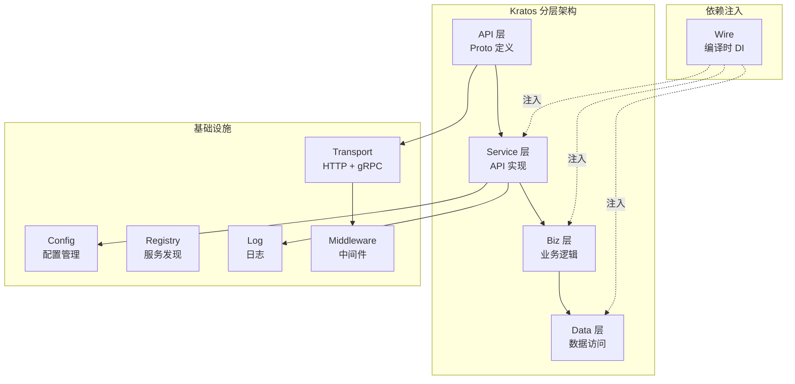
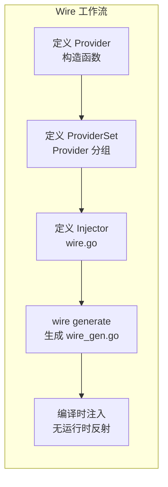
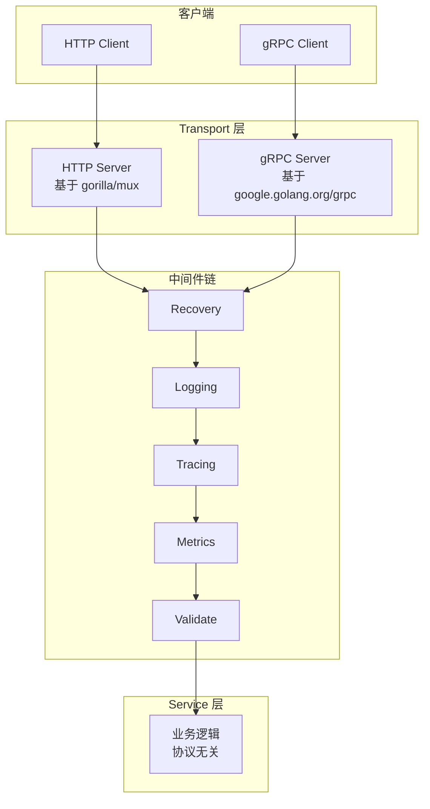
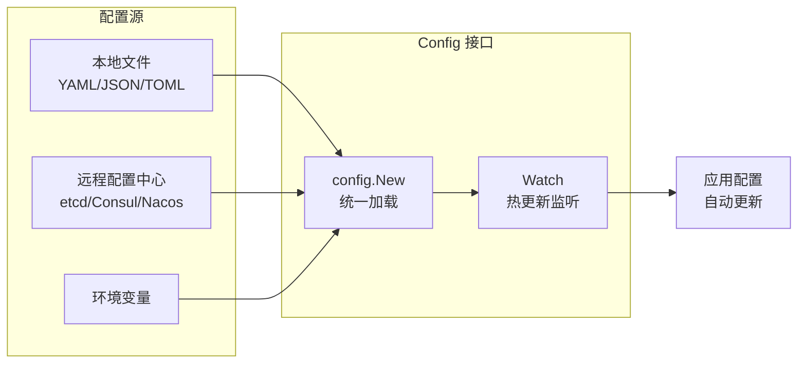

# Kratos 微服务框架

## 概念说明

Kratos 是 B 站（Bilibili）开源的 Go 微服务框架，以古希腊神话中的战神命名。它不是一个"大而全"的框架，而是一套**微服务解决方案**——提供规范化的项目结构、插件化的组件体系和清晰的分层架构，让团队在统一规范下高效协作。

**Kratos 的核心设计哲学：**

| 设计原则 | 说明 |
|---------|------|
| **API 驱动** | 以 Protocol Buffers 定义 API，自动生成 HTTP/gRPC 双协议代码 |
| **插件化** | Transport、Registry、Config、Log 等组件均为接口，可自由替换实现 |
| **Wire 依赖注入** | 使用 Google Wire 编译时依赖注入，避免运行时反射开销 |
| **规范化** | 统一的项目结构、错误处理、日志格式，降低团队协作成本 |

**Kratos 在国内的使用情况：**
- B 站：Kratos 的诞生地，内部大规模使用
- 字节跳动：部分团队采用 Kratos 架构思想
- 滴滴、美团：部分微服务项目使用

## 核心原理

### Kratos 项目结构

Kratos 推荐的项目布局遵循 DDD（领域驱动设计）思想：

```
myservice/
├── api/                    # API 定义（.proto 文件）
│   └── helloworld/
│       └── v1/
│           ├── helloworld.proto
│           └── helloworld_grpc.pb.go  # 自动生成
├── cmd/                    # 应用入口
│   └── myservice/
│       ├── main.go         # 启动入口
│       ├── wire.go         # Wire 依赖注入声明
│       └── wire_gen.go     # Wire 自动生成
├── configs/                # 配置文件
│   └── config.yaml
├── internal/               # 内部实现（不对外暴露）
│   ├── biz/                # 业务逻辑层（Domain）
│   │   ├── biz.go
│   │   └── greeter.go
│   ├── conf/               # 配置结构定义
│   │   └── conf.proto
│   ├── data/               # 数据访问层（Repository 实现）
│   │   ├── data.go
│   │   └── greeter.go
│   ├── server/             # 服务层（HTTP/gRPC 服务器）
│   │   ├── grpc.go
│   │   └── http.go
│   └── service/            # 服务实现层（API 实现）
│       └── greeter.go
├── third_party/            # 第三方 proto 文件
├── go.mod
├── go.sum
└── Makefile
```

### 分层架构



### Wire 依赖注入

Wire 是 Google 开源的编译时依赖注入工具，Kratos 将其作为核心依赖管理方案：



**Wire 的核心概念：**

| 概念 | 说明 | 示例 |
|------|------|------|
| **Provider** | 构造函数，返回一个依赖实例 | `func NewUserRepo(db *gorm.DB) *UserRepo` |
| **ProviderSet** | Provider 的分组集合 | `wire.NewSet(NewUserRepo, NewUserService)` |
| **Injector** | 入口函数，Wire 根据它生成依赖注入代码 | `func initApp() (*App, func(), error)` |

### Transport 层（双协议支持）

Kratos 的 Transport 层同时支持 HTTP 和 gRPC 两种协议，通过统一的接口抽象实现协议无关的业务逻辑：



### Middleware 中间件

Kratos 中间件采用洋葱模型（Onion Model），请求从外到内穿过中间件链，响应从内到外返回：

```go
// Kratos 中间件签名
type Middleware func(Handler) Handler
type Handler func(ctx context.Context, req interface{}) (interface{}, error)
```

**内置中间件：**

| 中间件 | 功能 | 说明 |
|--------|------|------|
| `recovery` | Panic 恢复 | 捕获 panic，返回 500 错误 |
| `logging` | 请求日志 | 记录请求方法、路径、耗时 |
| `tracing` | 链路追踪 | OpenTelemetry 集成 |
| `metrics` | 指标采集 | Prometheus 指标 |
| `validate` | 参数校验 | Proto 消息校验 |
| `metadata` | 元数据传递 | 跨服务元数据传播 |
| `ratelimit` | 限流 | 自适应限流（BBR 算法） |
| `circuitbreaker` | 熔断 | 基于 Google SRE 的熔断策略 |

### 错误处理

Kratos 定义了统一的错误模型，基于 gRPC Status 扩展：

```go
// Kratos 错误结构
type Error struct {
    Status   // gRPC Status
    Code     int32             // 业务错误码
    Reason   string            // 错误原因（枚举值）
    Message  string            // 用户可读的错误信息
    Metadata map[string]string // 附加元数据
}
```

错误码设计遵循 HTTP 状态码语义：

| 错误码范围 | 含义 | 示例 |
|-----------|------|------|
| 200 | 成功 | OK |
| 400 | 客户端错误 | 参数校验失败 |
| 401 | 未认证 | Token 过期 |
| 403 | 无权限 | 角色权限不足 |
| 404 | 资源不存在 | 用户不存在 |
| 500 | 服务端错误 | 数据库连接失败 |

### 配置管理

Kratos 的配置管理支持多种数据源和热更新：



## 标准库方案

Kratos 本身就大量使用 Go 标准库：
- `net/http`：HTTP Transport 底层
- `context`：请求上下文传递
- `errors`：错误处理基础

不使用框架时，可以用标准库 `net/http` + `google.golang.org/grpc` 实现类似的微服务架构，但需要自行处理服务发现、配置管理、中间件链等基础设施。

## 第三方库方案

Kratos 的插件生态：

| 组件 | 可选实现 |
|------|---------|
| 注册中心 | etcd / Consul / Nacos / ZooKeeper |
| 配置中心 | 本地文件 / etcd / Consul / Nacos / Apollo |
| 日志 | zap / zerolog / logrus / slog |
| 链路追踪 | Jaeger / Zipkin / OpenTelemetry |
| 指标 | Prometheus / DataDog |
| 消息队列 | Kafka / RabbitMQ / NATS |

## 代码示例

> 💻 完整可运行代码：[code-examples/03-microservice/microservice/kratos-example/](https://github.com/your-repo/code-examples/03-microservice/microservice/kratos-example/)
> 🏷️ Demo 模式：Part A（纯 Go 模拟，直接运行）

## 常见面试题

### Q1: Kratos 的分层架构是怎样的？各层职责是什么？

**难度**：⭐⭐⭐ | **频率**：🔥🔥🔥

**答题思路**：

1. 四层架构：API → Service → Biz → Data
2. 各层职责和依赖方向
3. 与 DDD 的对应关系

**标准答案**：

Kratos 采用四层架构：**API 层**（Proto 定义，自动生成 HTTP/gRPC 代码）→ **Service 层**（API 实现，参数转换和校验）→ **Biz 层**（核心业务逻辑，定义 Repository 接口）→ **Data 层**（数据访问，实现 Repository 接口）。依赖方向从上到下，Biz 层通过接口依赖 Data 层（依赖倒置），便于单元测试和替换数据源。这种分层对应 DDD 中的 Application → Domain → Infrastructure。

**深入追问**：

- Wire 依赖注入在 Kratos 中如何工作？
- Kratos 的 Transport 层如何实现 HTTP/gRPC 双协议？

### Q2: Wire 依赖注入和运行时依赖注入（如 dig/fx）有什么区别？

**难度**：⭐⭐⭐ | **频率**：🔥🔥🔥

**答题思路**：

1. 编译时 vs 运行时
2. 类型安全 vs 反射
3. 性能差异

**标准答案**：

Wire 是编译时依赖注入，通过代码生成在编译阶段完成依赖解析，生成的代码是普通的 Go 函数调用，无运行时反射开销，类型错误在编译时就能发现。dig/fx 是运行时依赖注入，通过反射在程序启动时解析依赖关系，灵活性更高但有运行时开销，类型错误只能在运行时发现。Kratos 选择 Wire 是因为 Go 社区推崇"显式优于隐式"，编译时注入更符合 Go 哲学。

**深入追问**：

- Wire 的 ProviderSet 和 Injector 分别是什么？
- 如何在不使用 Wire 的情况下手动实现依赖注入？

## 常见陷阱

1. **Proto 文件管理混乱**：Kratos 强依赖 Proto 定义，团队需要统一 Proto 文件的目录结构和版本管理规范，否则多人协作时容易冲突
2. **Wire 生成代码未提交**：`wire_gen.go` 是自动生成的，但应该提交到 Git 仓库，否则其他开发者 clone 后无法直接编译
3. **中间件顺序错误**：Recovery 中间件必须放在最外层，否则 panic 可能无法被捕获
4. **错误码设计不规范**：业务错误码应该在 Proto 中统一定义，避免各服务自行定义导致冲突

## 参考资料

- [Kratos 官方文档](https://go-kratos.dev/)
- [Kratos GitHub](https://github.com/go-kratos/kratos)
- [Google Wire](https://github.com/google/wire)
- [Protocol Buffers](https://protobuf.dev/)
