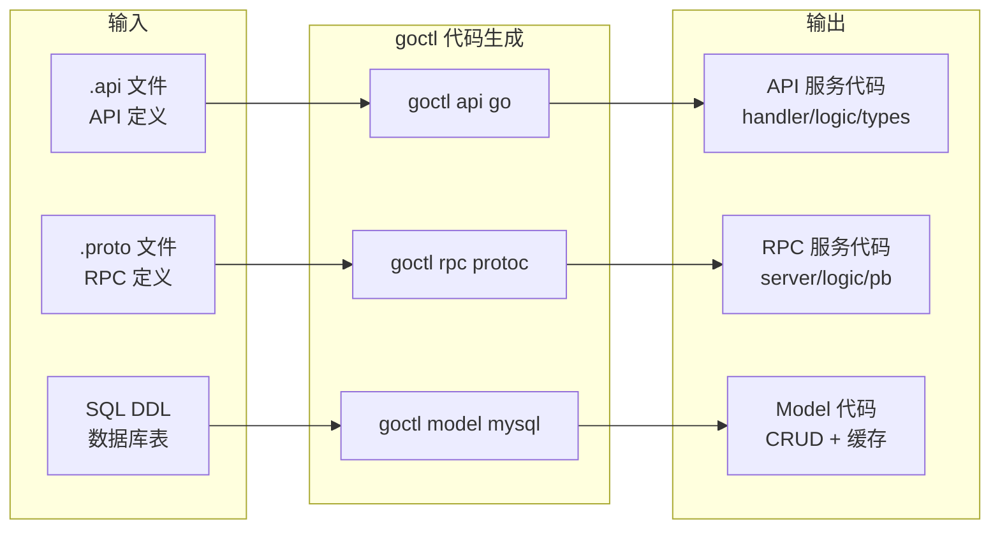
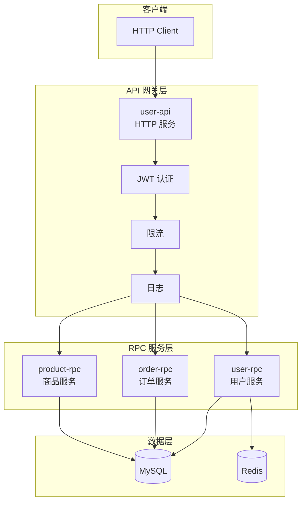
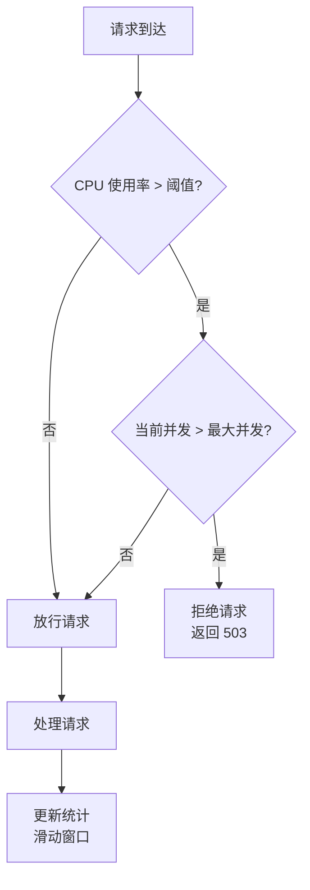
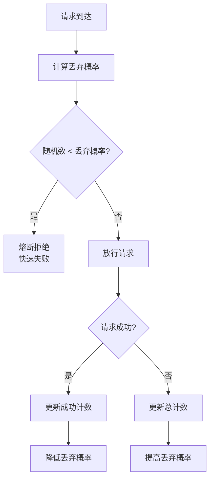

# Go-Zero 微服务框架

## 概念说明

Go-Zero 是好未来（TAL）开源的 Go 微服务框架，核心理念是**"开箱即用、代码生成、内置服务治理"**。与 Kratos 的"规范化 + 插件化"不同，Go-Zero 追求的是**极致的开发效率**——通过 `goctl` 代码生成工具，从 API 定义文件一键生成完整的服务代码骨架，开发者只需填充业务逻辑。

**Go-Zero 的核心设计哲学：**

| 设计原则 | 说明 |
|---------|------|
| **代码生成** | goctl 工具从 .api/.proto 文件生成完整服务代码，减少样板代码 |
| **开箱即用** | 内置限流、熔断、负载均衡、缓存、监控等服务治理能力 |
| **高性能** | 自研的高性能 HTTP/RPC 框架，内置连接池和缓存优化 |
| **低门槛** | 简单的 DSL 定义 API，学习曲线平缓 |

**Go-Zero 在国内的使用情况：**
- 好未来：Go-Zero 的诞生地，内部大规模使用
- 晓黑板、作业帮等教育公司
- 大量中小型创业公司：Go-Zero 的低门槛和代码生成特性深受中小团队欢迎

## 核心原理

### goctl 代码生成

goctl 是 Go-Zero 的核心工具，支持从多种定义文件生成代码：



### Go-Zero API 定义语法

Go-Zero 使用自定义的 `.api` DSL 定义 HTTP API：

```
// user.api — Go-Zero API 定义文件
type (
    LoginReq {
        Username string `json:"username"`
        Password string `json:"password"`
    }
    LoginResp {
        Token string `json:"token"`
    }
    UserInfo {
        Id       int64  `json:"id"`
        Username string `json:"username"`
        Nickname string `json:"nickname"`
    }
)

@server(
    prefix: /api/v1
    group: user
    middleware: AuthMiddleware
)
service user-api {
    @handler Login
    post /user/login (LoginReq) returns (LoginResp)
    
    @handler GetUserInfo
    get /user/info returns (UserInfo)
}
```

### 项目结构

Go-Zero 生成的项目结构：

```
user-service/
├── user-api/                   # API 网关服务
│   ├── etc/
│   │   └── user-api.yaml       # 配置文件
│   ├── internal/
│   │   ├── config/
│   │   │   └── config.go       # 配置结构
│   │   ├── handler/            # HTTP Handler（自动生成）
│   │   │   ├── loginhandler.go
│   │   │   └── getuserinfohandler.go
│   │   ├── logic/              # 业务逻辑（开发者填充）
│   │   │   ├── loginlogic.go
│   │   │   └── getuserinfologic.go
│   │   ├── middleware/         # 自定义中间件
│   │   │   └── authmiddleware.go
│   │   ├── svc/                # 服务上下文（依赖注入）
│   │   │   └── servicecontext.go
│   │   └── types/              # 请求/响应类型（自动生成）
│   │       └── types.go
│   └── user.go                 # 入口文件
│
├── user-rpc/                   # RPC 服务
│   ├── etc/
│   │   └── user-rpc.yaml
│   ├── internal/
│   │   ├── config/
│   │   ├── logic/              # RPC 业务逻辑
│   │   ├── server/             # RPC Server 实现
│   │   └── svc/
│   ├── pb/                     # Proto 生成的代码
│   │   └── user.pb.go
│   ├── user.proto
│   └── userrpc.go
│
└── model/                      # 数据模型
    ├── usermodel.go            # goctl model 生成
    └── usermodel_gen.go
```

### API 网关 + RPC 服务架构



### 内置中间件与服务治理

Go-Zero 内置了丰富的服务治理能力，无需额外引入第三方库：

| 能力 | 实现方式 | 说明 |
|------|---------|------|
| **限流** | 令牌桶 + 自适应限流 | 基于 CPU 使用率的自适应限流 |
| **熔断** | Google SRE 算法 | 基于成功率的自适应熔断 |
| **负载均衡** | P2C（Power of Two Choices） | 基于 EWMA 延迟的智能负载均衡 |
| **超时控制** | 级联超时 | 上游超时自动传递到下游 |
| **缓存** | 内置缓存层 | Model 层自动生成缓存逻辑 |
| **链路追踪** | OpenTelemetry | 内置 Span 传播 |
| **指标监控** | Prometheus | 自动暴露 HTTP/RPC 指标 |
| **服务发现** | etcd | 内置 etcd 注册与发现 |

### 自适应限流原理



### 自适应熔断原理（Google SRE）



丢弃概率公式：`max(0, (requests - K * accepts) / (requests + 1))`

其中 K 是倍率参数（默认 1.5），requests 是总请求数，accepts 是成功请求数。

## 标准库方案

不使用 Go-Zero 时，可以用标准库实现类似功能：
- `net/http`：HTTP 服务
- `google.golang.org/grpc`：RPC 服务
- `golang.org/x/time/rate`：限流
- 自实现熔断器

但需要大量的样板代码和基础设施搭建工作。

## 第三方库方案

Go-Zero 的生态相对封闭，大部分能力内置：

| 组件 | Go-Zero 内置 | 可替换方案 |
|------|-------------|-----------|
| HTTP 框架 | 自研 | Gin（需适配） |
| RPC 框架 | 基于 gRPC | — |
| 注册中心 | etcd | Consul / Nacos |
| 缓存 | 内置缓存层 | go-redis |
| ORM | 内置 sqlx 封装 | GORM |
| 日志 | 内置 logx | zap / zerolog |

## 代码示例

> 💻 完整可运行代码：[code-examples/03-microservice/microservice/go-zero-example/](https://github.com/skyhe58/guide-go/tree/main/code-examples/03-microservice/microservice/go-zero-example/)
> 🏷️ Demo 模式：Part A（纯 Go 模拟，直接运行）

## 常见面试题

### Q1: Go-Zero 的 goctl 代码生成工具有什么优势？

**难度**：⭐⭐⭐ | **频率**：🔥🔥🔥

**答题思路**：

1. 从 API 定义到完整服务代码的一键生成
2. 减少样板代码，开发者只需关注业务逻辑
3. 统一代码风格，降低团队协作成本

**标准答案**：

goctl 是 Go-Zero 的代码生成工具，支持从 `.api` 文件生成 HTTP 服务代码（handler/logic/types），从 `.proto` 文件生成 RPC 服务代码，从 SQL DDL 生成带缓存的 Model 代码。核心优势是：1）减少 80% 以上的样板代码，开发者只需在 logic 层填充业务逻辑；2）生成的代码自带服务治理能力（限流/熔断/链路追踪）；3）统一的代码结构降低团队协作成本。缺点是生成的代码灵活性较低，定制化需求需要修改生成模板。

**深入追问**：

- goctl 生成的代码如何自定义？
- Go-Zero 的 .api 文件和 Proto 文件有什么区别？

### Q2: Go-Zero 的自适应熔断是如何实现的？

**难度**：⭐⭐⭐ | **频率**：🔥🔥🔥

**答题思路**：

1. 基于 Google SRE 的客户端熔断算法
2. 丢弃概率公式
3. 与传统熔断器（Hystrix）的区别

**标准答案**：

Go-Zero 的熔断器基于 Google SRE 的客户端节流算法，核心公式为 `max(0, (requests - K * accepts) / (requests + 1))`，其中 K 默认为 1.5。当成功率下降时，丢弃概率自动升高；当服务恢复时，丢弃概率自动降低。与传统的 Hystrix 状态机（Closed → Open → Half-Open）不同，Go-Zero 的熔断是概率性的、渐进式的，不存在"全开"或"全关"的突变，对流量更友好。

**深入追问**：

- K 值为什么默认是 1.5？调大调小有什么影响？
- Go-Zero 的限流和熔断如何配合使用？

## 常见陷阱

1. **过度依赖代码生成**：goctl 生成的代码结构固定，复杂业务场景可能需要手动调整，不要盲目依赖生成
2. **缓存一致性问题**：goctl model 生成的缓存逻辑是基于主键的简单缓存，复杂查询场景需要自行处理缓存一致性
3. **RPC 服务粒度过细**：不要为每个数据库表创建一个 RPC 服务，应该按业务领域划分
4. **配置文件管理**：Go-Zero 的配置文件是 YAML 格式，多环境配置需要自行管理

## 参考资料

- [Go-Zero 官方文档](https://go-zero.dev/)
- [Go-Zero GitHub](https://github.com/zeromicro/go-zero)
- [goctl 工具文档](https://go-zero.dev/docs/tasks/cli/overview)
- [Google SRE 客户端节流](https://sre.google/sre-book/handling-overload/)
