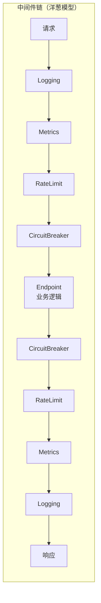
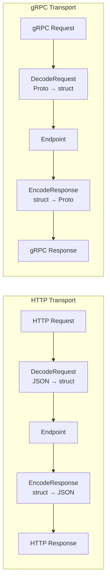
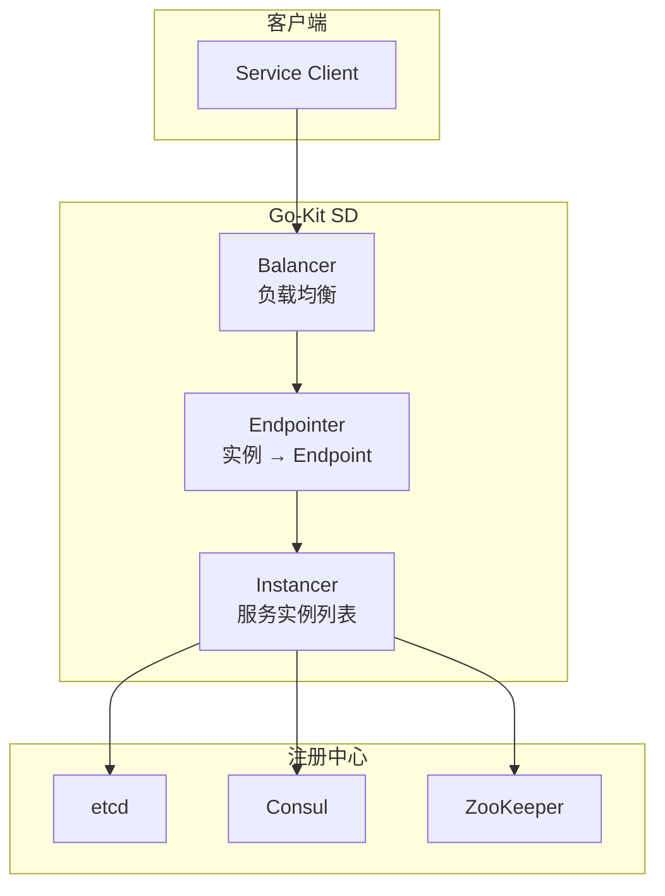

# Go-Kit 微服务框架

## 概念说明

Go-Kit 是 Go 微服务生态中最早的框架之一，由 Peter Bourgon 创建，设计哲学是**"工具集而非框架"**——它不规定项目结构，不提供代码生成，而是提供一组可组合的抽象和工具，让开发者自由搭建微服务架构。

**Go-Kit 的核心设计哲学：**

| 设计原则 | 说明 |
|---------|------|
| **三层架构** | Service → Endpoint → Transport，职责清晰分离 |
| **中间件组合** | 通过装饰器模式层层包装，灵活组合功能 |
| **协议无关** | 业务逻辑与传输协议完全解耦 |
| **标准库友好** | 尽量使用 Go 标准库接口，减少框架锁定 |

**Go-Kit 的使用场景：**
- 海外公司：Go-Kit 在海外 Go 社区有较高知名度
- 需要高度定制化的项目：Go-Kit 的灵活性适合有特殊需求的团队
- 学习微服务架构思想：Go-Kit 的三层架构是理解微服务设计的经典教材

## 核心原理

### 三层架构

Go-Kit 的核心是 **Service → Endpoint → Transport** 三层架构：

```mermaid
graph TB
    subgraph "Transport 层（传输）"
        T1[HTTP Handler]
        T2[gRPC Handler]
        T3[Thrift Handler]
    end
    
    subgraph "Endpoint 层（端点）"
        E[Endpoint<br/>func(ctx, request) → response, error]
        MW1[Logging 中间件]
        MW2[Metrics 中间件]
        MW3[RateLimit 中间件]
        MW4[CircuitBreaker 中间件]
    end
    
    subgraph "Service 层（业务）"
        S[Service Interface<br/>纯业务逻辑]
    end
    
    T1 --> E
    T2 --> E
    T3 --> E
    MW1 --> MW2 --> MW3 --> MW4 --> E
    E --> S
```

**各层职责：**

| 层 | 职责 | Go 类型 |
|----|------|---------|
| **Service** | 纯业务逻辑，定义为 Go 接口 | `interface` |
| **Endpoint** | 将 Service 方法包装为统一的函数签名，便于添加中间件 | `func(ctx context.Context, request interface{}) (response interface{}, err error)` |
| **Transport** | 处理 HTTP/gRPC/Thrift 等协议的编解码 | `http.Handler` / `grpc.Server` |

### Endpoint 详解

Endpoint 是 Go-Kit 的核心抽象，它将每个 Service 方法包装为统一的函数签名：

```go
// Go-Kit Endpoint 定义
type Endpoint func(ctx context.Context, request interface{}) (response interface{}, err error)

// 中间件定义
type Middleware func(Endpoint) Endpoint
```

**Endpoint 的作用：**
1. 统一函数签名，使中间件可以通用地应用于所有服务方法
2. 解耦业务逻辑和横切关注点（日志、监控、限流等）
3. 支持装饰器模式的中间件链

### 中间件组合

Go-Kit 的中间件采用装饰器模式，层层包装 Endpoint：



```go
// 中间件组合示例
endpoint := makeGreeterEndpoint(svc)
endpoint = loggingMiddleware(logger)(endpoint)
endpoint = metricsMiddleware(counter, histogram)(endpoint)
endpoint = rateLimitMiddleware(limiter)(endpoint)
endpoint = circuitBreakerMiddleware(breaker)(endpoint)
```

### Transport 编解码

Transport 层负责将 HTTP/gRPC 请求解码为 Endpoint 的 request 参数，将 Endpoint 的 response 编码为 HTTP/gRPC 响应：



### 服务发现与负载均衡

Go-Kit 提供了服务发现和负载均衡的抽象：



## 标准库方案

Go-Kit 本身就非常贴近标准库：
- Service 层是纯 Go 接口
- Transport 层使用 `net/http` 和 `google.golang.org/grpc`
- 中间件模式是标准的装饰器模式

不使用 Go-Kit 时，可以直接用标准库实现相同的三层架构，Go-Kit 主要提供了 Endpoint 抽象和一些开箱即用的中间件。

## 第三方库方案

Go-Kit 的组件生态：

| 组件 | 可选实现 |
|------|---------|
| 服务发现 | etcd / Consul / ZooKeeper / Eureka |
| 负载均衡 | Round Robin / Random / Least Connections |
| 限流 | golang.org/x/time/rate / uber/ratelimit |
| 熔断 | sony/gobreaker / afex/hystrix-go |
| 日志 | go-kit/log / zap / zerolog |
| 指标 | Prometheus / StatsD / InfluxDB |
| 链路追踪 | OpenTelemetry / Zipkin / Jaeger |

## 代码示例

> 💻 完整可运行代码：[code-examples/03-microservice/microservice/](https://github.com/your-repo/code-examples/03-microservice/microservice/)
> 🏷️ Demo 模式：Part A（纯 Go 模拟，直接运行）

## 常见面试题

### Q1: Go-Kit 的三层架构是什么？为什么要这样设计？

**难度**：⭐⭐⭐ | **频率**：🔥🔥

**答题思路**：

1. Service → Endpoint → Transport 三层
2. 各层职责和解耦目的
3. 中间件如何在 Endpoint 层统一应用

**标准答案**：

Go-Kit 采用 Service → Endpoint → Transport 三层架构。Service 层是纯业务逻辑接口，不关心传输协议；Endpoint 层将 Service 方法包装为统一的 `func(ctx, request) (response, error)` 签名，使日志、监控、限流等中间件可以通用地应用于所有方法；Transport 层处理 HTTP/gRPC 等协议的编解码。这种设计实现了业务逻辑与传输协议的完全解耦——同一个 Service 可以同时暴露 HTTP 和 gRPC 接口，中间件只需编写一次就能应用于所有协议。

**深入追问**：

- Endpoint 和 HTTP Handler 有什么区别？
- Go-Kit 的中间件和 Gin 的中间件有什么区别？

### Q2: Go-Kit 和 Kratos/Go-Zero 相比有什么优劣？

**难度**：⭐⭐⭐ | **频率**：🔥🔥

**答题思路**：

1. 设计哲学差异：工具集 vs 框架
2. 开发效率 vs 灵活性
3. 适用场景

**标准答案**：

Go-Kit 是"工具集"，提供可组合的抽象但不规定项目结构，灵活性最高但样板代码多；Kratos 是"规范化框架"，提供标准项目结构和插件体系，适合中大型团队统一规范；Go-Zero 是"效率框架"，通过代码生成最大化开发效率，适合快速迭代。Go-Kit 适合需要高度定制化的项目和学习微服务架构思想；Kratos 适合追求规范化的中大型团队；Go-Zero 适合追求开发效率的中小团队。

**深入追问**：

- 如果让你选择，你会在什么场景下使用 Go-Kit？
- Go-Kit 的 Endpoint 抽象和 Kratos 的 Middleware 有什么异同？

## 常见陷阱

1. **样板代码过多**：Go-Kit 不提供代码生成，每个服务方法都需要手动编写 Endpoint 和 Transport 代码，项目规模大时维护成本高
2. **过度抽象**：Go-Kit 的三层架构对于简单服务来说可能过度设计，小项目不建议使用
3. **社区活跃度下降**：Go-Kit 的维护频率不如 Kratos 和 Go-Zero，部分组件可能滞后于 Go 生态发展
4. **学习曲线陡峭**：虽然概念简单，但将三层架构正确组合起来需要一定经验

## 参考资料

- [Go-Kit 官方文档](https://gokit.io/)
- [Go-Kit GitHub](https://github.com/go-kit/kit)
- [Go-Kit 示例项目](https://github.com/go-kit/examples)
- [Peter Bourgon: Go + Microservices](https://peter.bourgon.org/go-for-industrial-programming/)
