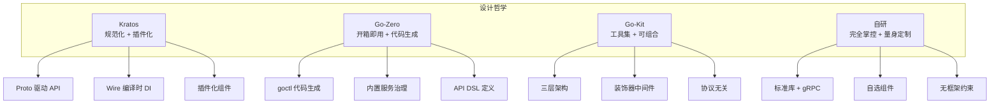

# 微服务框架选型对比

## 概念说明

Go 微服务生态中，Kratos、Go-Zero、Go-Kit 是三个最具代表性的框架，此外还有"自研"这一选项。四种方案各有优劣，选型需要综合考虑团队规模、项目复杂度、开发效率、可维护性等因素。

本文从多个维度对四种方案进行系统对比，帮助开发者做出理性的技术决策。

## 核心原理

### 设计哲学对比



### 全维度对比表

| 维度 | Kratos | Go-Zero | Go-Kit | 自研 |
|------|--------|---------|--------|------|
| **开源方** | B 站 | 好未来 | Peter Bourgon | — |
| **GitHub Stars** | 23k+ | 29k+ | 26k+ | — |
| **设计哲学** | 规范化 + 插件化 | 开箱即用 + 代码生成 | 工具集 + 可组合 | 完全自主 |
| **API 定义** | Protocol Buffers | .api DSL + Proto | 手动定义 | 自选 |
| **代码生成** | kratos proto 生成 | goctl 全链路生成 | 无 | 自选 |
| **依赖注入** | Wire（编译时） | ServiceContext（手动） | 无（手动） | 自选 |
| **HTTP 框架** | 内置（基于 gorilla/mux） | 自研 | 标准库 net/http | 自选 |
| **RPC 框架** | gRPC | gRPC | gRPC / Thrift | 自选 |
| **服务发现** | 插件化（etcd/Consul/...） | 内置 etcd | 插件化 | 自选 |
| **限流** | 插件（BBR 自适应） | 内置（自适应） | 需自行集成 | 自选 |
| **熔断** | 插件（Google SRE） | 内置（Google SRE） | 需自行集成 | 自选 |
| **负载均衡** | 插件 | 内置（P2C） | 内置（多种策略） | 自选 |
| **链路追踪** | OpenTelemetry 插件 | 内置 OpenTelemetry | 需自行集成 | 自选 |
| **配置管理** | 插件化（多源支持） | 内置（YAML） | 无 | 自选 |
| **日志** | 插件化接口 | 内置 logx | go-kit/log | 自选 |
| **学习曲线** | 中等 | 低 | 高 | 取决于方案 |
| **开发效率** | 中等 | 高 | 低 | 取决于方案 |
| **灵活性** | 高 | 中等 | 极高 | 极高 |
| **社区活跃度** | 高（国内） | 高（国内） | 中等（海外） | — |
| **文档质量** | 优秀（中文） | 优秀（中文） | 良好（英文） | — |

### 架构风格对比

```mermaid
graph TB
    subgraph "Kratos 架构"
        KA[API Proto] --> KB[Service]
        KB --> KC[Biz]
        KC --> KD[Data]
    end
    
    subgraph "Go-Zero 架构"
        GA[API/Proto] --> GB[Handler]
        GB --> GC[Logic]
        GC --> GD[Model]
    end
    
    subgraph "Go-Kit 架构"
        JA[Transport] --> JB[Endpoint]
        JB --> JC[Service]
    end
    
    subgraph "自研架构"
        DA[Router] --> DB[Handler]
        DB --> DC[Service]
        DC --> DD[Repository]
    end
```



### 服务治理能力对比

| 能力 | Kratos | Go-Zero | Go-Kit | 自研 |
|------|--------|---------|--------|------|
| 限流 | ✅ 插件（BBR） | ✅ 内置（自适应） | ⚠️ 需集成 | ⚠️ 需自建 |
| 熔断 | ✅ 插件（SRE） | ✅ 内置（SRE） | ⚠️ 需集成 | ⚠️ 需自建 |
| 负载均衡 | ✅ 插件 | ✅ 内置（P2C） | ✅ 内置 | ⚠️ 需自建 |
| 超时控制 | ✅ 内置 | ✅ 内置（级联） | ⚠️ 需自行处理 | ⚠️ 需自建 |
| 重试 | ✅ 插件 | ✅ 内置 | ⚠️ 需集成 | ⚠️ 需自建 |
| 链路追踪 | ✅ OTel 插件 | ✅ 内置 OTel | ⚠️ 需集成 | ⚠️ 需自建 |
| 指标监控 | ✅ Prometheus 插件 | ✅ 内置 Prometheus | ⚠️ 需集成 | ⚠️ 需自建 |
| 服务发现 | ✅ 多注册中心 | ✅ etcd | ✅ 多注册中心 | ⚠️ 需自建 |

### 开发效率对比

| 场景 | Kratos | Go-Zero | Go-Kit | 自研 |
|------|--------|---------|--------|------|
| 新建服务 | 中（kratos new） | 快（goctl 生成） | 慢（手动搭建） | 慢 |
| 新增 API | 中（Proto + 生成） | 快（.api + 生成） | 慢（三层手写） | 中 |
| 新增中间件 | 快（插件接口） | 中（需适配） | 快（装饰器） | 中 |
| 更换组件 | 快（插件化） | 慢（深度耦合） | 快（松耦合） | 快 |
| 调试排查 | 中 | 中 | 中 | 快（代码透明） |

### 性能对比

四种方案在性能上差异不大，瓶颈通常在业务逻辑和数据库访问：

| 指标 | Kratos | Go-Zero | Go-Kit | 自研（net/http） |
|------|--------|---------|--------|-----------------|
| HTTP QPS | 高 | 高 | 高 | 最高 |
| gRPC QPS | 高 | 高 | 高 | 高 |
| 内存占用 | 中 | 中 | 低 | 最低 |
| 启动时间 | 快 | 快 | 快 | 最快 |

> 注：实际性能差异通常在 5% 以内，不应作为选型的主要依据。

## 标准库方案

"自研"方案的核心就是基于标准库构建：

```go
// 自研微服务的最小技术栈
import (
    "net/http"                          // HTTP 服务
    "google.golang.org/grpc"            // gRPC 服务
    "golang.org/x/time/rate"            // 限流
    "go.opentelemetry.io/otel"          // 链路追踪
    "github.com/prometheus/client_golang" // 指标监控
)
```

优势是完全掌控代码，无框架黑盒；劣势是需要大量基础设施搭建工作。

## 代码示例

> 💻 完整可运行代码：[code-examples/03-microservice/microservice/](https://github.com/your-repo/code-examples/03-microservice/microservice/)

## 常见面试题

### Q1: 如果让你选择 Go 微服务框架，你会怎么选？

**难度**：⭐⭐⭐ | **频率**：🔥🔥🔥

**答题思路**：

1. 先问清楚团队规模和项目类型
2. 分析各框架的适用场景
3. 给出推荐并说明理由

**标准答案**：

选型需要考虑团队规模、项目复杂度和开发效率。**中大型团队（20+人）推荐 Kratos**：规范化的项目结构和插件化体系能统一团队规范，Wire 依赖注入提升代码可测试性。**中小型团队（5-20人）推荐 Go-Zero**：goctl 代码生成大幅提升开发效率，内置服务治理降低基础设施搭建成本。**需要高度定制化的项目推荐 Go-Kit 或自研**：Go-Kit 的三层架构灵活性最高，自研则完全掌控代码。**不建议盲目自研**：除非团队有丰富的微服务经验，否则自研的基础设施成本远高于使用成熟框架。

**深入追问**：

- Kratos 和 Go-Zero 能混用吗？
- 从单体迁移到微服务，应该选哪个框架？

## 常见陷阱

1. **唯性能论**：框架间性能差异极小，不应作为选型主要依据
2. **盲目跟风**：不要因为某个框架 Star 数多就选择它，要根据团队实际情况
3. **忽视学习成本**：框架的学习曲线和团队现有技术栈的匹配度很重要
4. **低估自研成本**：自研微服务框架需要处理服务发现、限流、熔断、链路追踪等大量基础设施

## 参考资料

- [Kratos 官方文档](https://go-kratos.dev/)
- [Go-Zero 官方文档](https://go-zero.dev/)
- [Go-Kit 官方文档](https://gokit.io/)
- [Go 微服务框架选型实践](https://go.dev/blog/)
