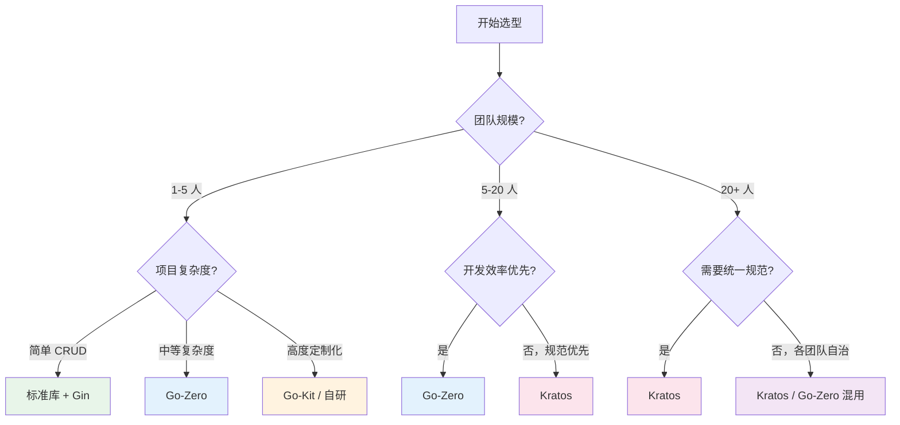
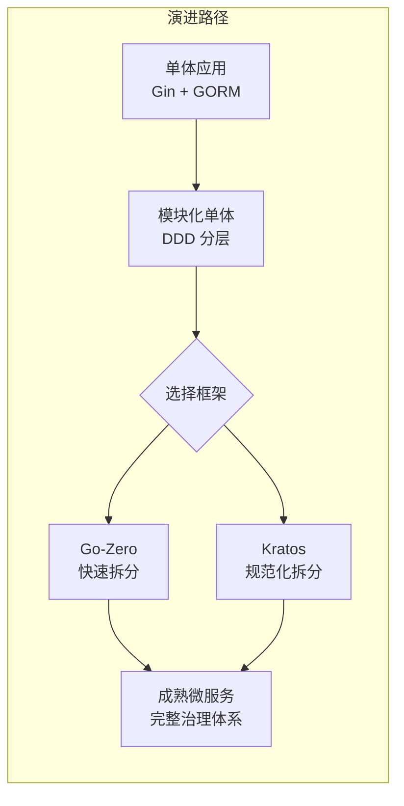

# 微服务框架选型指南

## 概念说明

微服务框架选型是技术决策中最重要的环节之一，选错框架可能导致开发效率低下、维护成本飙升。本指南从**团队规模**和**项目类型**两个核心维度出发，提供具体的选型建议和决策流程。

选型的核心原则：**没有最好的框架，只有最适合的框架。**

## 核心原理

### 选型决策流程

### 按团队规模推荐

#### 小型团队（1-5 人）

| 场景 | 推荐方案 | 理由 |
|------|---------|------|
| 简单 API 服务 | 标准库 net/http + Gin | 无需微服务框架，单体足够 |
| 2-3 个微服务 | Go-Zero | goctl 代码生成提升效率，内置服务治理 |
| 高度定制化需求 | Go-Kit / 自研 | 灵活性优先，团队小沟通成本低 |

**小型团队注意事项：**
- 不要过早引入微服务架构，单体 + 模块化可能更合适
- 如果确实需要微服务，Go-Zero 的代码生成能力可以弥补人力不足
- 避免自研框架，除非团队有丰富的微服务经验

#### 中型团队（5-20 人）

| 场景 | 推荐方案 | 理由 |
|------|---------|------|
| 快速迭代业务 | Go-Zero | 代码生成 + 内置治理，开发效率最高 |
| 追求代码规范 | Kratos | 统一项目结构，Wire DI 提升可测试性 |
| 混合场景 | Kratos（核心服务）+ Go-Zero（业务服务） | 核心服务追求规范，业务服务追求效率 |

**中型团队注意事项：**
- 统一框架选型，避免每个团队用不同框架导致维护成本飙升
- 建立内部脚手架和最佳实践文档
- 投入时间搭建 CI/CD 和监控体系

#### 大型团队（20+ 人）

| 场景 | 推荐方案 | 理由 |
|------|---------|------|
| 统一技术栈 | Kratos | 规范化项目结构，插件化组件，适合大团队协作 |
| 多团队自治 | Kratos + 内部平台 | 基于 Kratos 封装内部框架，统一规范但允许定制 |
| 已有自研框架 | 持续演进 | 大团队通常已有自研框架，不建议全面替换 |

**大型团队注意事项：**
- 基于 Kratos 封装内部框架，统一错误码、日志格式、监控指标
- 建立框架升级和迁移机制
- 投入专人维护内部框架和工具链

### 按项目类型推荐

| 项目类型 | 推荐方案 | 理由 |
|---------|---------|------|
| **电商/交易系统** | Kratos | 需要严格的错误处理、事务管理和可观测性 |
| **内容/社交平台** | Go-Zero | 快速迭代，CRUD 为主，代码生成效率高 |
| **IoT/边缘计算** | 自研 / Go-Kit | 资源受限，需要极致轻量和定制化 |
| **基础设施/中间件** | 自研 / Go-Kit | 需要极致性能和灵活性 |
| **企业内部系统** | Go-Zero | 业务逻辑简单，追求开发效率 |
| **金融/支付系统** | Kratos | 需要严格的规范化和可审计性 |
| **API 网关** | Go-Zero | 内置网关能力，API 定义清晰 |
| **数据管道** | 自研 | 特殊的数据处理需求，框架反而是负担 |

### 迁移路径

**从单体迁移到微服务的建议：**

1. **不要一步到位**：先将单体应用按 DDD 分层重构，再逐步拆分
2. **先拆最独立的服务**：选择与其他模块耦合最少的业务先拆分
3. **保持数据库独立**：每个微服务拥有自己的数据库，避免共享数据库
4. **引入 API 网关**：统一入口，屏蔽内部服务拆分对客户端的影响

### 选型检查清单

在做最终决策前，逐项检查：

| 检查项 | 问题 |
|--------|------|
| 团队经验 | 团队是否有微服务开发经验？是否熟悉 gRPC/Proto？ |
| 项目规模 | 预计有多少个微服务？服务间调用关系复杂吗？ |
| 开发效率 | 是否需要快速迭代？代码生成是否重要？ |
| 规范化 | 是否需要统一的项目结构和编码规范？ |
| 服务治理 | 是否需要限流、熔断、链路追踪等能力？ |
| 技术栈 | 是否需要与现有技术栈（如 etcd、Consul）集成？ |
| 社区支持 | 是否需要中文文档和社区支持？ |
| 长期维护 | 框架的维护频率和社区活跃度如何？ |

## 常见面试题

### Q1: 你们团队是如何选择微服务框架的？

**难度**：⭐⭐⭐ | **频率**：🔥🔥🔥

**答题思路**：

1. 说明团队规模和项目背景
2. 列出评估的候选方案
3. 说明选型依据和最终决策
4. 总结使用效果

**标准答案**：

（示例回答）我们团队 10 人左右，负责一个电商后端系统，需要拆分为 5-8 个微服务。评估了 Kratos、Go-Zero 和自研三个方案。最终选择 Kratos，原因是：1）团队需要统一的项目结构和编码规范，Kratos 的四层架构和 Wire DI 满足需求；2）Proto 驱动的 API 定义便于前后端协作和跨服务通信；3）插件化的组件体系方便后续替换注册中心和配置中心。使用半年后效果良好，新人上手快，代码风格统一。

**深入追问**：

- 如果重新选择，你会做出不同的决策吗？
- 使用过程中遇到了哪些问题？

### Q2: 什么时候不应该使用微服务架构？

**难度**：⭐⭐⭐ | **频率**：🔥🔥🔥

**答题思路**：

1. 团队规模小
2. 业务简单
3. 运维能力不足
4. 过早优化

**标准答案**：

以下场景不建议使用微服务：1）**团队小于 5 人**：微服务的运维成本（服务发现、链路追踪、日志聚合）需要专人维护，小团队负担不起；2）**业务简单**：简单的 CRUD 应用用单体 + 模块化足够，微服务反而增加复杂度；3）**项目初期**：业务边界不清晰时拆分微服务容易拆错，应该先用单体验证业务模型；4）**运维能力不足**：没有 K8s、监控、日志聚合等基础设施，微服务的运维成本会非常高。Martin Fowler 的建议是"Monolith First"——先单体，等业务和团队成熟后再拆分。

**深入追问**：

- 单体应用如何为未来的微服务拆分做准备？
- 微服务拆分的粒度如何把握？

## 常见陷阱

1. **过早微服务化**：项目初期就上微服务，业务边界不清晰导致频繁重构
2. **框架选型政治化**：选型应该基于技术评估，而非个人偏好或"简历驱动开发"
3. **忽视运维成本**：微服务的运维成本（监控、日志、链路追踪、CI/CD）远高于单体
4. **混用多个框架**：同一项目中混用 Kratos 和 Go-Zero 会增加维护成本，除非有明确的分工

## 参考资料

- [Martin Fowler: Monolith First](https://martinfowler.com/bliki/MonolithFirst.html)
- [Sam Newman: Building Microservices](https://samnewman.io/books/building_microservices_2nd_edition/)
- [Kratos 官方文档](https://go-kratos.dev/)
- [Go-Zero 官方文档](https://go-zero.dev/)
