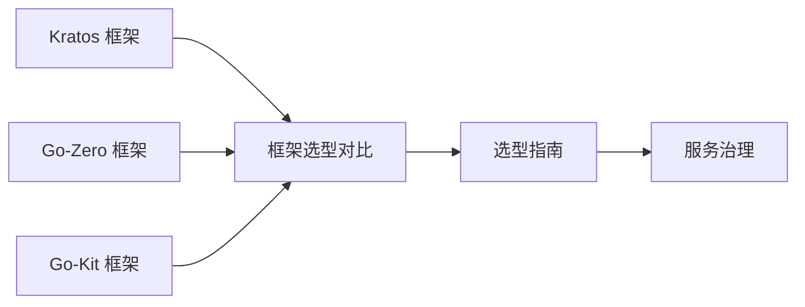
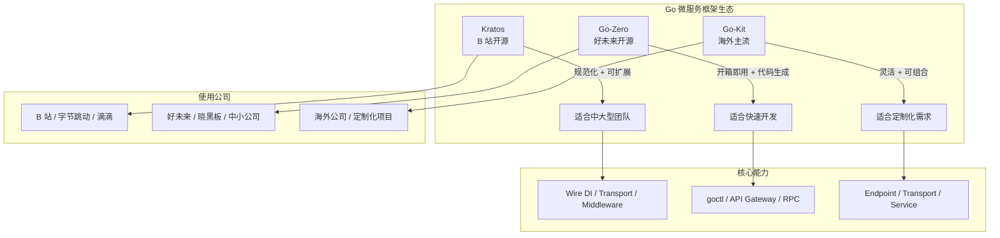

# 微服务架构

> **前置依赖：** [网络编程与 Web 框架](/2-web-data/2.1-web-framework/) | [Go 基础语法](/1-go-core/1.1-go-basics/)

## 模块概述

微服务架构是将单体应用拆分为一组小型、自治服务的架构风格，每个服务围绕特定业务能力构建，独立部署、独立扩展。Go 语言凭借**编译为单一二进制文件、天生并发、启动速度快、内存占用低**等特性，成为微服务开发的首选语言之一。

国内 Go 微服务生态以 **Kratos**（B 站开源）和 **Go-Zero**（好未来开源）为主流，海外则以 **Go-Kit** 为代表。三者设计哲学各异：Kratos 追求规范化和可扩展性，Go-Zero 追求开箱即用和代码生成，Go-Kit 追求极致的灵活性和可组合性。

本模块系统讲解三大微服务框架的核心概念、项目结构和使用方式，并提供框架选型对比和选型指南，帮助开发者根据团队规模和项目类型做出正确的技术决策。

## 知识点索引

### 微服务框架

| 序号 | 知识点 | 难度 | 面试频率 | 预计时间 |
|------|--------|------|---------|---------|
| 01 | [Kratos 微服务框架](./01-kratos.md) | ⭐⭐⭐ | 🔥🔥🔥 | 60min |
| 02 | [Go-Zero 微服务框架](./02-go-zero.md) | ⭐⭐⭐ | 🔥🔥🔥 | 60min |
| 03 | [Go-Kit 微服务框架](./03-go-kit.md) | ⭐⭐⭐ | 🔥🔥 | 45min |

### 框架选型

| 序号 | 知识点 | 难度 | 面试频率 | 预计时间 |
|------|--------|------|---------|---------|
| 04 | [框架选型对比](./04-comparison.md) | ⭐⭐⭐ | 🔥🔥🔥 | 40min |
| 05 | [微服务框架选型指南](./05-selection-guide.md) | ⭐⭐⭐ | 🔥🔥🔥 | 35min |

### 面试指南

| 📝 | [面试指南](./interview.md) | - | 🔥🔥🔥 | 60min |
|------|--------|------|---------|---------|

## 代码示例

> 💻 完整可运行代码：[code-examples/03-microservice/microservice/](https://github.com/your-repo/code-examples/03-microservice/microservice/)

| 示例目录 | 对应知识点 | 运行方式 | Demo 模式 |
|---------|-----------|---------|----------|
| `kratos-example/` | Kratos 完整微服务示例（服务定义/RPC/服务发现/错误处理） | `go run ./kratos-example/` | 纯 Go |
| `go-zero-example/` | Go-Zero 完整微服务示例（API 网关/RPC 服务/中间件/服务治理） | `go run ./go-zero-example/` | 纯 Go |

## 学习路径建议

1. **先学 Kratos**：B 站开源，国内使用最广泛，规范化程度高，适合理解微服务架构设计理念
2. **再学 Go-Zero**：好未来开源，开箱即用，goctl 代码生成效率高，适合快速开发
3. **了解 Go-Kit**：海外主流，极致灵活，理解 Endpoint/Transport/Service 三层架构思想
4. **最后做选型对比**：根据团队规模和项目类型，选择最适合的框架

## 国内 Go 微服务生态

