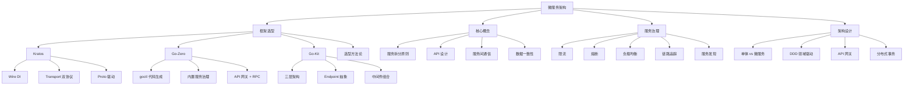

# 微服务架构面试指南

## 面试知识图谱

## 高频面试题

### Q1: 微服务架构和单体架构的区别？各自的优缺点？

**难度**：⭐⭐ | **频率**：🔥🔥🔥

**答题思路**：

1. 定义和核心区别
2. 各自优缺点
3. 适用场景

**标准答案**：

单体架构将所有功能模块打包为一个进程部署，优点是开发简单、部署方便、调试容易；缺点是模块耦合度高、扩展困难、技术栈单一、单点故障影响全局。

微服务架构将应用拆分为一组小型自治服务，每个服务独立部署、独立扩展。优点是服务独立演进、技术栈灵活、故障隔离、按需扩展；缺点是分布式系统复杂度高（网络延迟、数据一致性、服务发现）、运维成本高（需要监控、日志聚合、链路追踪等基础设施）、调试困难。

适用场景：小团队/简单业务用单体，大团队/复杂业务/需要独立扩展用微服务。Martin Fowler 建议"Monolith First"。

**深入追问**：

- 微服务拆分的粒度如何把握？
- 从单体迁移到微服务有哪些策略？

### Q2: Kratos 的分层架构和 Wire 依赖注入是怎样的？

**难度**：⭐⭐⭐ | **频率**：🔥🔥🔥

**答题思路**：

1. 四层架构：API → Service → Biz → Data
2. Wire 编译时 DI 的工作原理
3. 与运行时 DI 的对比

**标准答案**：

Kratos 采用四层架构：**API 层**（Proto 定义，自动生成 HTTP/gRPC 代码）→ **Service 层**（API 实现，参数转换）→ **Biz 层**（核心业务逻辑，定义 Repository 接口）→ **Data 层**（数据访问，实现 Repository 接口）。依赖方向从上到下，Biz 层通过接口依赖 Data 层（依赖倒置）。

Wire 是 Google 开源的编译时依赖注入工具。开发者定义 Provider（构造函数）和 ProviderSet（Provider 分组），Wire 在编译时分析依赖关系，生成 `wire_gen.go` 文件，其中是普通的 Go 函数调用。与运行时 DI（如 dig/fx）相比，Wire 无反射开销、类型错误编译时发现、生成的代码可读可调试。

**深入追问**：

- Wire 的 ProviderSet 如何组织？
- Kratos 的 Transport 层如何实现 HTTP/gRPC 双协议？

### Q3: Go-Zero 的 goctl 代码生成和内置服务治理有什么特点？

**难度**：⭐⭐⭐ | **频率**：🔥🔥🔥

**答题思路**：

1. goctl 的代码生成流程
2. 内置服务治理能力
3. 与 Kratos 的对比

**标准答案**：

goctl 是 Go-Zero 的核心工具，支持从 `.api` 文件生成 HTTP 服务代码（handler/logic/types），从 `.proto` 文件生成 RPC 服务代码，从 SQL DDL 生成带缓存的 Model 代码。开发者只需在 logic 层填充业务逻辑，减少 80% 以上的样板代码。

Go-Zero 内置了完整的服务治理能力：自适应限流（基于 CPU 使用率）、自适应熔断（Google SRE 算法）、P2C 负载均衡（基于 EWMA 延迟）、级联超时控制、OpenTelemetry 链路追踪、Prometheus 指标监控。这些能力无需额外配置，开箱即用。

与 Kratos 相比，Go-Zero 开发效率更高但灵活性较低；Kratos 规范化程度更高但需要更多手动配置。

**深入追问**：

- Go-Zero 的自适应限流是如何实现的？
- goctl 生成的代码如何自定义？

### Q4: Go-Kit 的三层架构（Service/Endpoint/Transport）是什么？

**难度**：⭐⭐⭐ | **频率**：🔥🔥

**答题思路**：

1. 三层各自的职责
2. Endpoint 抽象的作用
3. 中间件如何在 Endpoint 层应用

**标准答案**：

Go-Kit 采用 Service → Endpoint → Transport 三层架构。**Service 层**是纯业务逻辑接口，不关心传输协议；**Endpoint 层**将 Service 方法包装为统一的 `func(ctx, request) (response, error)` 签名，使日志、监控、限流等中间件可以通用地应用于所有方法；**Transport 层**处理 HTTP/gRPC 等协议的编解码。

Endpoint 是 Go-Kit 的核心创新——它在 Service 和 Transport 之间插入了一个统一的抽象层，使得横切关注点（Cross-Cutting Concerns）可以通过装饰器模式层层包装，而不需要修改业务逻辑或传输层代码。

**深入追问**：

- Endpoint 和 HTTP Handler 有什么区别？
- Go-Kit 的中间件和 Gin 的中间件有什么区别？

### Q5: 如何选择 Go 微服务框架？

**难度**：⭐⭐⭐ | **频率**：🔥🔥🔥

**答题思路**：

1. 选型维度：团队规模、项目类型、开发效率、灵活性
2. 各框架适用场景
3. 给出具体建议

**标准答案**：

选型核心维度：团队规模、项目复杂度、开发效率需求、灵活性需求。

- **中大型团队（20+人）→ Kratos**：规范化项目结构统一团队规范，Wire DI 提升可测试性，插件化组件便于替换
- **中小型团队（5-20人）→ Go-Zero**：goctl 代码生成提升效率，内置服务治理降低基础设施成本
- **高度定制化需求 → Go-Kit / 自研**：Go-Kit 灵活性最高，自研完全掌控代码
- **简单业务 → 不用微服务框架**：Gin + gRPC 足够，不要过度设计

关键原则：没有最好的框架，只有最适合的框架。性能差异通常在 5% 以内，不应作为选型主要依据。

**深入追问**：

- 什么时候不应该使用微服务架构？
- 从单体迁移到微服务应该选哪个框架？

### Q6: 微服务中的限流和熔断是如何实现的？

**难度**：⭐⭐⭐ | **频率**：🔥🔥🔥

**答题思路**：

1. 限流算法：令牌桶、漏桶、滑动窗口
2. 熔断模式：状态机 vs 概率性
3. Go-Zero 的自适应实现

**标准答案**：

**限流**常用算法：令牌桶（允许突发流量）、漏桶（匀速处理）、滑动窗口（精确计数）。Go-Zero 使用自适应限流，基于 CPU 使用率动态调整阈值——CPU 使用率超过阈值时自动限流，恢复后自动放开。

**熔断**有两种模式：传统状态机（Hystrix 的 Closed → Open → Half-Open）和概率性熔断（Google SRE 算法）。Go-Zero 和 Kratos 都采用 Google SRE 算法，公式为 `max(0, (requests - K * accepts) / (requests + 1))`，K 默认 1.5。与状态机不同，概率性熔断是渐进式的，不存在"全开"或"全关"的突变，对流量更友好。

**深入追问**：

- 令牌桶和漏桶的区别？
- K 值为什么默认是 1.5？

### Q7: 微服务间通信用 HTTP 还是 gRPC？

**难度**：⭐⭐⭐ | **频率**：🔥🔥🔥

**答题思路**：

1. HTTP/REST vs gRPC 的核心区别
2. 各自适用场景
3. 实际项目中的选择

**标准答案**：

| 维度 | HTTP/REST | gRPC |
|------|-----------|------|
| 协议 | HTTP/1.1（文本） | HTTP/2（二进制） |
| 序列化 | JSON | Protocol Buffers |
| 性能 | 较低 | 高（二进制序列化 + 多路复用） |
| 类型安全 | 弱（JSON 无 Schema） | 强（Proto 定义） |
| 流式通信 | 不支持 | 支持四种模式 |
| 浏览器支持 | 原生支持 | 需要 grpc-web |
| 调试 | 简单（curl/Postman） | 需要专用工具 |

实际项目中通常**对外用 HTTP/REST**（面向前端和第三方），**内部用 gRPC**（服务间通信）。Kratos 和 Go-Zero 都支持 HTTP + gRPC 双协议。

**深入追问**：

- gRPC 的四种通信模式是什么？
- grpc-gateway 是什么？如何实现 REST 到 gRPC 的转换？

## 面试重点总结

### 按公司类型

| 公司类型 | 重点考察 |
|---------|---------|
| **B 站/字节** | Kratos 架构、Wire DI、Proto 驱动、服务治理 |
| **好未来/教育公司** | Go-Zero、goctl 代码生成、自适应限流熔断 |
| **大厂通用** | 框架选型方法论、微服务拆分原则、服务治理 |
| **中小公司** | 实际项目经验、框架使用心得、问题排查 |

### 按难度级别

| 级别 | 考察内容 |
|------|---------|
| **初级** | 微服务 vs 单体、HTTP vs gRPC、基本概念 |
| **中级** | 框架使用经验、服务治理原理、选型方法论 |
| **高级** | 架构设计、性能优化、分布式事务、自研框架经验 |
