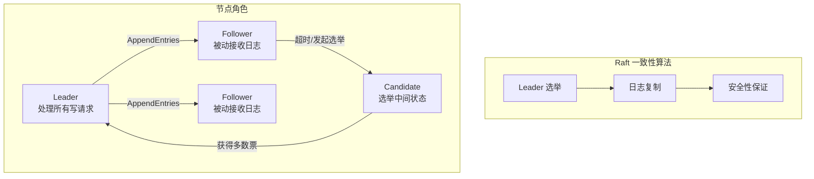
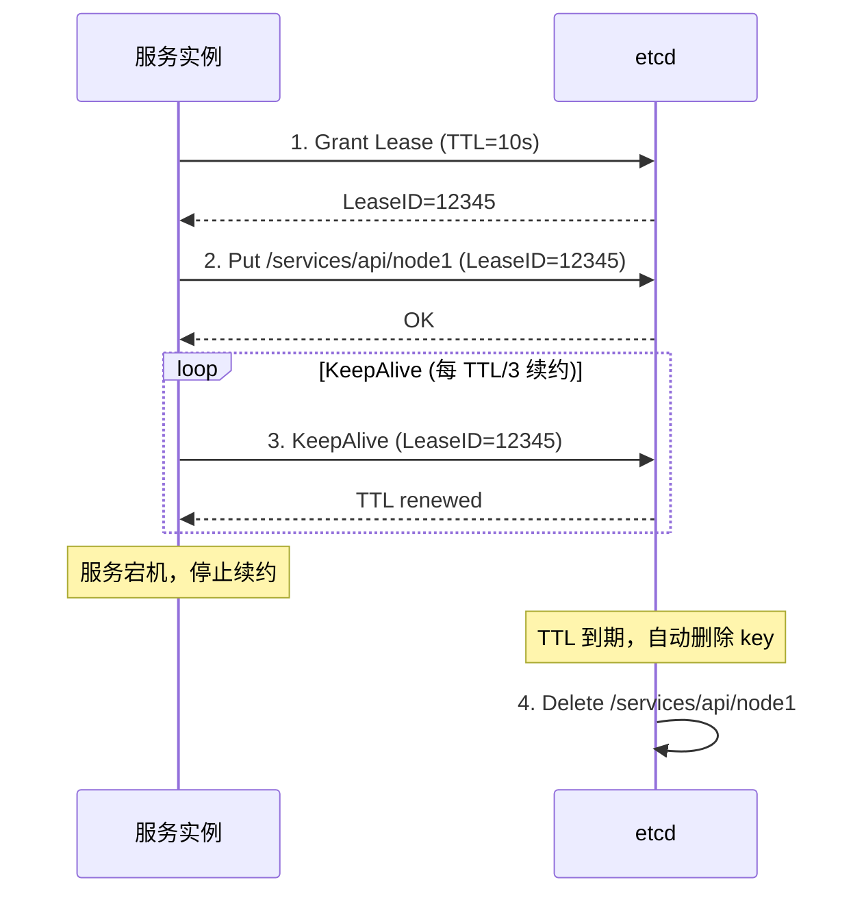
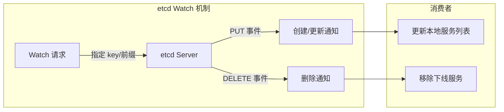

# etcd 服务注册与发现

## 概念说明

etcd 是一个分布式、高可用的键值存储系统，由 CoreOS 团队用 Go 语言开发，是 Kubernetes 的核心数据存储组件。etcd 的名字来源于 UNIX `/etc` 目录（存放配置文件）加上 `d`（distributed），意为"分布式配置存储"。

在微服务架构中，etcd 主要用于：

- **服务注册与发现**：服务启动时将自身地址注册到 etcd，消费者通过 etcd 发现可用服务实例
- **配置中心**：集中管理服务配置，通过 Watch 机制实现配置热更新
- **分布式锁**：基于 Lease 和 Revision 实现分布式互斥锁
- **Leader 选举**：基于 etcd 的原子操作实现分布式 Leader 选举

etcd 在 Go 生态中的地位类似于 ZooKeeper 在 Java 生态中的地位，但 etcd 更轻量、API 更简洁、与 Go 天然集成。

## 核心原理

### Raft 一致性算法

etcd 使用 Raft 算法保证集群中所有节点的数据一致性。Raft 将一致性问题分解为三个子问题：



**Leader 选举流程**：
1. 所有节点初始为 Follower 状态
2. Follower 在选举超时时间内未收到 Leader 心跳，转为 Candidate
3. Candidate 向其他节点发送 RequestVote 请求
4. 获得多数票（N/2 + 1）的 Candidate 成为新 Leader
5. Leader 通过定期心跳维持领导地位

**日志复制流程**：
1. 客户端写请求发送到 Leader
2. Leader 将操作追加到本地日志
3. Leader 将日志条目复制到所有 Follower
4. 多数节点确认后，Leader 提交该条目并返回客户端

### Lease 租约机制

Lease 是 etcd 的核心特性之一，为键值对提供 TTL（Time To Live）生存时间。租约到期后，关联的所有键值对自动删除。



**服务注册与发现的核心流程**：
1. 服务启动时创建 Lease（如 TTL=10s）
2. 将服务地址写入 etcd，绑定 Lease
3. 启动 KeepAlive 协程定期续约（通常每 TTL/3 续约一次）
4. 服务宕机后停止续约，Lease 到期自动删除注册信息
5. 消费者通过 Watch 机制感知服务上下线

### Watch 机制

etcd 的 Watch 机制基于 MVCC（多版本并发控制），客户端可以监听某个 key 或 key 前缀的变更事件。



Watch 的关键特性：
- **基于 Revision**：每次修改都有全局递增的 Revision，Watch 可以从指定 Revision 开始监听，不会丢失事件
- **前缀监听**：可以监听 `/services/api/` 前缀下所有 key 的变更
- **高效推送**：基于 gRPC 长连接，服务端主动推送变更事件

### clientv3 客户端

etcd 官方提供的 Go 客户端 `go.etcd.io/etcd/client/v3`，基于 gRPC 通信，支持：

| API | 说明 | 典型用途 |
|-----|------|---------|
| `Put` | 写入键值对 | 服务注册、配置写入 |
| `Get` | 读取键值对 | 服务发现、配置读取 |
| `Delete` | 删除键值对 | 服务注销 |
| `Watch` | 监听变更 | 服务上下线感知、配置热更新 |
| `Grant` | 创建 Lease | 设置 TTL |
| `KeepAlive` | 续约 Lease | 服务心跳 |
| `Revoke` | 撤销 Lease | 主动注销 |
| `Txn` | 事务操作 | 分布式锁、CAS 操作 |

## 标准库方案

Go 标准库没有内置 etcd 客户端，需要使用官方 `clientv3` 库。但 etcd 的核心概念（KV 存储、Lease、Watch）可以用 Go 标准库模拟实现，帮助理解原理。

## 第三方库方案

### clientv3 基本使用

```go
import (
    clientv3 "go.etcd.io/etcd/client/v3"
)

// 创建客户端
cli, err := clientv3.New(clientv3.Config{
    Endpoints:   []string{"localhost:2379"},
    DialTimeout: 5 * time.Second,
})
defer cli.Close()

// Put 写入
cli.Put(ctx, "/services/api/node1", "192.168.1.10:8080")

// Get 读取（支持前缀查询）
resp, _ := cli.Get(ctx, "/services/api/", clientv3.WithPrefix())

// Watch 监听变更
watchChan := cli.Watch(ctx, "/services/api/", clientv3.WithPrefix())
for resp := range watchChan {
    for _, ev := range resp.Events {
        // ev.Type: PUT / DELETE
        // ev.Kv.Key, ev.Kv.Value
    }
}

// Lease 租约
lease, _ := cli.Grant(ctx, 10) // TTL=10s
cli.Put(ctx, "/services/api/node1", "addr", clientv3.WithLease(lease.ID))
cli.KeepAlive(ctx, lease.ID) // 自动续约
```

## 代码示例

> 💻 完整可运行代码：[code-examples/03-microservice/service-governance/etcd/](https://github.com/your-repo/code-examples/03-microservice/service-governance/etcd/)
> 🏷️ Demo 模式：Part A（内存模拟服务注册与发现）/ Part B（连接真实 etcd）

## 常见面试题

### Q1: etcd 的 Raft 算法是如何保证数据一致性的？

**难度**：⭐⭐⭐ | **频率**：🔥🔥🔥

**答题思路**：

1. 解释 Raft 的三个子问题
2. 描述 Leader 选举流程
3. 描述日志复制流程
4. 说明安全性保证

**标准答案**：

Raft 将一致性问题分解为 Leader 选举、日志复制和安全性三个子问题。集群中只有一个 Leader 处理所有写请求，Leader 将操作追加到本地日志后复制到 Follower，当多数节点（N/2+1）确认后提交。Leader 通过定期心跳维持领导地位，Follower 超时未收到心跳则发起选举。安全性方面，Raft 保证已提交的日志不会被覆盖，新 Leader 一定包含所有已提交的日志条目。

**深入追问**：

- etcd 集群推荐几个节点？为什么？（推荐 3 或 5 个，奇数节点，容忍 N/2-1 个节点故障）
- 脑裂问题如何解决？（Raft 的多数派机制天然防止脑裂）

### Q2: etcd 的 Lease 机制在服务发现中的作用？

**难度**：⭐⭐⭐ | **频率**：🔥🔥🔥

**答题思路**：

1. Lease 的概念和 TTL
2. 服务注册绑定 Lease
3. KeepAlive 续约机制
4. 服务宕机自动摘除

**标准答案**：

Lease 为键值对提供 TTL 生存时间。服务注册时创建 Lease 并绑定注册信息，启动 KeepAlive 协程定期续约。服务正常运行时持续续约保持注册信息有效；服务宕机后停止续约，Lease 到期后 etcd 自动删除关联的注册信息，消费者通过 Watch 感知服务下线。这种机制实现了服务的自动摘除，无需额外的健康检查组件。

**深入追问**：

- KeepAlive 的续约频率如何设置？（通常 TTL/3）
- 网络抖动导致续约失败怎么办？（TTL 设置足够长，如 10-30s，给网络恢复留余量）

## 常见陷阱

1. **Lease TTL 设置过短**：网络抖动可能导致续约失败，服务被误摘除。建议 TTL 设置为 10-30s
2. **忘记关闭 Watch channel**：Watch 返回的 channel 需要通过 context 取消来关闭，否则会导致 goroutine 泄漏
3. **未处理 Watch 断连重连**：网络异常时 Watch 可能断开，需要处理重连逻辑并从上次 Revision 继续监听
4. **clientv3 版本兼容性**：etcd client v3 与 etcd server 版本需要匹配，注意 Go module 版本选择

## 参考资料

- [etcd 官方文档](https://etcd.io/docs/)
- [Raft 论文](https://raft.github.io/raft.pdf)
- [etcd clientv3 Go 文档](https://pkg.go.dev/go.etcd.io/etcd/client/v3)
- [etcd GitHub 仓库](https://github.com/etcd-io/etcd)
