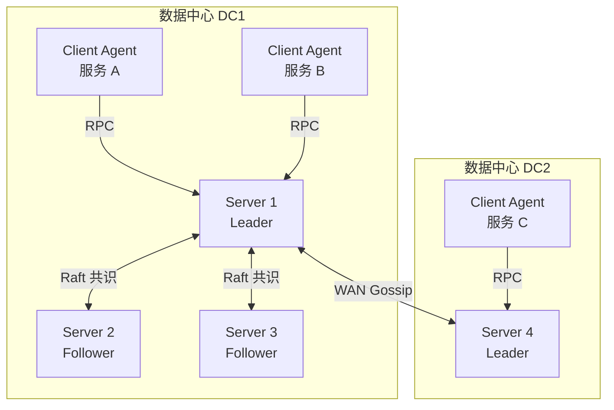
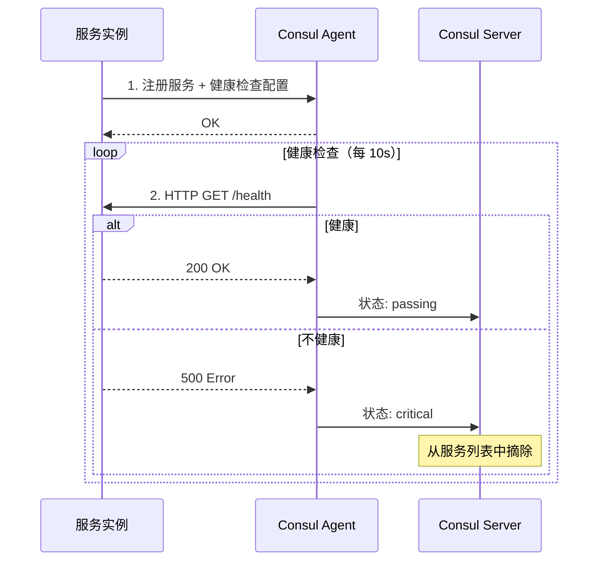

# Consul 服务发现

## 概念说明

Consul 是 HashiCorp 出品的分布式服务网格解决方案，提供服务发现、健康检查、KV 存储和多数据中心支持。与 etcd 专注于分布式 KV 存储不同，Consul 是一个更完整的服务治理平台，内置了服务注册、健康检查、DNS 解析等功能。

Consul 的核心特性：

- **服务发现**：服务注册后可通过 HTTP API 或 DNS 查询发现
- **健康检查**：支持 HTTP、TCP、gRPC、Script 等多种健康检查方式，自动摘除不健康实例
- **KV 存储**：内置键值存储，可用作配置中心
- **多数据中心**：原生支持多数据中心部署，跨数据中心服务发现
- **Service Mesh**：通过 Consul Connect 提供服务间 mTLS 加密通信

在 Go 生态中，Consul 通过 `github.com/hashicorp/consul/api` 提供官方 Go 客户端。

## 核心原理

### Consul 架构



Consul 采用 Client-Server 架构：
- **Server**：存储数据、参与 Raft 共识、处理查询请求。推荐 3-5 个 Server 节点
- **Client**：轻量级代理，运行在每个服务节点上，负责健康检查和请求转发
- **Gossip 协议**：LAN Gossip 用于同数据中心节点发现，WAN Gossip 用于跨数据中心通信

### 健康检查机制

Consul 的健康检查是其区别于 etcd 的核心特性：



支持的健康检查类型：

| 类型 | 说明 | 适用场景 |
|------|------|---------|
| HTTP | 定期发送 HTTP 请求，2xx 为健康 | Web 服务 |
| TCP | 尝试 TCP 连接 | 数据库、缓存 |
| gRPC | gRPC 健康检查协议 | gRPC 服务 |
| Script | 执行脚本，退出码 0 为健康 | 自定义检查 |
| TTL | 服务主动上报心跳 | 类似 etcd Lease |

### KV 存储

Consul 内置 KV 存储，支持：
- 层级化的 key 结构（如 `/config/app/database/host`）
- CAS（Compare-And-Swap）原子操作
- Watch 变更通知（通过 blocking query 长轮询实现）
- ACL 权限控制

## 标准库方案

Go 标准库没有内置 Consul 客户端。Consul 提供 HTTP API，可以用 `net/http` 直接调用，但推荐使用官方 Go 客户端库。

## 第三方库方案

### consul/api 基本使用

```go
import (
    "github.com/hashicorp/consul/api"
)

// 创建客户端
client, err := api.NewClient(&api.Config{
    Address: "localhost:8500",
})

// 服务注册
registration := &api.AgentServiceRegistration{
    ID:      "api-node1",
    Name:    "api-service",
    Address: "192.168.1.10",
    Port:    8080,
    Check: &api.AgentServiceCheck{
        HTTP:     "http://192.168.1.10:8080/health",
        Interval: "10s",
        Timeout:  "3s",
    },
}
client.Agent().ServiceRegister(registration)

// 服务发现
services, _, _ := client.Health().Service("api-service", "", true, nil)
for _, svc := range services {
    fmt.Printf("地址: %s:%d\n", svc.Service.Address, svc.Service.Port)
}

// KV 操作
kv := client.KV()
kv.Put(&api.KVPair{Key: "config/db/host", Value: []byte("localhost")}, nil)
pair, _, _ := kv.Get("config/db/host", nil)
```

## 代码示例

> 💻 完整可运行代码：[code-examples/03-microservice/service-governance/consul/](https://github.com/skyhe58/guide-go/tree/main/code-examples/03-microservice/service-governance/consul/)
> 🏷️ Demo 模式：Part A（内存模拟服务注册与发现）/ Part B（连接真实 Consul）

## 常见面试题

### Q1: Consul 和 etcd 在服务发现上的核心区别？

**难度**：⭐⭐⭐ | **频率**：🔥🔥🔥

**答题思路**：

1. 架构差异（Agent vs 纯 KV）
2. 健康检查方式
3. 服务发现方式
4. 适用场景

**标准答案**：

etcd 是纯粹的分布式 KV 存储，服务发现需要应用层自行实现（通过 Lease + Watch）；Consul 是完整的服务治理平台，内置服务注册、健康检查、DNS 发现。etcd 的健康检查依赖 Lease TTL 机制（被动），Consul 支持 HTTP/TCP/gRPC 等主动健康检查。Consul 原生支持多数据中心，etcd 需要额外方案。etcd 更适合 Kubernetes 生态和需要强一致性 KV 存储的场景，Consul 更适合需要丰富健康检查和多数据中心的场景。

**深入追问**：

- Consul 的 Gossip 协议和 Raft 协议分别用在哪里？
- 如何选择 etcd 和 Consul？

### Q2: Consul 的健康检查有哪些类型？

**难度**：⭐⭐ | **频率**：🔥🔥

**答题思路**：

1. 列举检查类型
2. 各类型适用场景
3. 与 etcd Lease 的对比

**标准答案**：

Consul 支持五种健康检查类型：HTTP（定期发送 HTTP 请求，2xx 为健康）、TCP（尝试 TCP 连接）、gRPC（使用 gRPC 健康检查协议）、Script（执行自定义脚本）、TTL（服务主动上报心跳）。HTTP 检查最常用，适合 Web 服务；TCP 适合数据库等非 HTTP 服务；gRPC 适合 gRPC 微服务；TTL 类似 etcd 的 Lease 机制。相比 etcd 只有 Lease TTL 一种方式，Consul 的健康检查更灵活、更精确。

**深入追问**：

- 健康检查的间隔和超时如何设置？
- 不健康的服务多久会被摘除？

## 常见陷阱

1. **忘记配置健康检查**：注册服务时不配置健康检查，服务宕机后不会被自动摘除
2. **健康检查间隔过短**：频繁的健康检查会增加网络开销和服务负载，建议 10-30s
3. **Client Agent 未部署**：生产环境中每个节点应部署 Consul Client Agent，而非直接连接 Server
4. **未处理服务注销**：服务优雅关闭时应主动调用 `ServiceDeregister` 注销，而非等待健康检查超时

## 参考资料

- [Consul 官方文档](https://developer.hashicorp.com/consul/docs)
- [Consul Go 客户端](https://pkg.go.dev/github.com/hashicorp/consul/api)
- [Consul GitHub 仓库](https://github.com/hashicorp/consul)
