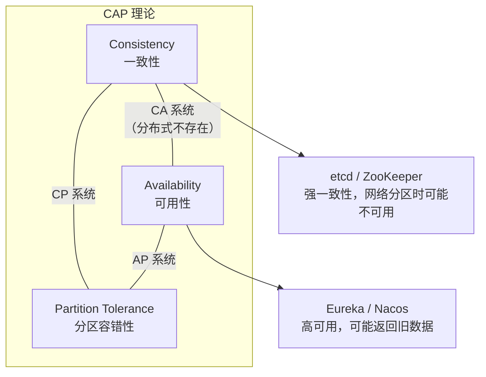
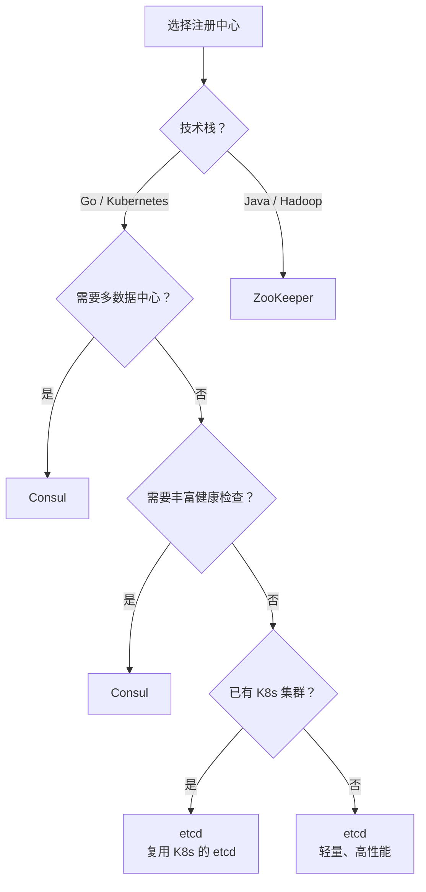

# 注册中心选型对比

## 概念说明

注册中心是微服务架构的核心基础设施，负责服务实例的注册、发现和健康管理。主流的注册中心方案有 etcd、Consul 和 ZooKeeper，三者在一致性模型、功能特性和生态适配上各有侧重。选型时需要从 CAP 理论、功能需求、运维成本和技术栈匹配等多个维度综合考量。

## 核心原理

### CAP 理论回顾

在分布式系统中，网络分区（P）是不可避免的，因此实际选择是在 CP 和 AP 之间权衡：

- **CP 系统**（etcd、Consul、ZooKeeper）：保证数据一致性，网络分区时可能拒绝服务
- **AP 系统**（Eureka、Nacos AP 模式）：保证可用性，可能返回过期数据

### 三大注册中心对比

| 维度 | etcd | Consul | ZooKeeper |
|------|------|--------|-----------|
| **开发语言** | Go | Go | Java |
| **一致性协议** | Raft | Raft（Server 间） + Gossip（Agent 间） | ZAB（类 Paxos） |
| **CAP 模型** | CP | CP（默认）/ AP（DNS 模式） | CP |
| **数据模型** | 扁平 KV | 扁平 KV + 服务目录 | 树形 ZNode |
| **Watch 机制** | 基于 gRPC 长连接推送 | Blocking Query 长轮询 | 基于 TCP 长连接推送 |
| **健康检查** | Lease TTL（被动） | HTTP/TCP/gRPC/Script/TTL（主动+被动） | 临时节点 + Session |
| **多数据中心** | 需额外方案 | 原生支持 | 需额外方案 |
| **ACL 权限** | 支持 | 支持（更完善） | 支持 |
| **服务网格** | 不支持 | Consul Connect | 不支持 |
| **DNS 发现** | 不支持 | 原生支持 | 不支持 |
| **API 风格** | gRPC + REST | REST | 自定义协议 |
| **客户端复杂度** | 低 | 低 | 高（需处理 Session、Watcher 重注册） |
| **运维复杂度** | 低 | 中（需部署 Agent） | 高（JVM 调优、GC 问题） |
| **社区生态** | Kubernetes 核心组件 | HashiCorp 全家桶 | Hadoop/Kafka 生态 |
| **性能** | 高（gRPC） | 中 | 中 |

### 选型决策树

## 标准库方案

注册中心选型是架构决策，不涉及标准库实现。

## 第三方库方案

### Go 生态推荐

| 场景 | 推荐方案 | 理由 |
|------|---------|------|
| Kubernetes 环境 | etcd | K8s 自带 etcd，无需额外部署 |
| 多数据中心 | Consul | 原生多数据中心支持 |
| 纯 Go 微服务 | etcd | Go 原生生态，API 简洁 |
| 需要服务网格 | Consul | Consul Connect 提供 mTLS |
| 已有 Java 生态 | ZooKeeper | 与 Kafka、Hadoop 等集成 |

## 代码示例

> 💻 完整可运行代码：[code-examples/03-microservice/service-governance/](https://github.com/skyhe58/guide-go/tree/main/code-examples/03-microservice/service-governance/)
> 🏷️ etcd 示例和 Consul 示例分别在 `etcd/` 和 `consul/` 目录

## 常见面试题

### Q1: etcd、Consul、ZooKeeper 如何选型？

**难度**：⭐⭐⭐ | **频率**：🔥🔥🔥

**答题思路**：

1. 从 CAP 角度分析
2. 从功能特性对比
3. 从技术栈匹配
4. 给出推荐方案

**标准答案**：

三者都是 CP 系统，保证强一致性。选型核心看三点：一是技术栈匹配——Go/K8s 生态选 etcd，Java 生态选 ZooKeeper；二是功能需求——需要多数据中心或丰富健康检查选 Consul，纯 KV 存储选 etcd；三是运维成本——etcd 最轻量（Go 单二进制），ZooKeeper 最重（JVM 调优）。Go 微服务推荐 etcd（K8s 环境可复用）或 Consul（需要多数据中心时）。

**深入追问**：

- 为什么 Kubernetes 选择 etcd 而不是 ZooKeeper？
- Consul 的 Gossip 协议和 Raft 协议分别解决什么问题？

### Q2: CAP 理论在注册中心选型中如何应用？

**难度**：⭐⭐⭐ | **频率**：🔥🔥🔥

**答题思路**：

1. CAP 三要素解释
2. CP vs AP 的取舍
3. 注册中心为什么多选 CP

**标准答案**：

CAP 理论指出分布式系统无法同时满足一致性（C）、可用性（A）和分区容错性（P）。网络分区不可避免，实际选择是 CP 或 AP。etcd、Consul、ZooKeeper 都选择 CP，因为注册中心的数据一致性至关重要——如果返回过期的服务地址，会导致请求路由到已下线的实例。但 Consul 在 DNS 模式下可以提供 AP 语义，牺牲一致性换取更高可用性。Eureka 和 Nacos AP 模式选择 AP，适合对一致性要求不高但对可用性要求极高的场景。

**深入追问**：

- 注册中心选 CP 还是 AP 更好？
- 如何在 CP 系统中提高可用性？

## 常见陷阱

1. **盲目追求强一致性**：某些场景下 AP 模式（如 Eureka）可能更合适，服务发现允许短暂的不一致
2. **忽视运维成本**：ZooKeeper 的 JVM 调优和 GC 问题在生产环境中是实际痛点
3. **混淆 Consul 的一致性模型**：Consul Server 间用 Raft（CP），Agent 间用 Gossip（最终一致性）
4. **过度依赖注册中心**：注册中心宕机时应有降级方案（如本地缓存服务列表）

## 参考资料

- [CAP 理论原始论文](https://users.ece.cmu.edu/~adrian/731-sp04/readings/GL-cap.pdf)
- [etcd vs Consul vs ZooKeeper](https://etcd.io/docs/v3.5/learning/why/)
- [Consul 架构文档](https://developer.hashicorp.com/consul/docs/architecture)
