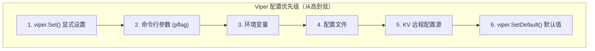
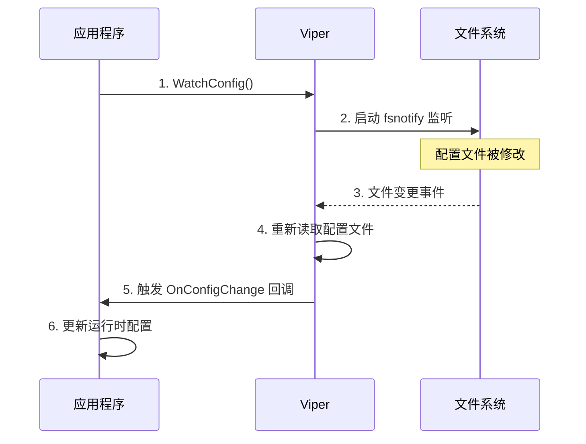

# Viper 配置管理

## 概念说明

Viper 是 Go 生态中最流行的配置管理库，由 Hugo（Go 静态站点生成器）的作者 Steve Francia 开发。Viper 的设计理念是"一个库解决所有配置问题"，支持多种配置格式、多种配置源，并提供统一的 API 读取配置。

Viper 的核心能力：

- **多格式支持**：JSON、YAML、TOML、HCL、envfile、Java properties
- **多配置源**：文件、环境变量、命令行参数（配合 pflag/cobra）、远程配置源（etcd、Consul）
- **配置优先级**：显式 Set > 命令行参数 > 环境变量 > 配置文件 > 默认值
- **配置热更新**：通过 `WatchConfig()` 监听文件变更，自动重新加载
- **结构体映射**：通过 `Unmarshal` 将配置映射到 Go 结构体

在 Go 微服务项目中，Viper 通常与 Cobra（命令行框架）配合使用，Cobra 处理命令行参数，Viper 处理配置文件和环境变量。

## 核心原理

### 配置优先级



这种优先级设计遵循 12-Factor App 原则：环境变量优先于配置文件，方便在不同环境（开发/测试/生产）中覆盖配置。

### 配置热更新机制



Viper 使用 `fsnotify` 库监听文件系统事件，当配置文件被修改时自动重新加载。需要注意的是，热更新只适用于文件配置源，环境变量和命令行参数不支持热更新。

### 结构体映射

Viper 通过 `mapstructure` 标签将配置映射到 Go 结构体：

```go
type Config struct {
    Server   ServerConfig   `mapstructure:"server"`
    Database DatabaseConfig `mapstructure:"database"`
}

type ServerConfig struct {
    Host string `mapstructure:"host"`
    Port int    `mapstructure:"port"`
}
```

## 标准库方案

Go 标准库提供了基础的配置读取能力：
- `os.Getenv()`：读取环境变量
- `encoding/json`、`encoding/xml`：解析配置文件
- `flag` 包：解析命令行参数

但标准库缺少配置优先级管理、热更新、多格式统一读取等能力，生产项目通常使用 Viper。

## 第三方库方案

### Viper 基本使用

```go
import "github.com/spf13/viper"

// 设置默认值
viper.SetDefault("server.port", 8080)

// 读取配置文件
viper.SetConfigName("config")  // 文件名（不含扩展名）
viper.SetConfigType("yaml")    // 文件格式
viper.AddConfigPath(".")       // 搜索路径
viper.ReadInConfig()

// 环境变量绑定
viper.SetEnvPrefix("APP")           // 前缀 APP_
viper.AutomaticEnv()                // 自动绑定环境变量
viper.SetEnvKeyReplacer(strings.NewReplacer(".", "_"))

// 读取配置
host := viper.GetString("server.host")
port := viper.GetInt("server.port")

// 结构体映射
var config Config
viper.Unmarshal(&config)

// 配置热更新
viper.WatchConfig()
viper.OnConfigChange(func(e fsnotify.Event) {
    fmt.Println("配置文件变更:", e.Name)
    viper.Unmarshal(&config) // 重新映射
})
```

## 代码示例

> 💻 完整可运行代码：[code-examples/03-microservice/service-governance/viper-config/](https://github.com/your-repo/code-examples/03-microservice/service-governance/viper-config/)
> 🏷️ Demo 模式：纯 Go（无需 Docker）

## 常见面试题

### Q1: Viper 的配置优先级是什么？

**难度**：⭐⭐ | **频率**：🔥🔥

**答题思路**：

1. 列举六个配置源
2. 说明优先级顺序
3. 解释设计理由

**标准答案**：

Viper 的配置优先级从高到低为：显式 Set > 命令行参数 > 环境变量 > 配置文件 > 远程配置源 > 默认值。这种设计遵循 12-Factor App 原则，环境变量优先于配置文件，方便在不同环境中覆盖配置而无需修改配置文件。生产环境中通常通过环境变量注入敏感配置（如数据库密码），配置文件提供基础配置。

**深入追问**：

- 如何在 Kubernetes 中使用 Viper？（ConfigMap 挂载为文件 + 环境变量注入 Secret）
- Viper 的热更新是如何实现的？（fsnotify 文件系统监听）

## 常见陷阱

1. **并发安全问题**：Viper 的 `Get` 操作是并发安全的，但 `Set` 和 `WatchConfig` 不是。多 goroutine 写入时需要加锁
2. **环境变量命名规则**：Viper 将 `.` 替换为 `_`，如 `server.port` 对应环境变量 `APP_SERVER_PORT`（需配置 `SetEnvKeyReplacer`）
3. **热更新回调中的 panic**：`OnConfigChange` 回调中如果 panic，会导致后续变更不再触发。建议在回调中加 recover
4. **配置文件路径**：`AddConfigPath` 是相对于程序运行目录，而非源码目录。部署时注意配置文件路径

## 参考资料

- [Viper GitHub 仓库](https://github.com/spf13/viper)
- [Viper Go 文档](https://pkg.go.dev/github.com/spf13/viper)
- [12-Factor App 配置原则](https://12factor.net/config)
