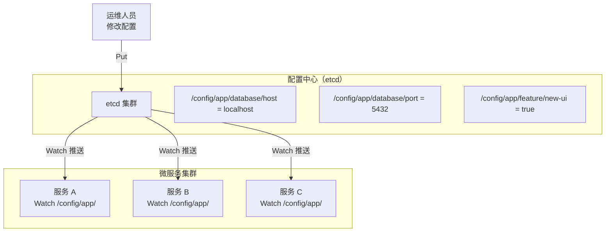
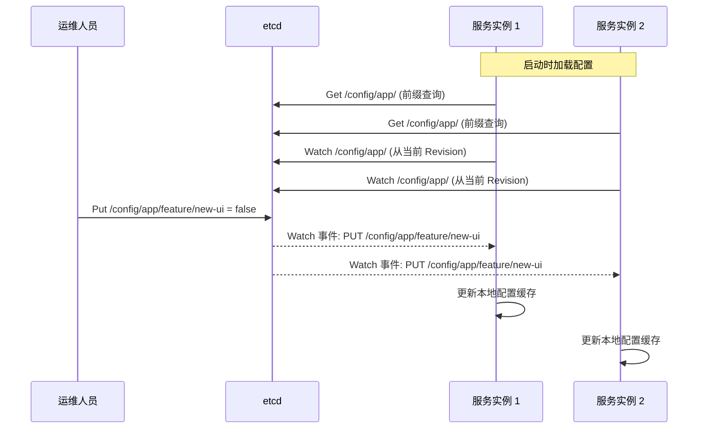

# etcd 作为配置中心

## 概念说明

配置中心是微服务架构中集中管理服务配置的基础设施。相比本地配置文件（如 Viper 读取 YAML），配置中心提供了集中管理、实时推送、版本管理和权限控制等能力。

etcd 天然适合作为配置中心：

- **KV 存储**：配置本质就是键值对，etcd 的 KV 模型完美匹配
- **Watch 机制**：基于 gRPC 长连接的实时推送，配置变更毫秒级生效
- **MVCC 版本控制**：每次修改都有全局递增的 Revision，天然支持配置版本管理
- **强一致性**：Raft 保证所有节点看到相同的配置，避免配置不一致导致的问题
- **高可用**：集群部署，单节点故障不影响配置读取

### 与 Viper 的关系

Viper 和 etcd 配置中心不是互斥的，而是互补的：

| 维度 | Viper（本地配置） | etcd（配置中心） |
|------|------------------|-----------------|
| 配置源 | 本地文件、环境变量 | 远程 KV 存储 |
| 热更新 | fsnotify 文件监听 | Watch gRPC 推送 |
| 适用场景 | 单体应用、开发环境 | 微服务、生产环境 |
| 配置管理 | 分散在各服务 | 集中管理 |
| 版本控制 | 依赖 Git | 内置 MVCC |

实际项目中，常见的做法是：Viper 读取本地配置文件作为基础配置，etcd 存储需要动态变更的配置（如限流阈值、功能开关），两者结合使用。

## 核心原理

### 配置中心架构



### 配置变更流程



### KV 存储的配置组织

推荐使用层级化的 key 结构组织配置：

```
/config/
├── {app-name}/
│   ├── database/
│   │   ├── host = "localhost"
│   │   ├── port = "5432"
│   │   └── password = "encrypted:xxx"
│   ├── redis/
│   │   ├── host = "localhost"
│   │   └── port = "6379"
│   └── feature/
│       ├── new-ui = "true"
│       └── rate-limit = "1000"
```

## 标准库方案

Go 标准库没有 etcd 客户端，但可以用标准库模拟配置中心的核心概念（KV 存储 + Watch 变更通知）。

## 第三方库方案

### etcd clientv3 配置中心实现

```go
// 启动时加载所有配置
resp, _ := cli.Get(ctx, "/config/app/", clientv3.WithPrefix())
configMap := make(map[string]string)
for _, kv := range resp.Kvs {
    configMap[string(kv.Key)] = string(kv.Value)
}

// Watch 配置变更
watchChan := cli.Watch(ctx, "/config/app/", 
    clientv3.WithPrefix(),
    clientv3.WithRev(resp.Header.Revision+1),
)
for resp := range watchChan {
    for _, ev := range resp.Events {
        switch ev.Type {
        case clientv3.EventTypePut:
            configMap[string(ev.Kv.Key)] = string(ev.Kv.Value)
        case clientv3.EventTypeDelete:
            delete(configMap, string(ev.Kv.Key))
        }
    }
}
```

## 代码示例

> 💻 完整可运行代码：[code-examples/03-microservice/service-governance/etcd/](https://github.com/your-repo/code-examples/03-microservice/service-governance/etcd/)
> 🏷️ Demo 模式：Part A（内存模拟配置中心）/ Part B（连接真实 etcd）

## 常见面试题

### Q1: 为什么用 etcd 做配置中心而不是直接用配置文件？

**难度**：⭐⭐⭐ | **频率**：🔥🔥🔥

**答题思路**：

1. 配置文件的局限性
2. etcd 配置中心的优势
3. 适用场景

**标准答案**：

配置文件的局限性：配置分散在各服务中难以统一管理、修改配置需要重启服务、无法实时推送变更、缺少版本管理和审计。etcd 配置中心的优势：集中管理所有服务配置、Watch 机制实现毫秒级配置热更新、MVCC 提供配置版本历史、Raft 保证配置一致性、支持 ACL 权限控制。适用场景：微服务架构中需要动态变更的配置（限流阈值、功能开关、数据库连接参数等），单体应用或开发环境用 Viper + 配置文件即可。

**深入追问**：

- etcd Watch 断连后如何保证不丢失配置变更？（从上次 Revision 继续 Watch）
- 配置中心的高可用如何保证？（etcd 集群 + 本地配置缓存降级）

## 常见陷阱

1. **未做本地缓存**：etcd 不可用时应降级到本地缓存的配置，而非直接报错
2. **Watch 从错误的 Revision 开始**：应从 Get 返回的 Revision+1 开始 Watch，避免丢失中间变更
3. **配置值未做类型转换**：etcd 存储的都是字符串，读取后需要转换为正确的类型
4. **敏感配置明文存储**：数据库密码等敏感配置应加密存储，读取后解密

## 参考资料

- [etcd KV API 文档](https://etcd.io/docs/v3.5/learning/api/)
- [etcd Watch 机制](https://etcd.io/docs/v3.5/learning/api/#watch-api)
- [etcd clientv3 Go 文档](https://pkg.go.dev/go.etcd.io/etcd/client/v3)
