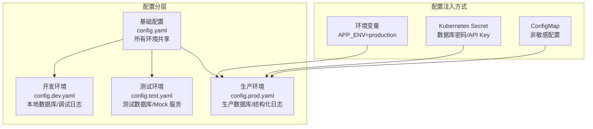
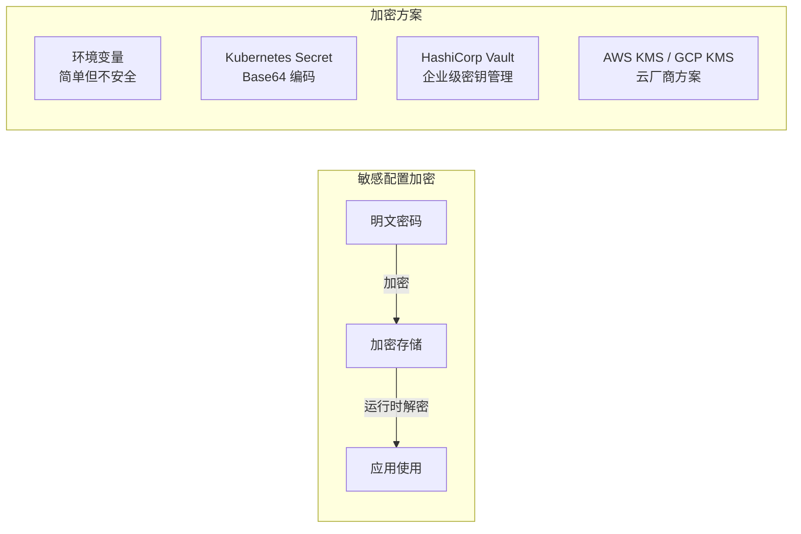

# 配置管理最佳实践

## 概念说明

配置管理是软件工程中的基础实践，直接影响系统的可维护性、安全性和可靠性。在微服务架构中，配置管理的复杂度随服务数量线性增长——每个服务都有自己的数据库连接、缓存地址、功能开关等配置项。

良好的配置管理实践应遵循以下原则：

- **12-Factor App 配置原则**：配置与代码严格分离，通过环境变量注入
- **最小权限原则**：敏感配置加密存储，按需授权访问
- **可追溯原则**：配置变更有版本记录和审计日志
- **渐进式发布**：配置变更支持灰度发布，避免全量生效导致故障

## 核心原理

### 分环境配置策略



推荐的分环境配置方案：

| 环境 | 配置文件 | 敏感配置 | 日志级别 |
|------|---------|---------|---------|
| 开发 | config.dev.yaml | 明文（本地） | debug |
| 测试 | config.test.yaml | 环境变量 | info |
| 预发布 | config.staging.yaml | Vault/Secret | info |
| 生产 | config.prod.yaml | Vault/Secret | warn |

### 配置加密方案



### 配置版本管理

配置变更应像代码变更一样可追溯：

| 方案 | 说明 | 适用场景 |
|------|------|---------|
| Git 版本控制 | 配置文件纳入 Git 管理 | 静态配置 |
| etcd MVCC | 每次修改自动记录 Revision | 动态配置 |
| 配置中心审计日志 | 记录谁在什么时间改了什么 | 生产环境 |
| GitOps | 配置变更通过 PR 审核后自动同步 | Kubernetes 环境 |

## 标准库方案

Go 标准库提供了基础的配置管理能力：

```go
// 环境变量读取
dbHost := os.Getenv("DB_HOST")
if dbHost == "" {
    dbHost = "localhost" // 默认值
}

// 命令行参数
port := flag.Int("port", 8080, "服务端口")
flag.Parse()
```

## 第三方库方案

### Viper 分环境配置

```go
// 根据 APP_ENV 环境变量加载不同配置
env := os.Getenv("APP_ENV")
if env == "" {
    env = "dev"
}

viper.SetConfigName("config." + env)
viper.SetConfigType("yaml")
viper.AddConfigPath("./configs")
viper.ReadInConfig()

// 环境变量覆盖（优先级高于配置文件）
viper.SetEnvPrefix("APP")
viper.AutomaticEnv()
```

### 配置验证

```go
// 使用 go-playground/validator 验证配置
type Config struct {
    Server struct {
        Host string `mapstructure:"host" validate:"required"`
        Port int    `mapstructure:"port" validate:"required,min=1,max=65535"`
    } `mapstructure:"server"`
    Database struct {
        Host     string `mapstructure:"host" validate:"required"`
        Port     int    `mapstructure:"port" validate:"required"`
        Password string `mapstructure:"password" validate:"required,min=8"`
    } `mapstructure:"database"`
}
```

## 代码示例

> 💻 完整可运行代码：[code-examples/03-microservice/service-governance/viper-config/](https://github.com/your-repo/code-examples/03-microservice/service-governance/viper-config/)
> 🏷️ Demo 模式：纯 Go（无需 Docker）

## 常见面试题

### Q1: 微服务的配置管理有哪些最佳实践？

**难度**：⭐⭐⭐ | **频率**：🔥🔥

**答题思路**：

1. 配置与代码分离
2. 分环境管理
3. 敏感配置加密
4. 配置热更新
5. 版本管理与审计

**标准答案**：

微服务配置管理的核心实践：一是配置与代码严格分离，遵循 12-Factor App 原则，通过环境变量或配置中心注入；二是分环境管理，开发/测试/生产使用不同配置文件，通过环境变量切换；三是敏感配置加密，数据库密码等使用 Vault 或 Kubernetes Secret 管理，禁止明文存储在代码仓库；四是配置热更新，使用 etcd Watch 或 Viper WatchConfig 实现不重启更新配置；五是版本管理，配置变更通过 GitOps 或配置中心审计日志追溯。

**深入追问**：

- 配置中心宕机时如何保证服务正常运行？（本地缓存降级）
- 如何实现配置的灰度发布？

## 常见陷阱

1. **敏感配置提交到 Git**：数据库密码、API Key 等绝不能提交到代码仓库，使用 `.gitignore` 排除
2. **配置文件路径硬编码**：使用相对路径或环境变量指定配置文件位置，避免硬编码绝对路径
3. **缺少配置验证**：应用启动时应验证必要配置项是否存在且格式正确，快速失败
4. **配置热更新未考虑并发**：热更新配置时需要考虑并发读写安全，使用 `atomic.Value` 或 `sync.RWMutex`
5. **所有配置都放配置中心**：不是所有配置都需要动态变更，静态配置（如端口号）放本地文件即可

## 参考资料

- [12-Factor App 配置原则](https://12factor.net/config)
- [HashiCorp Vault](https://www.vaultproject.io/)
- [Kubernetes ConfigMap 和 Secret](https://kubernetes.io/docs/concepts/configuration/)
- [GitOps 配置管理](https://www.gitops.tech/)
