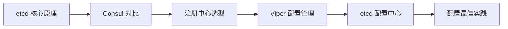
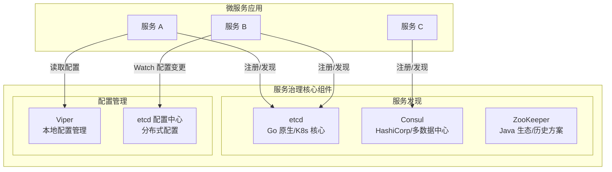

# 服务治理

> **前置依赖：** [Go 基础语法](/1-go-core/1.1-go-basics/) | [微服务架构](/3-microservice/3.1-microservice/)

## 模块概述

服务治理是微服务架构的核心基础设施，解决的是"服务在哪里"和"配置怎么管"两大核心问题。在分布式系统中，服务实例动态上下线、配置需要实时变更，传统的硬编码地址和本地配置文件方案无法满足需求。

Go 生态中，**etcd** 是最主流的服务注册与发现方案——它本身就是用 Go 编写的，是 Kubernetes 的核心存储组件，天然与 Go 生态深度集成。**Consul** 是 HashiCorp 出品的另一个主流方案，提供更丰富的健康检查和多数据中心支持。**Viper** 则是 Go 生态中最流行的配置管理库，支持多格式读取、环境变量覆盖和配置热更新。

本模块系统讲解服务发现（etcd、Consul）和配置管理（Viper、etcd 配置中心）的核心原理与 Go 实现，并提供注册中心选型对比和配置管理最佳实践。

## 知识点索引

### 服务发现与注册

| 序号 | 知识点 | 难度 | 面试频率 | 预计时间 |
|------|--------|------|---------|---------|
| 01 | [etcd 服务注册与发现](./01-etcd.md) | ⭐⭐⭐ | 🔥🔥🔥 | 60min |
| 02 | [Consul 服务发现](./02-consul.md) | ⭐⭐⭐ | 🔥🔥 | 50min |
| 03 | [注册中心选型对比](./03-registry-comparison.md) | ⭐⭐⭐ | 🔥🔥🔥 | 40min |

### 配置管理

| 序号 | 知识点 | 难度 | 面试频率 | 预计时间 |
|------|--------|------|---------|---------|
| 04 | [Viper 配置管理](./04-viper.md) | ⭐⭐ | 🔥🔥 | 40min |
| 05 | [etcd 作为配置中心](./05-etcd-config.md) | ⭐⭐⭐ | 🔥🔥🔥 | 45min |
| 06 | [配置管理最佳实践](./06-config-best-practices.md) | ⭐⭐⭐ | 🔥🔥 | 35min |

### 面试指南

| 📝 | [面试指南](./interview.md) | - | 🔥🔥🔥 | 60min |
|------|--------|------|---------|---------|

## 代码示例

> 💻 完整可运行代码：[code-examples/03-microservice/service-governance/](https://github.com/skyhe58/guide-go/tree/main/code-examples/03-microservice/service-governance/)

| 示例目录 | 对应知识点 | 运行方式 | Demo 模式 |
|---------|-----------|---------|----------|
| `etcd/` | etcd 服务注册与发现 + 配置中心 | `go run ./etcd/` | 混合（Part A + Part B） |
| `consul/` | Consul 服务注册与发现 | `go run ./consul/` | 混合（Part A + Part B） |
| `viper-config/` | Viper 配置管理 | `go run ./viper-config/` | 纯 Go |

### Docker 启动命令

```bash
# etcd（服务发现 + 配置中心）
docker compose -f docker/docker-compose.etcd.yml up -d

# Consul（服务发现）
docker compose -f docker/docker-compose.consul.yml up -d
```

## 学习路径建议



1. **先学 etcd**：Go 原生生态，Kubernetes 核心组件，理解 Raft 一致性、Lease 租约、Watch 机制
2. **再学 Consul**：对比 etcd，理解健康检查、多数据中心等差异化特性
3. **做选型对比**：从 CAP 视角理解 etcd vs Consul vs ZooKeeper 的取舍
4. **学 Viper**：Go 生态最流行的配置管理库，掌握多格式读取和热更新
5. **etcd 配置中心**：将 etcd 用作配置中心，结合 Watch 实现配置热更新
6. **最佳实践**：分环境配置、配置加密、版本管理等生产级实践

## 服务治理全景图


