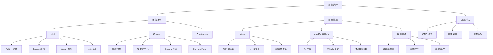

# 服务治理面试指南

## 面试知识图谱

## 高频面试题

### Q1: etcd 的 Raft 算法是如何保证数据一致性的？

**难度**：⭐⭐⭐ | **频率**：🔥🔥🔥

**答题思路**：

1. Raft 的三个子问题：Leader 选举、日志复制、安全性
2. Leader 选举流程
3. 日志复制和提交机制
4. 与 Paxos 的对比

**标准答案**：

Raft 将一致性问题分解为三个子问题。Leader 选举：所有节点初始为 Follower，超时未收到心跳则转为 Candidate 发起选举，获得多数票成为 Leader。日志复制：所有写请求由 Leader 处理，Leader 将操作追加到本地日志后复制到 Follower，多数节点确认后提交。安全性：已提交的日志不会被覆盖，新 Leader 一定包含所有已提交的日志。相比 Paxos，Raft 更易理解和实现，etcd 的 Raft 实现是 Go 生态的参考标准。

**深入追问**：

- etcd 集群推荐几个节点？为什么是奇数？
- 脑裂问题如何解决？
- Leader 宕机后选举需要多长时间？

### Q2: etcd 的 Lease 机制在服务发现中的作用？

**难度**：⭐⭐⭐ | **频率**：🔥🔥🔥

**答题思路**：

1. Lease 概念和 TTL
2. 服务注册绑定 Lease
3. KeepAlive 续约
4. 服务宕机自动摘除

**标准答案**：

Lease 为键值对提供 TTL 生存时间，是 etcd 服务发现的核心机制。服务启动时创建 Lease（如 TTL=10s），将服务地址写入 etcd 并绑定 Lease，同时启动 KeepAlive 协程每 TTL/3 续约一次。服务正常运行时持续续约保持注册有效；服务宕机后停止续约，Lease 到期后 etcd 自动删除关联的注册信息。消费者通过 Watch 前缀监听感知服务上下线，更新本地服务列表。

**深入追问**：

- KeepAlive 的续约频率如何设置？
- 网络抖动导致续约失败怎么办？
- 如何实现优雅下线（主动注销 vs 等待 Lease 过期）？

### Q3: etcd、Consul、ZooKeeper 如何选型？

**难度**：⭐⭐⭐ | **频率**：🔥🔥🔥

**答题思路**：

1. CAP 模型对比
2. 功能特性对比
3. 技术栈匹配
4. 运维成本

**标准答案**：

三者都是 CP 系统。选型看三点：技术栈匹配——Go/K8s 生态选 etcd，Java 生态选 ZooKeeper；功能需求——需要多数据中心或丰富健康检查选 Consul，纯 KV 存储选 etcd；运维成本——etcd 最轻量（Go 单二进制），ZooKeeper 最重（JVM 调优）。具体来说：已有 K8s 集群可复用 etcd；需要多数据中心或服务网格选 Consul；已有 Kafka/Hadoop 生态选 ZooKeeper。

**深入追问**：

- 为什么 Kubernetes 选择 etcd？
- Consul 的 Gossip 和 Raft 分别用在哪里？
- 注册中心宕机时如何保证服务可用？

### Q4: Viper 的配置优先级是什么？

**难度**：⭐⭐ | **频率**：🔥🔥

**答题思路**：

1. 六个配置源及优先级
2. 设计理由（12-Factor App）
3. 实际应用场景

**标准答案**：

Viper 配置优先级从高到低：显式 Set > 命令行参数 > 环境变量 > 配置文件 > 远程配置源 > 默认值。这种设计遵循 12-Factor App 原则，环境变量优先于配置文件，方便在不同环境中覆盖配置。生产环境通过环境变量注入敏感配置（数据库密码），配置文件提供基础配置，默认值作为兜底。

**深入追问**：

- Viper 的热更新是如何实现的？
- 如何在 Kubernetes 中使用 Viper？

### Q5: 微服务的配置管理有哪些最佳实践？

**难度**：⭐⭐⭐ | **频率**：🔥🔥

**答题思路**：

1. 配置与代码分离
2. 分环境管理
3. 敏感配置加密
4. 配置热更新
5. 版本管理

**标准答案**：

五大核心实践：一是配置与代码分离，遵循 12-Factor App，通过环境变量或配置中心注入；二是分环境管理，dev/test/prod 使用不同配置，通过 APP_ENV 切换；三是敏感配置加密，使用 Vault 或 K8s Secret，禁止明文存储在 Git；四是配置热更新，etcd Watch 或 Viper WatchConfig 实现不重启更新；五是版本管理，通过 GitOps 或配置中心审计日志追溯变更。此外还要做配置验证（启动时校验必要配置）和降级方案（配置中心不可用时使用本地缓存）。

**深入追问**：

- 配置中心宕机时如何保证服务正常？
- 如何实现配置的灰度发布？

### Q6: etcd 的 Watch 机制是如何实现的？

**难度**：⭐⭐⭐ | **频率**：🔥🔥🔥

**答题思路**：

1. Watch 的实现原理（MVCC + gRPC 流）
2. Revision 机制
3. 前缀监听
4. 断连重连处理

**标准答案**：

etcd 的 Watch 基于 MVCC（多版本并发控制）和 gRPC 双向流实现。每次数据修改都会生成全局递增的 Revision，Watch 可以从指定 Revision 开始监听，保证不丢失任何事件。客户端通过 gRPC 长连接接收服务端推送的变更事件（PUT/DELETE），支持前缀监听（如 Watch `/services/api/` 下所有 key）。断连后客户端应从上次收到的 Revision+1 重新 Watch，etcd 会将中间的所有变更事件补发。如果 Revision 已被压缩（compacted），需要重新全量获取数据。

**深入追问**：

- Watch 和轮询的区别？
- etcd 的 Revision 压缩是什么？
- 如何处理 Watch 事件的幂等性？

## 面试重点总结

### 按公司类型

| 公司类型 | 重点考察 | 深度要求 |
|---------|---------|---------|
| 大厂（字节/B站） | Raft 原理、etcd 源码级理解、配置中心设计 | 深入原理 |
| 中厂 | etcd/Consul 使用、选型对比、配置管理实践 | 原理 + 实践 |
| 创业公司 | Viper 使用、基本服务发现、配置管理 | 实践为主 |

### 高频考点 Top 5

1. **Raft 一致性算法**（几乎必问）
2. **etcd vs Consul vs ZooKeeper 选型**（高频）
3. **Lease 机制与服务发现**（高频）
4. **Watch 机制原理**（高频）
5. **配置管理最佳实践**（中频）
