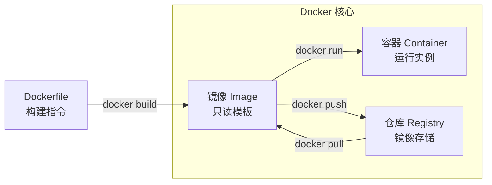
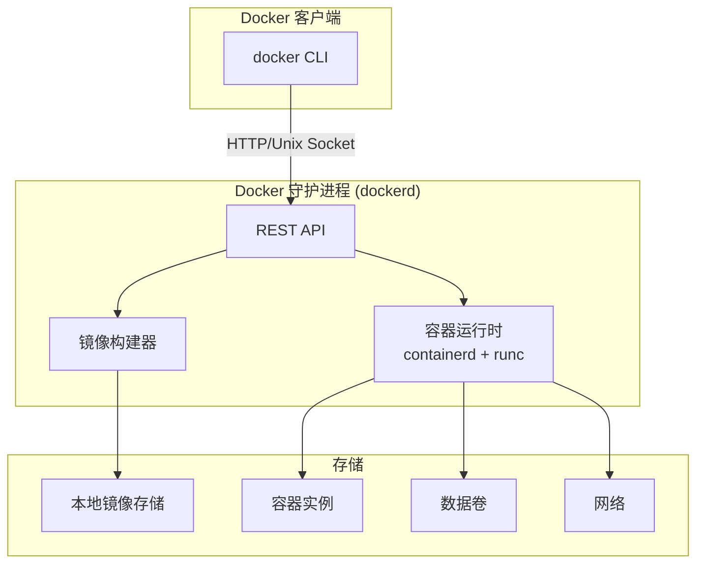
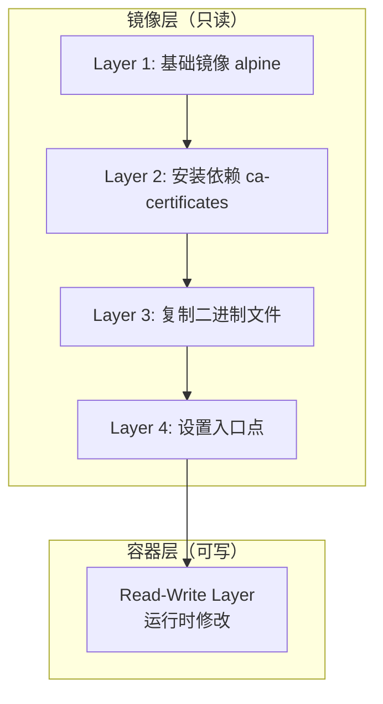

# Docker 核心概念

## 概念说明

Docker 是一个开源的容器化平台，用于将应用及其依赖打包到一个轻量级、可移植的容器中。Docker 本身就是用 Go 语言编写的，这使得 Go 开发者与 Docker 有着天然的亲和力。

容器化解决的核心问题是**环境一致性**——"在我机器上能跑"不再是一个有效的借口。通过容器，开发、测试、生产环境完全一致。

### Docker vs 虚拟机

| 维度 | Docker 容器 | 虚拟机 |
|------|------------|--------|
| 虚拟化层级 | 操作系统级（共享宿主机内核） | 硬件级（完整 Guest OS） |
| 启动速度 | 秒级 | 分钟级 |
| 资源占用 | MB 级 | GB 级 |
| 性能损耗 | 接近原生 | 有明显损耗 |
| 隔离性 | 进程级隔离（Namespace + Cgroup） | 完全隔离 |
| 镜像大小 | Go 应用可做到 ≤ 10MB | 通常 GB 级 |

## 核心原理

### Docker 三大核心概念



#### 1. 镜像（Image）

镜像是一个只读的模板，包含运行应用所需的一切：代码、运行时、库、环境变量、配置文件。镜像采用**分层存储**（Union FS），每一层都是只读的，层与层之间可以共享和复用。

```
┌─────────────────────────┐
│  应用层（Go 二进制文件）    │  ← 你的应用
├─────────────────────────┤
│  依赖层（ca-certificates）│  ← 运行时依赖
├─────────────────────────┤
│  基础镜像层（scratch/alpine）│  ← 基础操作系统
└─────────────────────────┘
```

Go 应用的优势：编译为静态二进制文件后，可以使用 `scratch`（空镜像）作为基础镜像，最终镜像只包含一个二进制文件，大小可控制在 10MB 以内。

#### 2. 容器（Container）

容器是镜像的运行实例。容器在镜像的只读层之上添加一个可写层，所有运行时的修改都发生在这个可写层。

容器的隔离机制基于 Linux 内核的两大特性：
- **Namespace**：隔离进程 ID、网络、文件系统、用户等
- **Cgroup**：限制 CPU、内存、磁盘 I/O 等资源使用

#### 3. 仓库（Registry）

仓库是存储和分发镜像的服务。Docker Hub 是最大的公共仓库，企业通常使用私有仓库（如 AWS ECR、Harbor）。

### Docker 架构



Docker 采用 Client-Server 架构：
- **Docker Client**：命令行工具 `docker`，通过 REST API 与 Docker Daemon 通信
- **Docker Daemon**（dockerd）：后台守护进程，管理镜像、容器、网络、数据卷
- **containerd**：容器运行时，负责容器的生命周期管理
- **runc**：OCI 标准的容器运行时实现，负责创建和运行容器

### Docker 镜像分层原理



每条 Dockerfile 指令（`FROM`、`RUN`、`COPY` 等）都会创建一个新的镜像层。层是只读的，可以被多个镜像共享，这大大节省了存储空间和传输时间。

## 标准库方案

Docker 本身不是 Go 标准库的一部分，但 Go 的以下标准库特性使其天然适合容器化：

```go
// Go 编译为静态二进制文件，无需外部依赖
// CGO_ENABLED=0 禁用 CGO，确保纯静态链接
// 编译命令：CGO_ENABLED=0 GOOS=linux go build -o app .

package main

import (
    "fmt"
    "net/http"
    "os"
    "os/signal"
    "syscall"
)

func main() {
    // 容器中运行的 Go 服务应正确处理信号
    // Docker stop 会发送 SIGTERM，优雅停机是容器化的基本要求
    quit := make(chan os.Signal, 1)
    signal.Notify(quit, syscall.SIGINT, syscall.SIGTERM)

    http.HandleFunc("/", func(w http.ResponseWriter, r *http.Request) {
        fmt.Fprintf(w, "Hello from Go container!")
    })

    go func() {
        fmt.Println("服务启动在 :8080")
        if err := http.ListenAndServe(":8080", nil); err != nil {
            fmt.Printf("服务启动失败: %v\n", err)
        }
    }()

    <-quit
    fmt.Println("收到停止信号，优雅关闭...")
}
```

## 代码示例

> 💻 完整配置文件：[code-examples/03-microservice/docker-k8s/](https://github.com/skyhe58/guide-go/tree/main/code-examples/03-microservice/docker-k8s/)
> 🏷️ Demo 模式：配置文件（直接使用）

## 常见面试题

### Q1: Docker 容器和虚拟机有什么区别？

**难度**：⭐⭐ | **频率**：🔥🔥🔥

**答题思路**：

1. 从虚拟化层级说起（OS 级 vs 硬件级）
2. 对比启动速度、资源占用、性能
3. 说明隔离机制（Namespace + Cgroup vs Hypervisor）
4. 结合 Go 应用场景说明容器化优势

**标准答案**：

Docker 容器是操作系统级虚拟化，共享宿主机内核，通过 Linux Namespace 实现进程隔离，通过 Cgroup 实现资源限制。虚拟机是硬件级虚拟化，通过 Hypervisor 运行完整的 Guest OS。容器启动秒级、资源占用 MB 级、性能接近原生；虚拟机启动分钟级、资源占用 GB 级、有明显性能损耗。对于 Go 应用，容器化优势更明显——Go 编译为静态二进制文件，基于 scratch 空镜像构建，最终镜像可以小到 10MB 以内。

**深入追问**：

- Docker 的 Namespace 有哪些类型？各自隔离什么？
- Cgroup v1 和 v2 有什么区别？
- 容器逃逸是什么？如何防范？

### Q2: Docker 镜像的分层存储是怎么实现的？

**难度**：⭐⭐⭐ | **频率**：🔥🔥

**答题思路**：

1. 解释 Union FS（联合文件系统）
2. 说明每层只读、容器层可写
3. 解释层共享和复用机制
4. 说明对镜像大小优化的影响

**标准答案**：

Docker 镜像采用分层存储，基于 Union FS（如 overlay2）实现。每条 Dockerfile 指令创建一个新的只读层，层与层之间通过联合挂载叠加。运行容器时，在镜像层之上添加一个可写的容器层。由于层是只读的，多个镜像可以共享相同的基础层，节省存储空间。这也是为什么 Dockerfile 中要合理组织指令顺序——将不常变化的层放在前面，利用构建缓存加速构建。

**深入追问**：

- overlay2 和 aufs 有什么区别？
- 如何查看镜像的分层信息？
- 为什么要在 Dockerfile 中合并 RUN 指令？

## 常见陷阱

1. **容器不是虚拟机**：不要在容器中运行 SSH 服务或多个进程，一个容器应该只运行一个主进程
2. **容器是临时的**：容器内的数据在容器删除后会丢失，持久化数据应使用数据卷（Volume）
3. **忽略信号处理**：Go 服务在容器中必须正确处理 SIGTERM 信号，否则 `docker stop` 会在超时后强制杀死进程
4. **以 root 用户运行**：生产环境应使用非 root 用户运行容器，降低安全风险

## 参考资料

- [Docker 官方文档](https://docs.docker.com/)
- [Docker 源码（Go 实现）](https://github.com/moby/moby)
- [containerd 项目](https://github.com/containerd/containerd)
- [OCI 运行时规范](https://github.com/opencontainers/runtime-spec)
