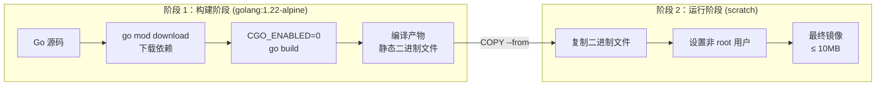

# Go 应用 Dockerfile

## 概念说明

Dockerfile 是构建 Docker 镜像的脚本文件，定义了从基础镜像到最终应用镜像的每一步操作。对于 Go 应用，Dockerfile 的核心技巧是**多阶段构建**（Multi-stage Build）——在一个阶段编译 Go 代码，在另一个阶段只复制编译产物，最终镜像不包含编译工具链，大小可控制在 10MB 以内。

这是 Go 相比 Java、Python 等语言的巨大优势：Go 编译为单一静态二进制文件，不需要 JVM 或解释器，可以直接运行在 `scratch`（空镜像）上。

## 核心原理

### 多阶段构建原理



多阶段构建的关键点：

1. **构建阶段**使用完整的 Go 工具链镜像（`golang:1.22-alpine`），包含编译器、标准库等
2. **运行阶段**使用最小化基础镜像（`scratch` 或 `alpine`），只包含运行所需的文件
3. 通过 `COPY --from=builder` 从构建阶段复制编译产物到运行阶段
4. 最终镜像不包含 Go 工具链、源码、依赖缓存，大幅减小镜像体积

### CGO_ENABLED=0 的重要性

Go 默认启用 CGO（C Go），某些标准库（如 `net`、`os/user`）会链接 C 库。在容器中，如果基础镜像没有对应的 C 库（如 `scratch` 没有任何库），程序会启动失败。

```
CGO_ENABLED=0  →  纯 Go 实现，静态链接  →  可在 scratch 上运行
CGO_ENABLED=1  →  链接 C 库，动态链接    →  需要 glibc/musl 的基础镜像
```

### 基础镜像选型

| 基础镜像 | 大小 | 适用场景 | 说明 |
|---------|------|---------|------|
| `scratch` | 0 MB | Go 静态二进制 | 空镜像，最小化，无 shell、无调试工具 |
| `alpine` | ~5 MB | 需要 shell 或调试 | 最小化 Linux 发行版，含 musl libc |
| `distroless` | ~2 MB | Google 推荐 | 无 shell，含 ca-certificates 和时区数据 |
| `debian-slim` | ~80 MB | 需要 glibc | 精简版 Debian，兼容性最好 |

**推荐**：生产环境使用 `scratch`（最安全、最小），开发调试使用 `alpine`（有 shell 可以进入容器排查问题）。

## 标准库方案

Go 应用 Dockerfile 最佳实践（多阶段构建 + scratch）：

```dockerfile
# ============================================
# 阶段 1：构建阶段
# ============================================
FROM golang:1.22-alpine AS builder

# 安装构建依赖（如需要 git 拉取私有依赖）
RUN apk add --no-cache git ca-certificates

WORKDIR /build

# 先复制依赖文件，利用 Docker 层缓存
COPY go.mod go.sum ./
RUN go mod download

# 复制源码并编译
COPY . .
RUN CGO_ENABLED=0 GOOS=linux GOARCH=amd64 \
    go build -ldflags="-s -w" -o /app ./cmd/server

# ============================================
# 阶段 2：运行阶段
# ============================================
FROM scratch

# 从构建阶段复制 CA 证书（HTTPS 请求需要）
COPY --from=builder /etc/ssl/certs/ca-certificates.crt /etc/ssl/certs/

# 从构建阶段复制编译产物
COPY --from=builder /app /app

# 暴露端口
EXPOSE 8080

# 设置入口点
ENTRYPOINT ["/app"]
```

### 编译参数说明

```bash
CGO_ENABLED=0    # 禁用 CGO，纯静态链接
GOOS=linux       # 目标操作系统
GOARCH=amd64     # 目标 CPU 架构（也可用 arm64）
-ldflags="-s -w" # -s 去掉符号表，-w 去掉 DWARF 调试信息，减小二进制体积
```

### 镜像大小对比

| 构建方式 | 镜像大小 | 说明 |
|---------|---------|------|
| `golang:1.22` 直接运行 | ~800 MB | 包含完整 Go 工具链 |
| `golang:1.22-alpine` 直接运行 | ~250 MB | Alpine 版 Go 工具链 |
| 多阶段 + `alpine` | ~15 MB | 只含二进制 + Alpine |
| 多阶段 + `scratch` | ~8 MB | 只含二进制文件 |
| 多阶段 + `scratch` + `-ldflags="-s -w"` | ~6 MB | 去掉调试信息 |

## 第三方库方案

### UPX 压缩（进一步减小体积）

```dockerfile
FROM golang:1.22-alpine AS builder
RUN apk add --no-cache upx
WORKDIR /build
COPY go.mod go.sum ./
RUN go mod download
COPY . .
RUN CGO_ENABLED=0 go build -ldflags="-s -w" -o /app ./cmd/server
# UPX 压缩，可再减小 50-70% 体积（代价是启动时需要解压）
RUN upx --best /app
```

> ⚠️ UPX 压缩会增加启动时间（需要解压），且可能触发某些安全扫描工具的误报。生产环境建议评估后使用。

## 代码示例

> 💻 完整 Dockerfile：[code-examples/03-microservice/docker-k8s/Dockerfile](https://github.com/skyhe58/guide-go/tree/main/code-examples/03-microservice/docker-k8s/Dockerfile)
> 🏷️ Demo 模式：配置文件（直接使用）

## 常见面试题

### Q1: Go 应用的 Docker 镜像如何优化到 10MB 以内？

**难度**：⭐⭐⭐ | **频率**：🔥🔥🔥

**答题思路**：

1. 多阶段构建分离编译和运行环境
2. CGO_ENABLED=0 确保静态链接
3. scratch 空镜像作为基础
4. -ldflags="-s -w" 去掉调试信息
5. 可选 UPX 压缩

**标准答案**：

Go 应用镜像优化的核心是多阶段构建：第一阶段使用 `golang:1.22-alpine` 编译代码，设置 `CGO_ENABLED=0` 确保纯静态链接；第二阶段使用 `scratch` 空镜像，只复制编译产物。配合 `-ldflags="-s -w"` 去掉符号表和调试信息，最终镜像通常在 6-10MB。如果需要进一步压缩，可以使用 UPX 工具，但会增加启动时间。

**深入追问**：

- 为什么要设置 CGO_ENABLED=0？不设置会怎样？
- scratch 和 alpine 作为基础镜像各有什么优缺点？
- 如何处理需要 CGO 的场景（如 SQLite）？

### Q2: Dockerfile 中如何利用构建缓存加速构建？

**难度**：⭐⭐ | **频率**：🔥🔥

**答题思路**：

1. Docker 构建缓存的工作原理
2. 指令顺序对缓存的影响
3. Go 项目的最佳实践

**标准答案**：

Docker 构建时，每条指令的结果会被缓存。如果某一层的输入没有变化，Docker 会直接使用缓存。对于 Go 项目，最佳实践是先复制 `go.mod` 和 `go.sum`，执行 `go mod download` 下载依赖（这一层很少变化），然后再复制源码并编译。这样修改代码时，依赖下载层可以命中缓存，只需重新编译，大幅加速构建。

**深入追问**：

- `--no-cache` 和 `--pull` 参数的区别？
- BuildKit 相比传统构建器有什么优势？

## 常见陷阱

1. **忘记设置 CGO_ENABLED=0**：在 scratch 镜像上运行会报 `exec format error` 或找不到动态库
2. **COPY 顺序不当**：先 COPY 全部源码再 go mod download，每次代码修改都会重新下载依赖
3. **忘记复制 CA 证书**：scratch 镜像没有 CA 证书，HTTPS 请求会失败
4. **以 root 用户运行**：scratch 镜像默认 root，生产环境应创建非 root 用户
5. **忽略时区数据**：scratch 镜像没有时区数据，`time.LoadLocation` 会失败，需要复制 `/usr/share/zoneinfo`

## 参考资料

- [Docker 多阶段构建文档](https://docs.docker.com/build/building/multi-stage/)
- [Go 官方 Docker 镜像](https://hub.docker.com/_/golang)
- [GoogleContainerTools distroless](https://github.com/GoogleContainerTools/distroless)
- [CGO_ENABLED 详解](https://go.dev/wiki/cgo)
