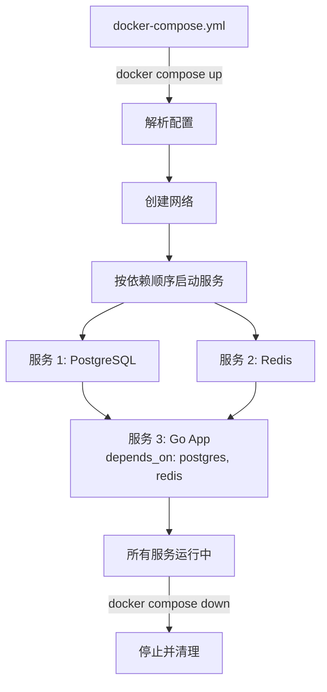

# Docker Compose 编排

## 概念说明

Docker Compose 是 Docker 官方的多容器编排工具，通过一个 YAML 文件定义和管理多个容器服务。在 Go 微服务开发中，一个典型的服务栈通常包含 Go 应用、数据库（PostgreSQL/MySQL）、缓存（Redis）、消息队列（Kafka/NATS）等多个组件，Docker Compose 让你用一条命令就能启动整个开发环境。

Docker Compose 主要用于**本地开发和测试**，生产环境通常使用 Kubernetes 进行编排。

## 核心原理

### Docker Compose 工作流程



### docker-compose.yml 核心结构

```yaml
version: "3.8"              # Compose 文件版本

services:                    # 服务定义
  app:                       # 服务名称
    build: .                 # 构建配置
    ports:                   # 端口映射
      - "8080:8080"
    environment:             # 环境变量
      - DB_HOST=postgres
    depends_on:              # 依赖关系
      postgres:
        condition: service_healthy
    networks:                # 网络
      - app-net

  postgres:
    image: postgres:16       # 使用现有镜像
    volumes:                 # 数据卷
      - pg-data:/var/lib/postgresql/data
    healthcheck:             # 健康检查
      test: ["CMD-SHELL", "pg_isready"]
      interval: 5s
      timeout: 5s
      retries: 5

volumes:                     # 数据卷定义
  pg-data:

networks:                    # 网络定义
  app-net:
    driver: bridge
```

### 核心配置项说明

| 配置项 | 说明 | 示例 |
|--------|------|------|
| `build` | 从 Dockerfile 构建镜像 | `build: .` 或 `build: {context: ., dockerfile: Dockerfile}` |
| `image` | 使用现有镜像 | `image: postgres:16-alpine` |
| `ports` | 端口映射（宿主机:容器） | `"8080:8080"` |
| `environment` | 环境变量 | `DB_HOST=postgres` |
| `volumes` | 数据卷挂载 | `pg-data:/var/lib/postgresql/data` |
| `depends_on` | 服务依赖 | `depends_on: {postgres: {condition: service_healthy}}` |
| `healthcheck` | 健康检查 | `test: ["CMD", "pg_isready"]` |
| `networks` | 网络配置 | `networks: [app-net]` |
| `restart` | 重启策略 | `restart: unless-stopped` |
| `deploy.resources` | 资源限制 | `limits: {cpus: "1.0", memory: 512M}` |

### 服务间通信

在 Docker Compose 中，同一网络下的服务可以通过**服务名**直接访问：

```go
// Go 应用中连接 PostgreSQL
// 不用 localhost，而是用服务名 "postgres"
dsn := "host=postgres port=5432 user=postgres password=postgres123 dbname=myapp sslmode=disable"

// 连接 Redis
// 服务名 "redis" 会被 Docker DNS 解析为容器 IP
redisAddr := "redis:6379"
```

## 标准库方案

Docker Compose 是配置文件，不涉及 Go 标准库。但 Go 应用需要正确处理容器环境：

```go
package main

import (
    "fmt"
    "os"
)

// 从环境变量读取配置，适配 Docker Compose 的 environment 配置
func getEnv(key, defaultValue string) string {
    if value, exists := os.LookupEnv(key); exists {
        return value
    }
    return defaultValue
}

func main() {
    dbHost := getEnv("DB_HOST", "localhost")
    dbPort := getEnv("DB_PORT", "5432")
    redisAddr := getEnv("REDIS_ADDR", "localhost:6379")

    fmt.Printf("数据库: %s:%s\n", dbHost, dbPort)
    fmt.Printf("Redis: %s\n", redisAddr)
}
```

## 代码示例

> 💻 完整配置文件：[code-examples/03-microservice/docker-k8s/docker-compose.yml](https://github.com/skyhe58/guide-go/tree/main/code-examples/03-microservice/docker-k8s/docker-compose.yml)
> 🏷️ Demo 模式：配置文件（直接使用）

## 常见面试题

### Q1: Docker Compose 中 depends_on 能保证服务就绪吗？

**难度**：⭐⭐ | **频率**：🔥🔥

**答题思路**：

1. depends_on 只保证启动顺序，不保证服务就绪
2. 需要配合 healthcheck + condition: service_healthy
3. 应用层面也应有重试机制

**标准答案**：

`depends_on` 默认只保证依赖服务的容器已启动，不保证服务已就绪（如数据库已可接受连接）。要确保依赖服务就绪，需要配合 `healthcheck` 定义健康检查，并在 `depends_on` 中设置 `condition: service_healthy`。此外，应用层面也应实现连接重试机制，因为即使健康检查通过，服务也可能在短暂时间内不可用。

**深入追问**：

- Docker Compose v2 和 v3 在 depends_on 上有什么区别？
- 如何自定义健康检查脚本？

### Q2: Docker Compose 和 Kubernetes 有什么区别？

**难度**：⭐⭐ | **频率**：🔥🔥

**答题思路**：

1. 定位不同：本地开发 vs 生产编排
2. 功能差异：单机 vs 集群
3. 使用场景

**标准答案**：

Docker Compose 是单机多容器编排工具，适合本地开发和测试，通过一个 YAML 文件管理多个容器。Kubernetes 是分布式容器编排平台，适合生产环境，提供自动扩缩容、滚动更新、服务发现、负载均衡、自愈等企业级功能。简单说，Compose 管理的是一台机器上的容器，K8s 管理的是整个集群的容器。开发流程通常是：本地用 Compose 开发测试，生产用 K8s 部署。

**深入追问**：

- Kompose 工具了解吗？它能做什么？
- Docker Swarm 和 Kubernetes 的区别？

## 常见陷阱

1. **depends_on 不等于 ready**：服务启动不代表就绪，必须配合 healthcheck
2. **数据卷未持久化**：不使用命名卷（named volume），容器删除后数据丢失
3. **端口冲突**：多个 Compose 项目使用相同的宿主机端口会冲突
4. **网络隔离不当**：不同 Compose 项目默认在不同网络中，无法直接通信

## 参考资料

- [Docker Compose 官方文档](https://docs.docker.com/compose/)
- [Compose 文件规范](https://docs.docker.com/compose/compose-file/)
- [Docker Compose 最佳实践](https://docs.docker.com/compose/production/)
