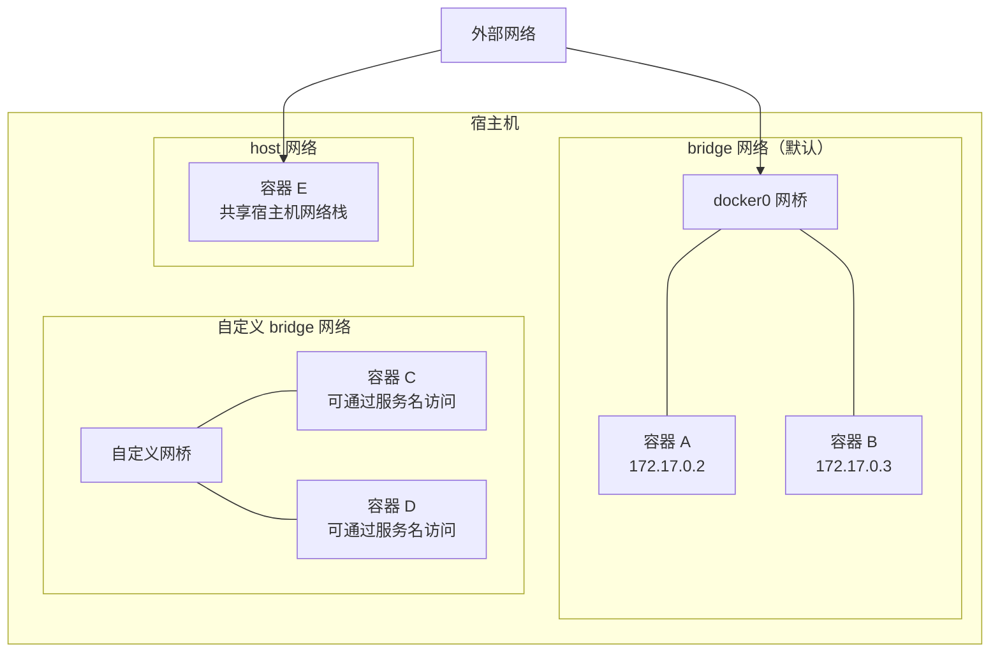
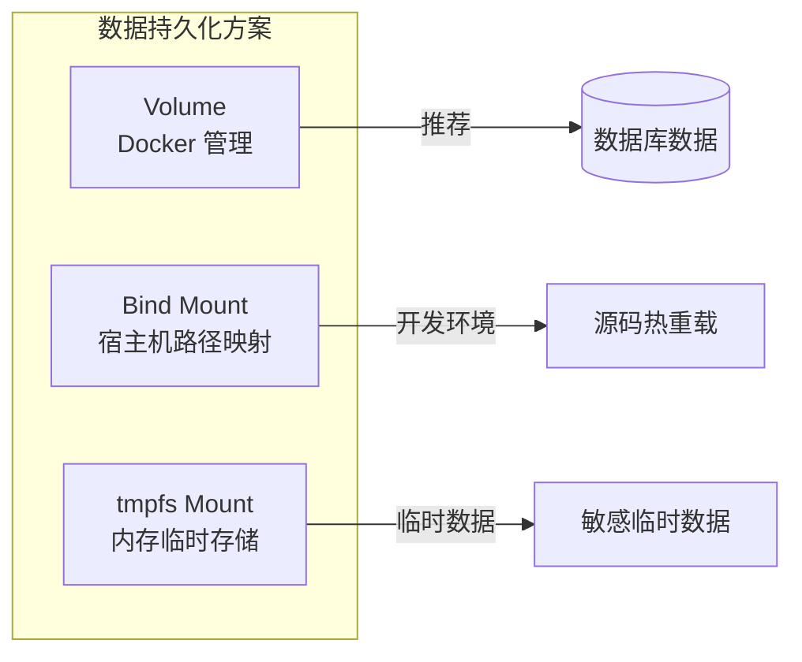

# Docker 网络与数据卷

## 概念说明

Docker 网络和数据卷是容器化的两大基础设施：网络解决容器间**如何通信**的问题，数据卷解决容器**如何持久化数据**的问题。理解这两个概念对于构建可靠的容器化 Go 服务至关重要。

## 核心原理

### Docker 网络模型



### 网络驱动类型

| 驱动 | 说明 | 适用场景 |
|------|------|---------|
| `bridge` | 默认驱动，容器通过虚拟网桥通信 | 单机多容器通信 |
| `host` | 容器共享宿主机网络栈 | 需要最高网络性能 |
| `none` | 无网络，完全隔离 | 安全敏感场景 |
| `overlay` | 跨主机容器通信 | Docker Swarm / 多主机 |
| `macvlan` | 容器拥有独立 MAC 地址 | 需要直接接入物理网络 |

### 自定义 bridge vs 默认 bridge

| 特性 | 默认 bridge | 自定义 bridge |
|------|------------|--------------|
| DNS 解析 | 不支持（只能用 IP） | 支持（可用容器名/服务名） |
| 隔离性 | 所有容器共享 | 只有同网络的容器可通信 |
| 热连接 | 需要重启容器 | 可动态连接/断开 |

**最佳实践**：始终使用自定义 bridge 网络，Docker Compose 默认就会创建自定义网络。

### 数据卷类型



| 类型 | 说明 | 适用场景 |
|------|------|---------|
| **Volume** | Docker 管理的数据卷，存储在 `/var/lib/docker/volumes/` | 数据库数据、持久化存储（推荐） |
| **Bind Mount** | 将宿主机目录挂载到容器 | 开发环境源码映射、配置文件 |
| **tmpfs** | 存储在内存中，容器停止后消失 | 敏感临时数据、高性能缓存 |

## 标准库方案

Go 应用在容器网络中的最佳实践：

```go
package main

import (
    "fmt"
    "net"
    "os"
    "time"
)

// 在容器环境中，服务应监听 0.0.0.0 而非 localhost
// localhost 只能接受容器内部的连接
const listenAddr = "0.0.0.0:8080"

// 等待依赖服务就绪（容器启动顺序不保证服务就绪）
func waitForService(addr string, timeout time.Duration) error {
    deadline := time.Now().Add(timeout)
    for time.Now().Before(deadline) {
        conn, err := net.DialTimeout("tcp", addr, time.Second)
        if err == nil {
            conn.Close()
            return nil
        }
        time.Sleep(time.Second)
    }
    return fmt.Errorf("服务 %s 在 %v 内未就绪", addr, timeout)
}

func main() {
    // 从环境变量获取依赖服务地址（Docker Compose 中用服务名）
    dbHost := os.Getenv("DB_HOST")
    if dbHost == "" {
        dbHost = "localhost"
    }

    // 等待数据库就绪
    dbAddr := fmt.Sprintf("%s:5432", dbHost)
    if err := waitForService(dbAddr, 30*time.Second); err != nil {
        fmt.Printf("数据库连接失败: %v\n", err)
        os.Exit(1)
    }

    fmt.Printf("数据库已就绪: %s\n", dbAddr)
    fmt.Printf("服务监听: %s\n", listenAddr)
}
```

## 代码示例

> 💻 完整配置文件：[code-examples/03-microservice/docker-k8s/docker-compose.yml](https://github.com/your-repo/code-examples/03-microservice/docker-k8s/docker-compose.yml)
> 🏷️ Demo 模式：配置文件（直接使用）

## 常见面试题

### Q1: Docker 的网络模式有哪些？各自适用什么场景？

**难度**：⭐⭐⭐ | **频率**：🔥🔥

**答题思路**：

1. 列举四种主要网络模式
2. 说明各自的工作原理
3. 结合实际场景说明选型

**标准答案**：

Docker 主要有四种网络模式：bridge（默认，通过虚拟网桥通信，适合单机多容器）、host（共享宿主机网络栈，适合需要最高网络性能的场景）、none（无网络，完全隔离）、overlay（跨主机通信，用于 Docker Swarm 或多主机场景）。日常开发中最常用的是自定义 bridge 网络，它支持 DNS 解析（可通过容器名访问），Docker Compose 默认就会创建自定义 bridge 网络。

**深入追问**：

- 自定义 bridge 和默认 bridge 有什么区别？
- 容器如何访问宿主机的服务？
- overlay 网络的 VXLAN 封装原理？

### Q2: Docker Volume 和 Bind Mount 有什么区别？

**难度**：⭐⭐ | **频率**：🔥🔥

**答题思路**：

1. 管理方式不同
2. 可移植性不同
3. 适用场景不同

**标准答案**：

Volume 由 Docker 管理，存储在 Docker 的数据目录下（`/var/lib/docker/volumes/`），可移植性好，支持驱动扩展（如 NFS、云存储），适合数据库等需要持久化的场景。Bind Mount 直接映射宿主机路径到容器，依赖宿主机目录结构，适合开发环境的源码映射和配置文件挂载。生产环境推荐使用 Volume。

**深入追问**：

- tmpfs mount 适用什么场景？
- 如何备份 Docker Volume 的数据？

## 常见陷阱

1. **监听 localhost**：容器中的服务应监听 `0.0.0.0`，监听 `localhost` 或 `127.0.0.1` 只能接受容器内部连接
2. **默认 bridge 无 DNS**：默认 bridge 网络不支持容器名解析，必须使用自定义网络
3. **数据卷权限问题**：容器内非 root 用户可能无法写入挂载的数据卷，需要设置正确的文件权限
4. **端口映射混淆**：`-p 8080:80` 是宿主机 8080 映射到容器 80，顺序不要搞反

## 参考资料

- [Docker 网络文档](https://docs.docker.com/network/)
- [Docker 数据卷文档](https://docs.docker.com/storage/volumes/)
- [Docker 网络最佳实践](https://docs.docker.com/network/#network-driver-summary)
