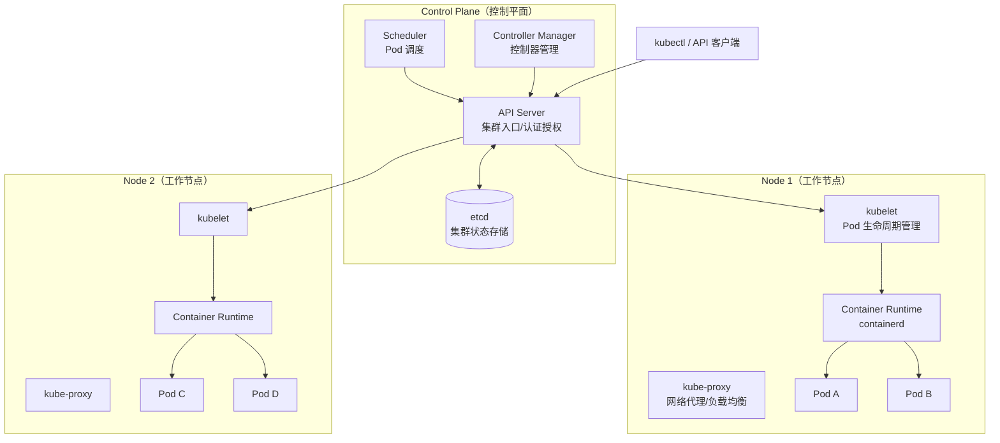
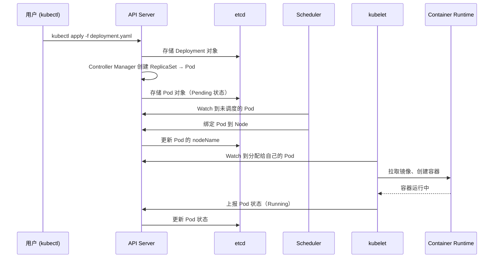
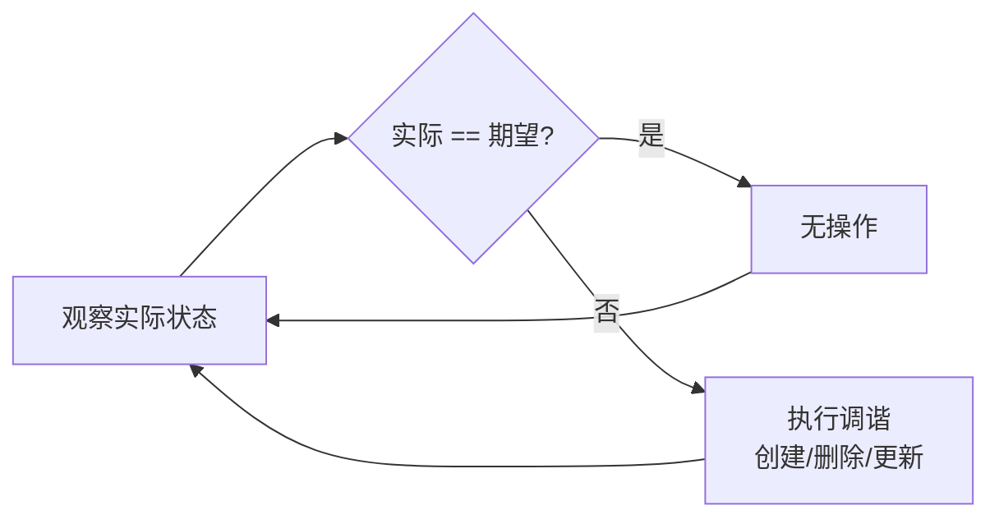

# Kubernetes 架构与核心组件

## 概念说明

Kubernetes（简称 K8s）是 Google 开源的容器编排平台，用于自动化部署、扩缩容和管理容器化应用。K8s 本身就是用 Go 语言编写的，是云原生领域最重要的基础设施项目。

K8s 解决的核心问题：当你有成百上千个容器需要管理时，如何自动化地完成部署、扩缩容、故障恢复、服务发现、负载均衡、配置管理等工作。

## 核心原理

### K8s 整体架构



### 控制平面组件

| 组件 | 职责 | 说明 |
|------|------|------|
| **API Server** | 集群入口 | 所有操作都通过 API Server，提供 RESTful API、认证授权、准入控制 |
| **etcd** | 状态存储 | 分布式 KV 存储，保存集群所有状态数据（唯一的有状态组件） |
| **Scheduler** | Pod 调度 | 根据资源需求、亲和性等策略，将 Pod 分配到合适的 Node |
| **Controller Manager** | 控制循环 | 运行各种控制器（Deployment、ReplicaSet、Node 等），确保实际状态与期望状态一致 |

### 工作节点组件

| 组件 | 职责 | 说明 |
|------|------|------|
| **kubelet** | Pod 管理 | 接收 API Server 的指令，管理 Pod 的生命周期，上报节点和 Pod 状态 |
| **kube-proxy** | 网络代理 | 维护节点上的网络规则，实现 Service 的负载均衡（iptables/IPVS） |
| **Container Runtime** | 容器运行时 | 负责拉取镜像、创建和运行容器（containerd、CRI-O） |

### K8s 工作流程



### 声明式 vs 命令式

K8s 采用**声明式**管理模型：你告诉 K8s "我想要什么状态"（如 3 个副本），K8s 的控制器会持续工作，确保实际状态与期望状态一致。

```
声明式（K8s 推荐）：
  "我需要 3 个 Pod 副本" → K8s 自动创建/删除 Pod 达到 3 个

命令式（传统方式）：
  "创建一个 Pod" → "再创建一个 Pod" → "再创建一个 Pod"
```

这种设计的核心是**控制循环**（Reconciliation Loop）：



## 标准库方案

K8s 本身是用 Go 编写的，Go 开发者可以通过 `client-go` 库与 K8s API 交互：

```go
package main

import (
    "context"
    "fmt"

    metav1 "k8s.io/apimachinery/pkg/apis/meta/v1"
    "k8s.io/client-go/kubernetes"
    "k8s.io/client-go/tools/clientcmd"
)

func main() {
    // 加载 kubeconfig
    config, err := clientcmd.BuildConfigFromFlags("", clientcmd.RecommendedHomeFile)
    if err != nil {
        panic(err)
    }

    // 创建 K8s 客户端
    clientset, err := kubernetes.NewForConfig(config)
    if err != nil {
        panic(err)
    }

    // 列出所有 Pod
    pods, err := clientset.CoreV1().Pods("default").List(
        context.TODO(), metav1.ListOptions{},
    )
    if err != nil {
        panic(err)
    }

    for _, pod := range pods.Items {
        fmt.Printf("Pod: %s, Status: %s\n", pod.Name, pod.Status.Phase)
    }
}
```

## 代码示例

> 💻 完整 K8s 配置：[code-examples/03-microservice/docker-k8s/k8s/](https://github.com/your-repo/code-examples/03-microservice/docker-k8s/k8s/)
> 🏷️ Demo 模式：配置文件（直接使用）

## 常见面试题

### Q1: 简述 Kubernetes 的架构和核心组件

**难度**：⭐⭐⭐ | **频率**：🔥🔥🔥

**答题思路**：

1. 整体架构：Control Plane + Worker Node
2. 控制平面四大组件及职责
3. 工作节点三大组件及职责
4. 声明式管理和控制循环

**标准答案**：

K8s 采用 Master-Node 架构。控制平面包含四个核心组件：API Server 是集群入口，所有操作都通过它；etcd 是分布式 KV 存储，保存集群所有状态；Scheduler 负责将 Pod 调度到合适的 Node；Controller Manager 运行各种控制器确保实际状态与期望状态一致。工作节点包含三个组件：kubelet 管理 Pod 生命周期；kube-proxy 维护网络规则实现 Service 负载均衡；Container Runtime（如 containerd）负责运行容器。K8s 采用声明式管理，用户定义期望状态，控制器通过控制循环持续调谐。

**深入追问**：

- etcd 在 K8s 中存储了哪些数据？
- API Server 的认证授权流程是怎样的？
- Scheduler 的调度策略有哪些？

### Q2: K8s 中 Pod 的创建流程是怎样的？

**难度**：⭐⭐⭐ | **频率**：🔥🔥🔥

**答题思路**：

1. kubectl 提交到 API Server
2. API Server 存储到 etcd
3. Scheduler 调度到 Node
4. kubelet 创建容器

**标准答案**：

用户通过 kubectl 提交 YAML 到 API Server，API Server 验证后存储到 etcd。Controller Manager 中的 Deployment Controller 创建 ReplicaSet，ReplicaSet Controller 创建 Pod 对象（此时 Pod 处于 Pending 状态）。Scheduler Watch 到未调度的 Pod，根据资源需求和调度策略选择合适的 Node，将 Pod 绑定到该 Node。目标 Node 上的 kubelet Watch 到分配给自己的 Pod，调用 Container Runtime 拉取镜像并创建容器，然后上报 Pod 状态为 Running。

**深入追问**：

- 如果 Node 宕机，Pod 会怎样？
- Pod 的状态有哪些？各代表什么？

## 常见陷阱

1. **混淆 Pod 和容器**：Pod 是 K8s 的最小调度单位，一个 Pod 可以包含多个容器（但通常只有一个主容器）
2. **直接创建 Pod**：生产环境不应直接创建 Pod，而是通过 Deployment 管理，确保自动恢复和滚动更新
3. **忽略资源限制**：不设置 CPU/内存限制，可能导致单个 Pod 耗尽节点资源
4. **etcd 性能瓶颈**：etcd 是 K8s 的唯一有状态组件，性能直接影响集群稳定性

## 参考资料

- [Kubernetes 官方文档](https://kubernetes.io/docs/)
- [Kubernetes 源码（Go 实现）](https://github.com/kubernetes/kubernetes)
- [client-go 库](https://github.com/kubernetes/client-go)
- [etcd 项目](https://github.com/etcd-io/etcd)
