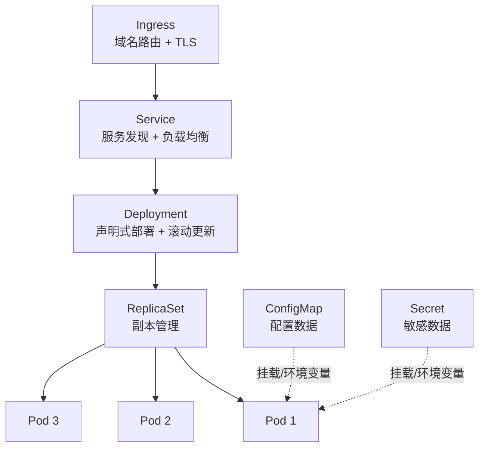
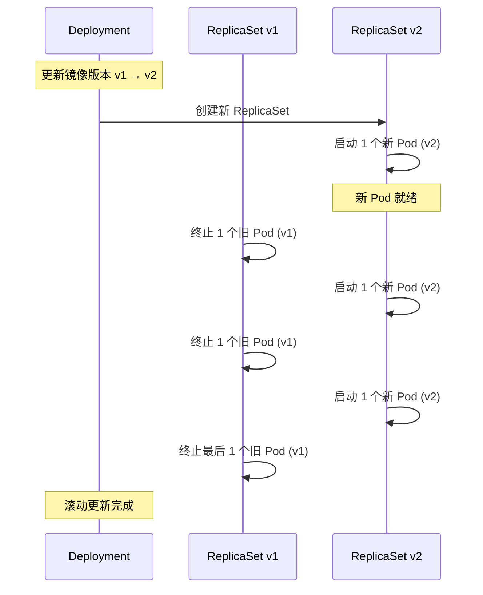
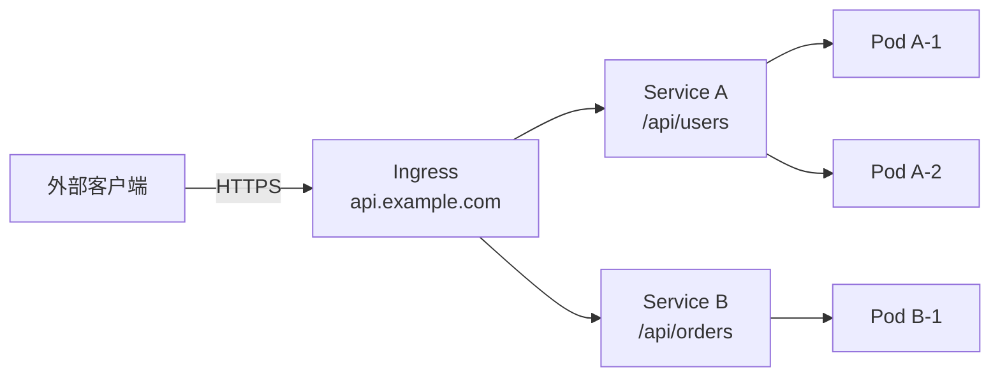

# Kubernetes 核心资源对象

## 概念说明

K8s 通过**资源对象**（Resource Object）来描述集群的期望状态。每个资源对象都是一个 YAML/JSON 文件，提交给 API Server 后，K8s 的控制器会持续工作，确保实际状态与期望状态一致。

日常工作中最常用的六大核心资源：Pod、Deployment、Service、ConfigMap、Secret、Ingress。

## 核心原理

### 资源对象关系图



### 1. Pod

Pod 是 K8s 的最小调度单位，包含一个或多个容器，共享网络和存储。

```yaml
apiVersion: v1
kind: Pod
metadata:
  name: my-go-app
  labels:
    app: my-go-app
spec:
  containers:
    - name: app
      image: my-go-app:latest
      ports:
        - containerPort: 8080
      resources:
        requests:          # 最低资源需求（调度依据）
          cpu: "100m"      # 0.1 核
          memory: "64Mi"
        limits:            # 资源上限（超出会被 OOM Kill）
          cpu: "500m"
          memory: "256Mi"
```

> ⚠️ 生产环境不要直接创建 Pod，应通过 Deployment 管理。

### 2. Deployment

Deployment 是最常用的工作负载资源，管理 Pod 的副本数、滚动更新和回滚。

```yaml
apiVersion: apps/v1
kind: Deployment
metadata:
  name: my-go-app
spec:
  replicas: 3                    # 副本数
  selector:
    matchLabels:
      app: my-go-app
  strategy:
    type: RollingUpdate          # 滚动更新策略
    rollingUpdate:
      maxSurge: 1                # 最多多创建 1 个 Pod
      maxUnavailable: 0          # 不允许不可用 Pod
  template:
    metadata:
      labels:
        app: my-go-app
    spec:
      containers:
        - name: app
          image: my-go-app:v1.0.0
```

滚动更新流程：



### 3. Service

Service 为一组 Pod 提供稳定的网络入口和负载均衡。Pod 的 IP 是动态的，Service 提供固定的 ClusterIP 和 DNS 名称。

```yaml
apiVersion: v1
kind: Service
metadata:
  name: my-go-app
spec:
  type: ClusterIP              # 集群内部访问
  selector:
    app: my-go-app             # 匹配 Pod 标签
  ports:
    - port: 80                 # Service 端口
      targetPort: 8080         # Pod 端口
```

Service 类型：

| 类型 | 说明 | 适用场景 |
|------|------|---------|
| `ClusterIP` | 集群内部 IP（默认） | 内部服务间通信 |
| `NodePort` | 在每个 Node 上开放端口 | 开发测试、简单外部访问 |
| `LoadBalancer` | 云厂商负载均衡器 | 生产环境外部访问 |
| `ExternalName` | DNS CNAME 映射 | 访问集群外部服务 |

### 4. ConfigMap

ConfigMap 用于存储非敏感的配置数据，可以通过环境变量或文件挂载注入到 Pod。

```yaml
apiVersion: v1
kind: ConfigMap
metadata:
  name: app-config
data:
  APP_ENV: "production"
  APP_PORT: "8080"
  config.yaml: |
    server:
      port: 8080
      readTimeout: 10s
    database:
      host: postgres
      port: 5432
```

### 5. Secret

Secret 用于存储敏感数据（密码、Token、证书等），数据以 Base64 编码存储。

```yaml
apiVersion: v1
kind: Secret
metadata:
  name: app-secret
type: Opaque
data:
  DB_PASSWORD: cG9zdGdyZXMxMjM=    # base64 编码
  JWT_SECRET: bXktc2VjcmV0LWtleQ==
```

> ⚠️ Secret 的 Base64 编码不是加密，只是编码。生产环境应配合 RBAC 和加密存储（如 Sealed Secrets、Vault）使用。

### 6. Ingress

Ingress 管理集群外部到 Service 的 HTTP/HTTPS 路由，通常配合 Ingress Controller（如 Nginx Ingress）使用。

```yaml
apiVersion: networking.k8s.io/v1
kind: Ingress
metadata:
  name: my-go-app
  annotations:
    nginx.ingress.kubernetes.io/rewrite-target: /
spec:
  ingressClassName: nginx
  tls:
    - hosts:
        - api.example.com
      secretName: tls-secret
  rules:
    - host: api.example.com
      http:
        paths:
          - path: /
            pathType: Prefix
            backend:
              service:
                name: my-go-app
                port:
                  number: 80
```



## 代码示例

> 💻 完整 K8s 配置：[code-examples/03-microservice/docker-k8s/k8s/](https://github.com/your-repo/code-examples/03-microservice/docker-k8s/k8s/)
> 🏷️ Demo 模式：配置文件（直接使用）

## 常见面试题

### Q1: K8s 中 Deployment、ReplicaSet、Pod 三者的关系？

**难度**：⭐⭐⭐ | **频率**：🔥🔥🔥

**答题思路**：

1. 层级关系：Deployment → ReplicaSet → Pod
2. 各自职责
3. 滚动更新时的协作

**标准答案**：

Deployment 管理 ReplicaSet，ReplicaSet 管理 Pod，形成三层层级关系。Deployment 负责声明式更新策略（滚动更新、回滚）；ReplicaSet 负责维持指定数量的 Pod 副本；Pod 是实际运行容器的最小单位。滚动更新时，Deployment 会创建新的 ReplicaSet，逐步增加新 ReplicaSet 的副本数并减少旧 ReplicaSet 的副本数，实现零停机更新。

**深入追问**：

- 如何回滚到上一个版本？
- maxSurge 和 maxUnavailable 分别控制什么？

### Q2: K8s Service 的几种类型及适用场景？

**难度**：⭐⭐⭐ | **频率**：🔥🔥🔥

**答题思路**：

1. 四种类型及工作原理
2. 各自适用场景
3. 生产环境推荐方案

**标准答案**：

K8s Service 有四种类型：ClusterIP（默认，分配集群内部 IP，适合服务间通信）、NodePort（在每个 Node 上开放端口，适合开发测试）、LoadBalancer（通过云厂商负载均衡器暴露服务，适合生产环境外部访问）、ExternalName（DNS CNAME 映射，适合访问集群外部服务）。生产环境通常使用 ClusterIP + Ingress 的组合，通过 Ingress Controller 统一管理外部流量路由。

**深入追问**：

- kube-proxy 的 iptables 和 IPVS 模式有什么区别？
- Headless Service 是什么？适用什么场景？

## 常见陷阱

1. **不设置资源限制**：Pod 不设置 `resources.limits`，可能耗尽节点资源影响其他 Pod
2. **Secret 不是加密**：Secret 只是 Base64 编码，不要以为它是安全的
3. **标签选择器不匹配**：Service 的 `selector` 必须与 Pod 的 `labels` 完全匹配
4. **忽略 Namespace**：不同 Namespace 的 Service 需要通过 `<service>.<namespace>.svc.cluster.local` 访问

## 参考资料

- [K8s 资源对象文档](https://kubernetes.io/docs/concepts/workloads/)
- [K8s Service 文档](https://kubernetes.io/docs/concepts/services-networking/service/)
- [K8s Ingress 文档](https://kubernetes.io/docs/concepts/services-networking/ingress/)
- [K8s ConfigMap 和 Secret](https://kubernetes.io/docs/concepts/configuration/)
