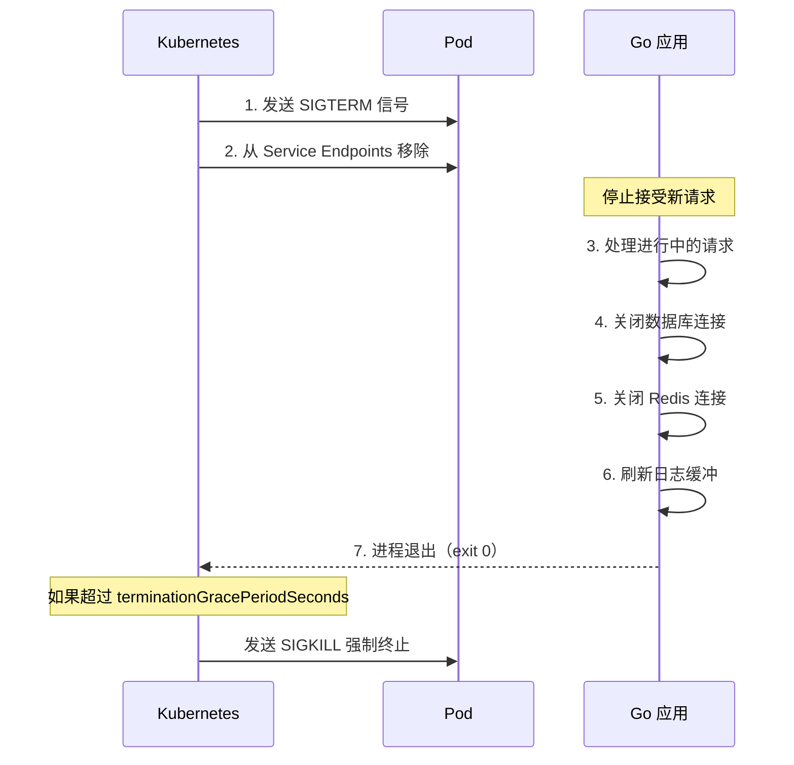
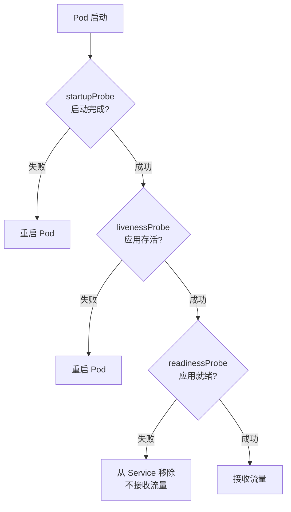

# Go 应用 K8s 部署实践

## 概念说明

将 Go 应用部署到 Kubernetes 不仅仅是写一个 Deployment YAML，还需要在应用层面做好三件事：**优雅停机**（Graceful Shutdown）、**健康检查**（Health Check）和**配置管理**。这三者是 Go 服务上 K8s 的必备能力，也是面试高频考点。

## 核心原理

### 优雅停机（Graceful Shutdown）

当 K8s 需要终止一个 Pod 时（滚动更新、缩容、节点维护），会经历以下流程：



关键时间线：
1. K8s 发送 SIGTERM → Go 应用收到信号
2. 默认 `terminationGracePeriodSeconds` 为 30 秒
3. 超时后 K8s 发送 SIGKILL 强制杀死进程

### 健康检查（Health Check）

K8s 提供三种探针来检测 Pod 的健康状态：

| 探针 | 用途 | 失败后果 | Go 端点 |
|------|------|---------|---------|
| **livenessProbe** | 检测应用是否存活 | 重启 Pod | `/healthz` |
| **readinessProbe** | 检测应用是否就绪 | 从 Service 移除 | `/readyz` |
| **startupProbe** | 检测应用是否启动完成 | 阻止其他探针 | `/healthz` |



### 配置管理

Go 应用在 K8s 中的配置来源优先级：

```
命令行参数 > 环境变量 > ConfigMap 挂载文件 > 默认值
```

## 标准库方案

### 优雅停机实现（signal.NotifyContext）

Go 1.16+ 引入了 `signal.NotifyContext`，是实现优雅停机的最佳方式：

```go
package main

import (
    "context"
    "errors"
    "fmt"
    "net/http"
    "os/signal"
    "syscall"
    "time"
)

func main() {
    // signal.NotifyContext：收到 SIGINT/SIGTERM 时自动取消 context
    ctx, stop := signal.NotifyContext(context.Background(),
        syscall.SIGINT, syscall.SIGTERM)
    defer stop()

    // 创建 HTTP 服务器
    mux := http.NewServeMux()
    mux.HandleFunc("/", func(w http.ResponseWriter, r *http.Request) {
        fmt.Fprintln(w, "Hello from Go on K8s!")
    })
    mux.HandleFunc("/healthz", func(w http.ResponseWriter, r *http.Request) {
        w.WriteHeader(http.StatusOK)
        fmt.Fprintln(w, "ok")
    })
    mux.HandleFunc("/readyz", func(w http.ResponseWriter, r *http.Request) {
        // 检查数据库连接、Redis 连接等
        w.WriteHeader(http.StatusOK)
        fmt.Fprintln(w, "ready")
    })

    server := &http.Server{
        Addr:    ":8080",
        Handler: mux,
    }

    // 在 goroutine 中启动服务器
    go func() {
        fmt.Println("服务启动在 :8080")
        if err := server.ListenAndServe(); err != nil &&
            !errors.Is(err, http.ErrServerClosed) {
            fmt.Printf("服务启动失败: %v\n", err)
        }
    }()

    // 等待终止信号
    <-ctx.Done()
    fmt.Println("收到终止信号，开始优雅关闭...")

    // 创建关闭超时 context（给进行中的请求留时间）
    shutdownCtx, cancel := context.WithTimeout(context.Background(), 15*time.Second)
    defer cancel()

    // 优雅关闭 HTTP 服务器
    if err := server.Shutdown(shutdownCtx); err != nil {
        fmt.Printf("服务关闭异常: %v\n", err)
    }

    // 关闭其他资源（数据库、Redis 等）
    // db.Close()
    // redisClient.Close()

    fmt.Println("服务已优雅关闭")
}
```

### K8s Deployment 配置（含健康检查和优雅停机）

```yaml
apiVersion: apps/v1
kind: Deployment
metadata:
  name: my-go-app
spec:
  replicas: 3
  selector:
    matchLabels:
      app: my-go-app
  template:
    metadata:
      labels:
        app: my-go-app
    spec:
      terminationGracePeriodSeconds: 30  # 优雅停机超时
      containers:
        - name: app
          image: my-go-app:v1.0.0
          ports:
            - containerPort: 8080
          # 存活探针：检测应用是否存活
          livenessProbe:
            httpGet:
              path: /healthz
              port: 8080
            initialDelaySeconds: 5
            periodSeconds: 10
            failureThreshold: 3
          # 就绪探针：检测应用是否可以接收流量
          readinessProbe:
            httpGet:
              path: /readyz
              port: 8080
            initialDelaySeconds: 5
            periodSeconds: 5
            failureThreshold: 3
          # 资源限制
          resources:
            requests:
              cpu: "100m"
              memory: "64Mi"
            limits:
              cpu: "500m"
              memory: "256Mi"
          # 从 ConfigMap 注入环境变量
          envFrom:
            - configMapRef:
                name: app-config
            - secretRef:
                name: app-secret
```

## 代码示例

> 💻 完整 K8s 配置：[code-examples/03-microservice/docker-k8s/k8s/](https://github.com/skyhe58/guide-go/tree/main/code-examples/03-microservice/docker-k8s/k8s/)
> 🏷️ Demo 模式：配置文件（直接使用）

## 常见面试题

### Q1: Go 服务如何实现优雅停机？在 K8s 中需要注意什么？

**难度**：⭐⭐⭐ | **频率**：🔥🔥🔥

**答题思路**：

1. K8s 终止 Pod 的流程（SIGTERM → 等待 → SIGKILL）
2. Go 中捕获信号的方式（signal.NotifyContext）
3. http.Server.Shutdown 的作用
4. terminationGracePeriodSeconds 的配置

**标准答案**：

Go 服务优雅停机的核心是捕获 SIGTERM 信号并正确关闭资源。推荐使用 Go 1.16+ 的 `signal.NotifyContext`，收到信号后自动取消 context。然后调用 `http.Server.Shutdown()` 优雅关闭 HTTP 服务器——它会停止接受新连接，等待进行中的请求处理完毕，再关闭服务器。之后依次关闭数据库、Redis 等连接。在 K8s 中，需要注意 `terminationGracePeriodSeconds`（默认 30 秒）要大于应用的关闭超时时间，否则 K8s 会发送 SIGKILL 强制终止。

**深入追问**：

- signal.NotifyContext 和 signal.Notify 有什么区别？
- 如果优雅停机超时了怎么办？
- preStop hook 有什么用？

### Q2: K8s 的 livenessProbe 和 readinessProbe 有什么区别？

**难度**：⭐⭐⭐ | **频率**：🔥🔥🔥

**答题思路**：

1. 两者的用途不同
2. 失败后的行为不同
3. Go 应用中如何实现

**标准答案**：

livenessProbe 检测应用是否存活，失败后 K8s 会重启 Pod；readinessProbe 检测应用是否就绪（能否接收流量），失败后 K8s 会将 Pod 从 Service 的 Endpoints 中移除，不再转发流量，但不会重启。Go 应用中通常实现 `/healthz` 端点返回 200 表示存活，`/readyz` 端点检查数据库、Redis 等依赖是否可用后返回 200 表示就绪。启动阶段可以配合 startupProbe 避免慢启动应用被 livenessProbe 误杀。

**深入追问**：

- startupProbe 的作用是什么？
- 探针的 initialDelaySeconds、periodSeconds、failureThreshold 如何配置？
- TCP 探针和 HTTP 探针各适用什么场景？

## 常见陷阱

1. **不处理 SIGTERM**：Go 应用不捕获 SIGTERM，K8s 发送信号后应用不会优雅关闭
2. **关闭超时大于 terminationGracePeriodSeconds**：应用还没关完就被 SIGKILL 杀死
3. **livenessProbe 检查依赖**：livenessProbe 不应检查外部依赖（如数据库），否则数据库故障会导致所有 Pod 被重启
4. **readinessProbe 初始延迟太短**：应用还没启动完就被标记为不就绪
5. **忽略 preStop hook**：滚动更新时，Pod 从 Endpoints 移除和收到 SIGTERM 是异步的，可能导致短暂的请求失败

## 参考资料

- [K8s Pod 生命周期](https://kubernetes.io/docs/concepts/workloads/pods/pod-lifecycle/)
- [K8s 健康检查配置](https://kubernetes.io/docs/tasks/configure-pod-container/configure-liveness-readiness-startup-probes/)
- [Go signal.NotifyContext 文档](https://pkg.go.dev/os/signal#NotifyContext)
- [Go http.Server.Shutdown 文档](https://pkg.go.dev/net/http#Server.Shutdown)
