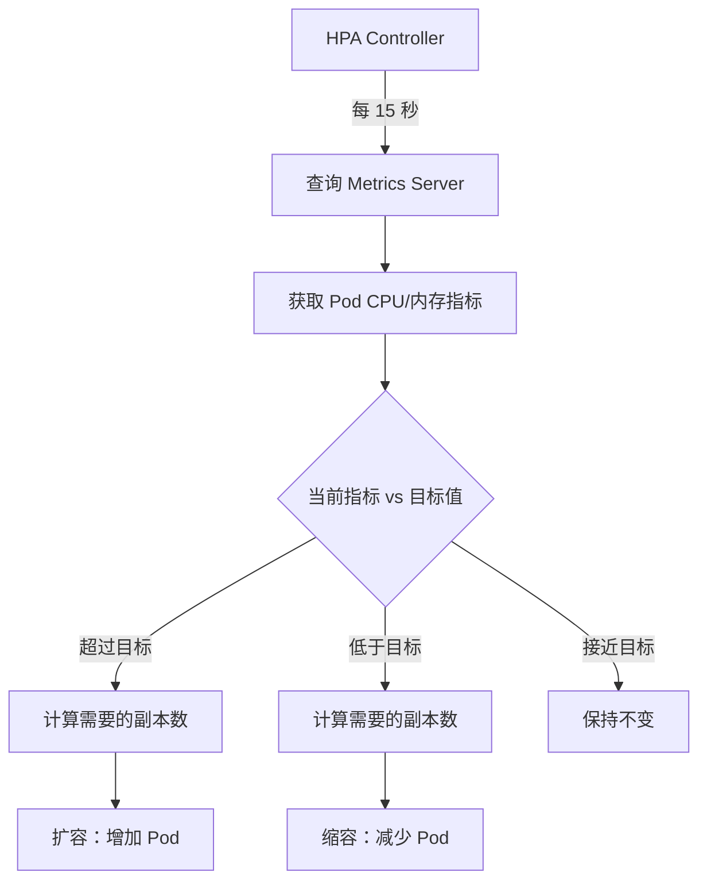

# HPA 自动扩缩容

## 概念说明

HPA（Horizontal Pod Autoscaler）是 K8s 的自动水平扩缩容机制，根据 CPU 使用率、内存使用率或自定义指标，自动调整 Deployment 的副本数。HPA 是生产环境应对流量波动的核心能力——流量高峰时自动扩容，低谷时自动缩容，既保证服务可用性又节省资源成本。

## 核心原理

### HPA 工作流程



### 扩缩容算法

HPA 使用以下公式计算期望副本数：

```
期望副本数 = ceil(当前副本数 × (当前指标值 / 目标指标值))
```

示例：
- 当前 3 个副本，CPU 使用率 80%，目标 50%
- 期望副本数 = ceil(3 × 80/50) = ceil(4.8) = 5
- HPA 会将副本数从 3 扩容到 5

### HPA 配置示例

```yaml
apiVersion: autoscaling/v2
kind: HorizontalPodAutoscaler
metadata:
  name: my-go-app-hpa
spec:
  scaleTargetRef:
    apiVersion: apps/v1
    kind: Deployment
    name: my-go-app
  minReplicas: 2              # 最小副本数
  maxReplicas: 10             # 最大副本数
  metrics:
    - type: Resource
      resource:
        name: cpu
        target:
          type: Utilization
          averageUtilization: 50    # CPU 使用率目标 50%
    - type: Resource
      resource:
        name: memory
        target:
          type: Utilization
          averageUtilization: 70    # 内存使用率目标 70%
  behavior:
    scaleUp:
      stabilizationWindowSeconds: 60   # 扩容稳定窗口
      policies:
        - type: Percent
          value: 100                    # 每次最多扩容 100%
          periodSeconds: 60
    scaleDown:
      stabilizationWindowSeconds: 300  # 缩容稳定窗口（5 分钟）
      policies:
        - type: Percent
          value: 10                     # 每次最多缩容 10%
          periodSeconds: 60
```

### 前置条件：Metrics Server

HPA 依赖 Metrics Server 提供 Pod 的资源使用指标。Metrics Server 从每个 Node 的 kubelet 收集 CPU 和内存数据。

```bash
# 安装 Metrics Server
kubectl apply -f https://github.com/kubernetes-sigs/metrics-server/releases/latest/download/components.yaml

# 验证安装
kubectl top pods
kubectl top nodes
```

### 自定义指标扩缩容

除了 CPU 和内存，HPA 还支持基于自定义指标扩缩容（如 QPS、队列长度）：

```yaml
metrics:
  - type: Pods
    pods:
      metric:
        name: http_requests_per_second    # 自定义指标
      target:
        type: AverageValue
        averageValue: "1000"              # 每个 Pod 目标 1000 QPS
```

自定义指标需要配合 Prometheus Adapter 或 KEDA 使用。

## 标准库方案

Go 应用配合 HPA 的最佳实践——暴露 Prometheus 指标：

```go
package main

import (
    "fmt"
    "net/http"

    "github.com/prometheus/client_golang/prometheus"
    "github.com/prometheus/client_golang/prometheus/promhttp"
)

var (
    httpRequestsTotal = prometheus.NewCounterVec(
        prometheus.CounterOpts{
            Name: "http_requests_total",
            Help: "HTTP 请求总数",
        },
        []string{"method", "path", "status"},
    )
)

func init() {
    prometheus.MustRegister(httpRequestsTotal)
}

func main() {
    mux := http.NewServeMux()
    mux.HandleFunc("/api/hello", func(w http.ResponseWriter, r *http.Request) {
        httpRequestsTotal.WithLabelValues(r.Method, "/api/hello", "200").Inc()
        fmt.Fprintln(w, "Hello!")
    })

    // 暴露 Prometheus 指标端点，供 HPA 自定义指标使用
    mux.Handle("/metrics", promhttp.Handler())

    http.ListenAndServe(":8080", mux)
}
```

## 代码示例

> 💻 完整 K8s 配置：[code-examples/03-microservice/docker-k8s/k8s/](https://github.com/skyhe58/guide-go/tree/main/code-examples/03-microservice/docker-k8s/k8s/)
> 🏷️ Demo 模式：配置文件（直接使用）

## 常见面试题

### Q1: K8s HPA 的工作原理是什么？

**难度**：⭐⭐⭐ | **频率**：🔥🔥

**答题思路**：

1. HPA Controller 的工作循环
2. 指标来源（Metrics Server）
3. 扩缩容算法
4. 稳定窗口机制

**标准答案**：

HPA Controller 每 15 秒从 Metrics Server 查询 Pod 的资源使用指标，根据公式 `期望副本数 = ceil(当前副本数 × 当前指标/目标指标)` 计算需要的副本数。如果计算结果与当前副本数不同，HPA 会调整 Deployment 的 replicas。为避免频繁扩缩容（抖动），HPA 提供了稳定窗口机制：扩容默认等待 0 秒（快速响应），缩容默认等待 5 分钟（避免过早缩容）。HPA v2 还支持基于自定义指标（如 QPS）扩缩容，需要配合 Prometheus Adapter。

**深入追问**：

- HPA 和 VPA（Vertical Pod Autoscaler）有什么区别？
- 如何避免 HPA 频繁扩缩容？
- KEDA 是什么？和 HPA 有什么关系？

## 常见陷阱

1. **未设置 resources.requests**：HPA 基于 CPU 的扩缩容需要 Pod 设置 `resources.requests.cpu`，否则无法计算使用率
2. **未安装 Metrics Server**：HPA 依赖 Metrics Server，未安装时 HPA 无法获取指标
3. **缩容太激进**：默认缩容策略可能导致流量波动时频繁扩缩容，应配置合理的稳定窗口
4. **minReplicas 设为 1**：生产环境至少设置 2 个副本，避免单点故障

## 参考资料

- [K8s HPA 文档](https://kubernetes.io/docs/tasks/run-application/horizontal-pod-autoscale/)
- [Metrics Server](https://github.com/kubernetes-sigs/metrics-server)
- [KEDA 事件驱动自动扩缩容](https://keda.sh/)
- [Prometheus Adapter](https://github.com/kubernetes-sigs/prometheus-adapter)
