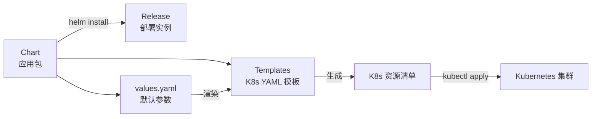

# Helm 包管理

## 概念说明

Helm 是 Kubernetes 的包管理工具，类似于 Linux 的 apt/yum 或 Node.js 的 npm。Helm 将 K8s 资源（Deployment、Service、ConfigMap 等）打包为 **Chart**，通过模板化和参数化管理复杂的 K8s 应用部署。

Helm 解决的核心问题：
- **模板化**：避免为每个环境（dev/staging/prod）维护一套 YAML
- **版本管理**：应用部署的版本化，支持回滚
- **依赖管理**：Chart 可以依赖其他 Chart（如 PostgreSQL、Redis）
- **一键部署**：`helm install` 一条命令部署整个应用栈

## 核心原理

### Helm 核心概念



| 概念 | 说明 | 类比 |
|------|------|------|
| **Chart** | 应用的打包格式，包含模板和默认值 | npm 包 |
| **Release** | Chart 的一次部署实例 | npm install 后的 node_modules |
| **Repository** | Chart 的存储仓库 | npm registry |
| **values.yaml** | Chart 的默认配置参数 | package.json 的 config |

### Chart 目录结构

```
my-go-app/
├── Chart.yaml          # Chart 元数据（名称、版本、描述）
├── values.yaml         # 默认配置值
├── templates/          # K8s 资源模板
│   ├── deployment.yaml
│   ├── service.yaml
│   ├── configmap.yaml
│   ├── ingress.yaml
│   ├── hpa.yaml
│   ├── _helpers.tpl    # 模板辅助函数
│   └── NOTES.txt       # 安装后提示信息
├── charts/             # 依赖的子 Chart
└── .helmignore         # 打包时忽略的文件
```

### Helm 模板语法

Helm 使用 Go 的 `text/template` 模板引擎（Go 开发者会很熟悉）：

```yaml
# templates/deployment.yaml
apiVersion: apps/v1
kind: Deployment
metadata:
  name: {{ include "my-go-app.fullname" . }}
  labels:
    {{- include "my-go-app.labels" . | nindent 4 }}
spec:
  replicas: {{ .Values.replicaCount }}
  selector:
    matchLabels:
      {{- include "my-go-app.selectorLabels" . | nindent 6 }}
  template:
    metadata:
      labels:
        {{- include "my-go-app.selectorLabels" . | nindent 8 }}
    spec:
      containers:
        - name: {{ .Chart.Name }}
          image: "{{ .Values.image.repository }}:{{ .Values.image.tag }}"
          ports:
            - containerPort: {{ .Values.service.targetPort }}
          resources:
            {{- toYaml .Values.resources | nindent 12 }}
```

```yaml
# values.yaml
replicaCount: 3

image:
  repository: my-go-app
  tag: "v1.0.0"
  pullPolicy: IfNotPresent

service:
  type: ClusterIP
  port: 80
  targetPort: 8080

resources:
  requests:
    cpu: "100m"
    memory: "64Mi"
  limits:
    cpu: "500m"
    memory: "256Mi"
```

### 常用 Helm 命令

```bash
# 创建新 Chart
helm create my-go-app

# 安装 Chart
helm install my-release ./my-go-app

# 使用自定义 values 安装
helm install my-release ./my-go-app -f prod-values.yaml

# 命令行覆盖参数
helm install my-release ./my-go-app --set replicaCount=5

# 升级 Release
helm upgrade my-release ./my-go-app --set image.tag=v2.0.0

# 回滚到上一个版本
helm rollback my-release 1

# 查看 Release 列表
helm list

# 查看 Release 历史
helm history my-release

# 卸载 Release
helm uninstall my-release

# 渲染模板（不安装，用于调试）
helm template my-release ./my-go-app
```

### 多环境管理

```bash
# 开发环境
helm install my-app ./my-go-app -f values-dev.yaml

# 预发布环境
helm install my-app ./my-go-app -f values-staging.yaml

# 生产环境
helm install my-app ./my-go-app -f values-prod.yaml
```

```yaml
# values-prod.yaml（生产环境覆盖）
replicaCount: 5

image:
  tag: "v1.0.0"

resources:
  requests:
    cpu: "500m"
    memory: "256Mi"
  limits:
    cpu: "2000m"
    memory: "1Gi"
```

## 代码示例

> 💻 完整 K8s 配置：[code-examples/03-microservice/docker-k8s/k8s/](https://github.com/your-repo/code-examples/03-microservice/docker-k8s/k8s/)
> 🏷️ Demo 模式：配置文件（直接使用）

## 常见面试题

### Q1: Helm 是什么？解决了什么问题？

**难度**：⭐⭐ | **频率**：🔥🔥

**答题思路**：

1. Helm 的定位（K8s 包管理器）
2. 解决的核心问题
3. 核心概念（Chart、Release、Repository）

**标准答案**：

Helm 是 Kubernetes 的包管理工具，将 K8s 资源打包为 Chart，通过模板化和参数化管理应用部署。它解决了三个核心问题：一是模板化，避免为每个环境维护一套 YAML；二是版本管理，支持部署的版本化和回滚；三是依赖管理，Chart 可以声明对其他 Chart 的依赖。Helm 的核心概念包括 Chart（应用包）、Release（部署实例）和 Repository（Chart 仓库）。

**深入追问**：

- Helm 2 和 Helm 3 有什么区别？
- Helm 模板使用的是什么模板引擎？
- 如何管理 Helm Chart 的依赖？

## 常见陷阱

1. **values.yaml 中的敏感数据**：不要在 values.yaml 中硬编码密码，应使用 Secret 或外部密钥管理
2. **模板调试困难**：使用 `helm template` 和 `helm install --dry-run --debug` 预览渲染结果
3. **Chart 版本和应用版本混淆**：Chart.yaml 中的 `version` 是 Chart 版本，`appVersion` 是应用版本
4. **忽略 .helmignore**：大文件或敏感文件应加入 .helmignore，避免打包到 Chart 中

## 参考资料

- [Helm 官方文档](https://helm.sh/docs/)
- [Helm Chart 最佳实践](https://helm.sh/docs/chart_best_practices/)
- [Artifact Hub（Helm Chart 仓库）](https://artifacthub.io/)
- [Go text/template 文档](https://pkg.go.dev/text/template)
