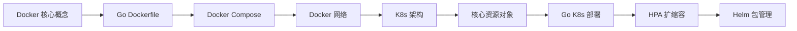
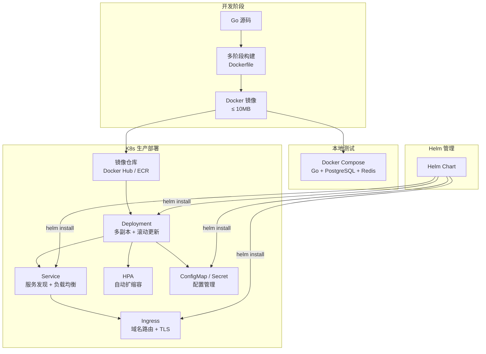

# 容器化与 Kubernetes

> **前置依赖：** [Go 基础语法](/1-go-core/1.1-go-basics/) | [微服务架构](/3-microservice/3.1-microservice/)

## 模块概述

容器化与 Kubernetes 是云原生时代 Go 服务部署的标准方案。Go 语言与容器技术有着天然的亲和力——Docker、Kubernetes、containerd、etcd 这些云原生基础设施本身就是用 Go 编写的。Go 编译为单一静态二进制文件的特性，使其天然适合容器化部署：基于 `scratch` 空镜像构建，最终镜像可以压缩到 10MB 以内。

本模块分为两大部分：

- **Docker 部分**：从核心概念到 Go 应用的多阶段构建 Dockerfile、Docker Compose 编排、网络与数据卷管理
- **Kubernetes 部分**：从 K8s 架构到核心资源对象、Go 应用部署实践（优雅停机、健康检查）、HPA 自动扩缩容、Helm 包管理

## 知识点索引

### Docker 容器化

| 序号 | 知识点 | 难度 | 面试频率 | 预计时间 |
|------|--------|------|---------|---------|
| 01 | [Docker 核心概念](./01-docker-basics.md) | ⭐⭐ | 🔥🔥🔥 | 40min |
| 02 | [Go 应用 Dockerfile](./02-dockerfile.md) | ⭐⭐⭐ | 🔥🔥🔥 | 50min |
| 03 | [Docker Compose 编排](./03-docker-compose.md) | ⭐⭐ | 🔥🔥 | 40min |
| 04 | [Docker 网络与数据卷](./04-docker-network.md) | ⭐⭐⭐ | 🔥🔥 | 45min |

### Kubernetes 编排

| 序号 | 知识点 | 难度 | 面试频率 | 预计时间 |
|------|--------|------|---------|---------|
| 05 | [K8s 架构与核心组件](./05-k8s-architecture.md) | ⭐⭐⭐ | 🔥🔥🔥 | 60min |
| 06 | [核心资源对象](./06-k8s-resources.md) | ⭐⭐⭐ | 🔥🔥🔥 | 60min |
| 07 | [Go 应用 K8s 部署实践](./07-k8s-go-deploy.md) | ⭐⭐⭐ | 🔥🔥🔥 | 60min |
| 08 | [HPA 自动扩缩容](./08-k8s-hpa.md) | ⭐⭐⭐ | 🔥🔥 | 40min |
| 09 | [Helm 包管理](./09-helm.md) | ⭐⭐⭐ | 🔥🔥 | 50min |

### 速查与面试

| 📝 | 文档 | 难度 | 面试频率 | 预计时间 |
|------|--------|------|---------|---------|
| 10 | [Docker 与 K8s 常用命令速查表](./10-cheatsheet.md) | ⭐ | - | 随时查阅 |
| 📝 | [面试指南](./interview.md) | - | 🔥🔥🔥 | 60min |

## 代码示例

> 💻 完整配置文件：[code-examples/03-microservice/docker-k8s/](https://github.com/skyhe58/guide-go/tree/main/code-examples/03-microservice/docker-k8s/)

| 示例文件 | 对应知识点 | 说明 |
|---------|-----------|------|
| `Dockerfile` | Go 应用 Dockerfile | 多阶段构建，scratch 基础镜像，≤ 10MB |
| `docker-compose.yml` | Docker Compose 编排 | Go 服务 + PostgreSQL + Redis 完整栈 |
| `k8s/deployment.yaml` | K8s Deployment | 含健康检查、资源限制、优雅停机 |
| `k8s/service.yaml` | K8s Service | ClusterIP + NodePort |
| `k8s/configmap.yaml` | K8s ConfigMap | 应用配置管理 |
| `k8s/ingress.yaml` | K8s Ingress | Nginx Ingress Controller |

## 学习路径建议

1. **先学 Docker 基础**：理解镜像、容器、仓库三大核心概念
2. **掌握 Go Dockerfile**：多阶段构建是 Go 容器化的核心技能，面试高频考点
3. **学 Docker Compose**：掌握多服务编排，为本地开发和测试打基础
4. **理解 K8s 架构**：Master/Node 架构、核心组件职责
5. **熟悉核心资源**：Pod、Deployment、Service、ConfigMap、Ingress 是日常工作中最常用的资源
6. **Go 部署实践**：优雅停机（signal.NotifyContext）和健康检查是 Go 服务上 K8s 的必备能力
7. **进阶 HPA 和 Helm**：自动扩缩容和包管理是生产环境的进阶技能

## 容器化部署全景图

