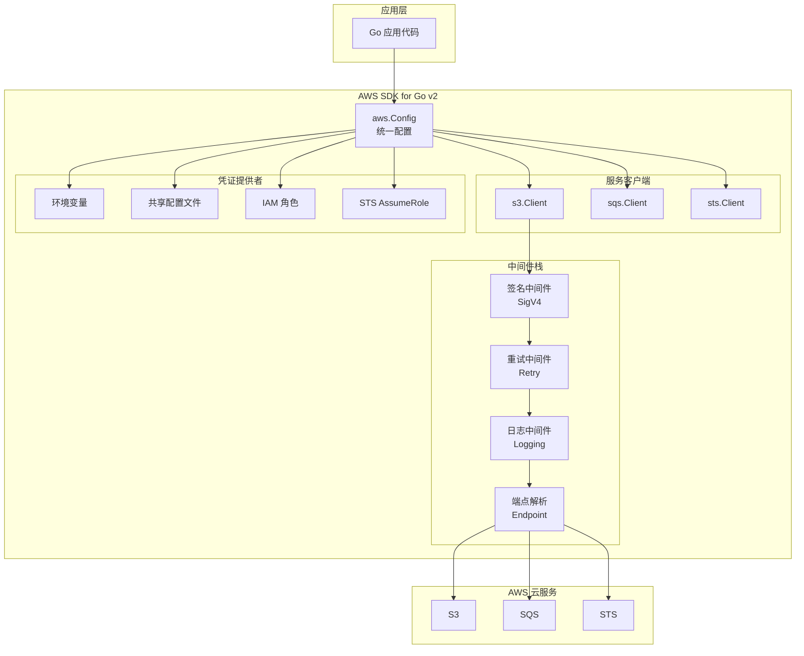
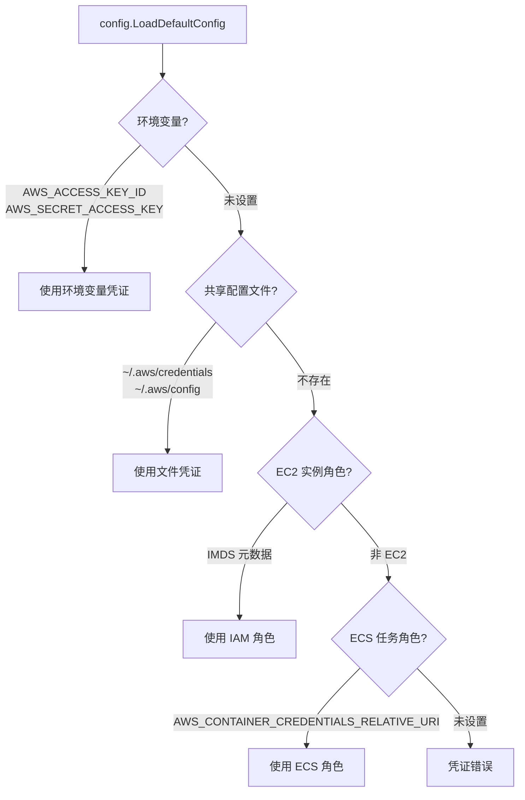

# AWS SDK for Go v2 基础

## 概念说明

AWS SDK for Go v2 是 Amazon 官方提供的 Go 语言 SDK，用于调用所有 AWS 云服务 API。v2 版本相比 v1 进行了全面重构，采用模块化设计，每个 AWS 服务对应一个独立的 Go 模块，按需引入，减少依赖体积。

SDK v2 的核心设计理念：
- **模块化**：每个服务独立模块（如 `github.com/aws/aws-sdk-go-v2/service/s3`），不再是单一大包
- **配置统一**：通过 `aws.Config` 统一管理认证、Region、Retry 等配置
- **Context 优先**：所有 API 调用都接受 `context.Context`，支持超时和取消
- **中间件架构**：请求/响应处理采用中间件栈，可自定义拦截逻辑

## 核心原理

### SDK v2 架构



### aws.Config 核心结构

`aws.Config` 是 SDK 的核心配置对象，包含：

| 字段 | 说明 | 默认值 |
|------|------|--------|
| `Region` | AWS 区域（如 us-east-1） | 从环境变量或配置文件读取 |
| `Credentials` | 凭证提供者 | 自动检测链 |
| `RetryMaxAttempts` | 最大重试次数 | 3 |
| `RetryMode` | 重试模式 | Standard |
| `HTTPClient` | 自定义 HTTP 客户端 | 默认 HTTP 客户端 |
| `EndpointResolverV2` | 自定义端点解析器 | AWS 默认端点 |

### 凭证解析链

SDK 按以下顺序自动查找凭证：



### Retry 策略

SDK v2 内置两种重试模式：

| 模式 | 说明 | 适用场景 |
|------|------|---------|
| `Standard` | 固定退避 + 抖动，最多重试 3 次 | 大多数场景 |
| `Adaptive` | 根据错误类型动态调整退避时间，带令牌桶限流 | 高并发场景 |

可重试的错误类型：
- 网络超时（`RequestTimeoutException`）
- 服务端限流（`ThrottlingException`、HTTP 429）
- 服务端内部错误（HTTP 500/502/503）

## 标准库方案

Go 标准库没有内置 AWS SDK。AWS 提供 HTTP API，理论上可以用 `net/http` 直接调用，但需要自行实现 SigV4 签名算法，不推荐。

## 第三方库方案

### 安装 SDK v2

```bash
# 核心模块
go get github.com/aws/aws-sdk-go-v2
go get github.com/aws/aws-sdk-go-v2/config

# 按需安装服务模块
go get github.com/aws/aws-sdk-go-v2/service/s3
go get github.com/aws/aws-sdk-go-v2/service/sqs
go get github.com/aws/aws-sdk-go-v2/service/sts
```

### 基本使用

```go
import (
    "context"
    "github.com/aws/aws-sdk-go-v2/config"
    "github.com/aws/aws-sdk-go-v2/service/s3"
)

// 加载默认配置（自动检测凭证和 Region）
cfg, err := config.LoadDefaultConfig(context.TODO(),
    config.WithRegion("us-east-1"),
)

// 创建 S3 客户端
client := s3.NewFromConfig(cfg)

// 调用 API
output, err := client.ListBuckets(context.TODO(), &s3.ListBucketsInput{})
```

### 自定义端点（LocalStack）

```go
import (
    "github.com/aws/aws-sdk-go-v2/aws"
    "github.com/aws/aws-sdk-go-v2/config"
    "github.com/aws/aws-sdk-go-v2/credentials"
)

cfg, _ := config.LoadDefaultConfig(context.TODO(),
    config.WithRegion("us-east-1"),
    config.WithCredentialsProvider(
        credentials.NewStaticCredentialsProvider("test", "test", ""),
    ),
)

// 创建 S3 客户端，指向 LocalStack
client := s3.NewFromConfig(cfg, func(o *s3.Options) {
    o.BaseEndpoint = aws.String("http://localhost:4566")
    o.UsePathStyle = true // LocalStack 需要路径风格
})
```

## 代码示例

> 💻 完整可运行代码：[code-examples/03-microservice/aws/](https://github.com/skyhe58/guide-go/tree/main/code-examples/03-microservice/aws/)
> 🏷️ Demo 模式：各子目录包含 Part A（内存模拟）和 Part B（连接 LocalStack）

## 常见面试题

### Q1: AWS SDK for Go v2 和 v1 的主要区别？

**难度**：⭐⭐ | **频率**：🔥🔥

**答题思路**：

1. 模块化设计 vs 单一大包
2. Context 支持
3. 中间件架构
4. 凭证管理改进

**标准答案**：

v2 采用模块化设计，每个 AWS 服务是独立的 Go 模块，按需引入减少依赖体积；v1 是单一大包，引入任何服务都会拉入全部依赖。v2 所有 API 调用都接受 `context.Context`，支持超时和取消；v1 需要手动设置。v2 采用中间件栈架构，请求/响应处理更灵活；v1 使用 Handler 链。v2 的凭证管理更统一，通过 `config.LoadDefaultConfig` 自动检测。

**深入追问**：

- v2 的中间件栈如何自定义？
- 如何从 v1 迁移到 v2？

## 常见陷阱

1. **忘记设置 Region**：SDK 不会自动推断 Region，必须通过环境变量、配置文件或代码显式设置
2. **忽略 Context 超时**：长时间运行的 API 调用（如 S3 大文件上传）应设置合理的 Context 超时
3. **v1 和 v2 混用**：项目中同时引入 v1 和 v2 会导致依赖冲突，应统一使用 v2
4. **未处理重试后的错误**：SDK 会自动重试可重试错误，但最终仍可能失败，必须检查返回的 error

## 参考资料

- [AWS SDK for Go v2 官方文档](https://aws.github.io/aws-sdk-go-v2/docs/)
- [AWS SDK for Go v2 GitHub](https://github.com/aws/aws-sdk-go-v2)
- [AWS SDK for Go v2 API Reference](https://pkg.go.dev/github.com/aws/aws-sdk-go-v2)
