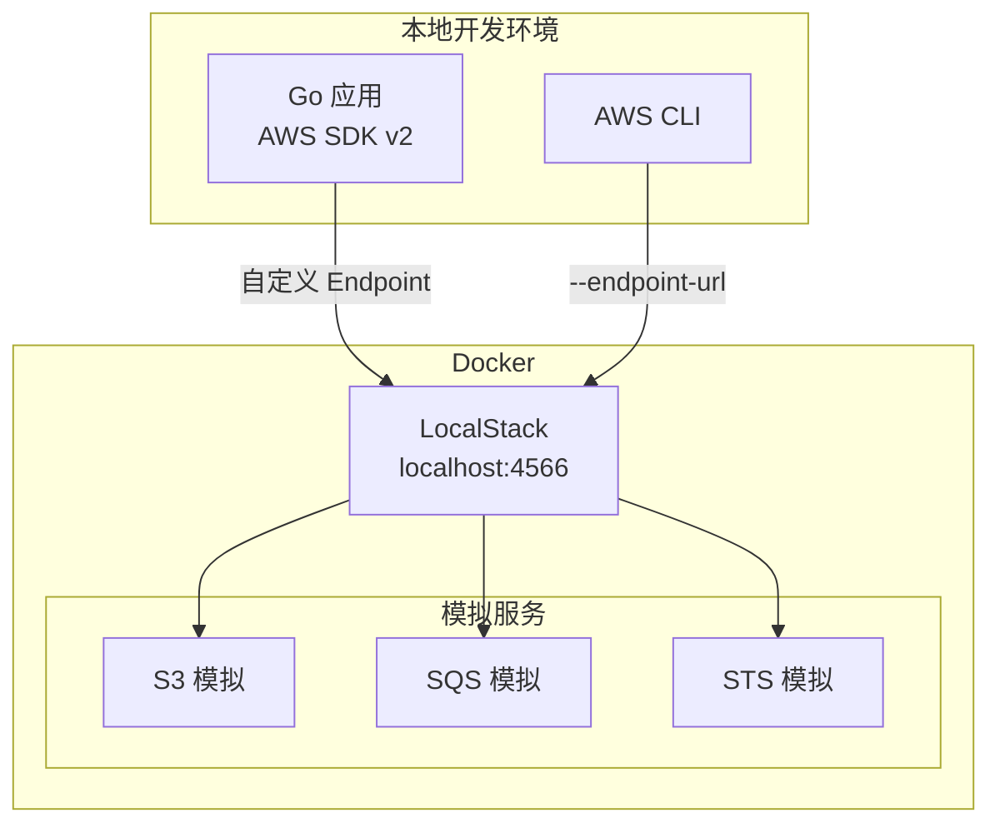
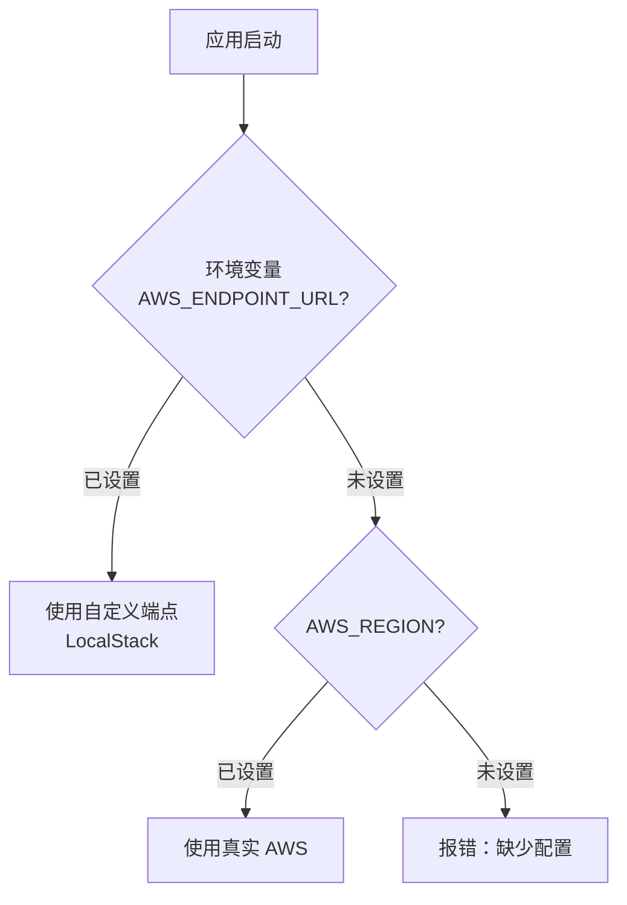

# 本地开发配置

## 概念说明

在本地开发和测试 AWS 集成代码时，不需要真实的 AWS 账号和资源。**LocalStack** 是一个开源的 AWS 云服务模拟器，可以在本地 Docker 容器中模拟 S3、SQS、STS 等常用 AWS 服务，提供与 AWS 完全兼容的 API 端点。

本地开发的三种方式：
- **LocalStack**：最推荐，完整模拟 AWS API，支持 S3/SQS/STS 等服务
- **AWS CLI + 真实 AWS**：需要 AWS 账号，适合集成测试
- **环境变量 Mock**：最简单，但功能有限

## 核心原理

### LocalStack 架构



### 配置切换策略



## 标准库方案

Go 标准库不提供 AWS 相关功能。本地开发配置通过 AWS SDK v2 的 `config` 包和环境变量实现。

## 第三方库方案

### LocalStack Docker Compose

```yaml
# docker/docker-compose.localstack.yml
services:
  localstack:
    image: localstack/localstack:3
    ports:
      - "4566:4566"
    environment:
      SERVICES: s3,sqs
      DEFAULT_REGION: us-east-1
```

### Go 代码中配置 LocalStack

```go
import (
    "os"
    "github.com/aws/aws-sdk-go-v2/aws"
    "github.com/aws/aws-sdk-go-v2/config"
    "github.com/aws/aws-sdk-go-v2/credentials"
    "github.com/aws/aws-sdk-go-v2/service/s3"
)

func newS3Client(ctx context.Context) (*s3.Client, error) {
    cfg, err := config.LoadDefaultConfig(ctx,
        config.WithRegion("us-east-1"),
        config.WithCredentialsProvider(
            credentials.NewStaticCredentialsProvider("test", "test", ""),
        ),
    )
    if err != nil {
        return nil, err
    }

    endpoint := os.Getenv("AWS_ENDPOINT_URL")
    if endpoint == "" {
        endpoint = "http://localhost:4566"
    }

    return s3.NewFromConfig(cfg, func(o *s3.Options) {
        o.BaseEndpoint = aws.String(endpoint)
        o.UsePathStyle = true
    }), nil
}
```

### AWS CLI 配合 LocalStack

```bash
# 安装 AWS CLI
brew install awscli  # macOS

# 配置 LocalStack 别名
alias awslocal='aws --endpoint-url=http://localhost:4566'

# 使用示例
awslocal s3 mb s3://test-bucket
awslocal s3 ls
awslocal sqs create-queue --queue-name test-queue
awslocal sqs list-queues
```

## 代码示例

> 💻 完整可运行代码：[code-examples/03-microservice/aws/](https://github.com/your-repo/code-examples/03-microservice/aws/)
> 🏷️ Demo 模式：Part A（纯内存模拟）/ Part B（连接 LocalStack）

## 常见面试题

### Q1: 如何在本地开发环境中测试 AWS 集成代码？

**难度**：⭐⭐ | **频率**：🔥

**答题思路**：

1. LocalStack 模拟器
2. 环境变量切换
3. 接口抽象

**标准答案**：

推荐使用 LocalStack 在本地 Docker 中模拟 AWS 服务。通过环境变量（如 `AWS_ENDPOINT_URL`）控制 SDK 连接的端点，开发环境指向 LocalStack（localhost:4566），生产环境使用 AWS 默认端点。同时在代码中通过接口抽象 AWS 操作，便于单元测试时使用 Mock 实现。LocalStack 社区版免费支持 S3、SQS、STS 等常用服务。

**深入追问**：

- LocalStack 和真实 AWS 有哪些行为差异？
- 如何在 CI/CD 中使用 LocalStack？

## 常见陷阱

1. **LocalStack 路径风格**：LocalStack 需要使用路径风格（Path Style）访问 S3，设置 `UsePathStyle = true`
2. **凭证不能为空**：即使连接 LocalStack，也需要提供凭证（可以是任意值如 "test"/"test"）
3. **服务未启用**：LocalStack 默认只启用配置的服务，确保 `SERVICES` 环境变量包含需要的服务
4. **端口冲突**：LocalStack 默认使用 4566 端口，确保不与其他服务冲突

## 参考资料

- [LocalStack 官方文档](https://docs.localstack.cloud/)
- [LocalStack GitHub](https://github.com/localstack/localstack)
- [AWS CLI 官方文档](https://docs.aws.amazon.com/cli/latest/userguide/)
