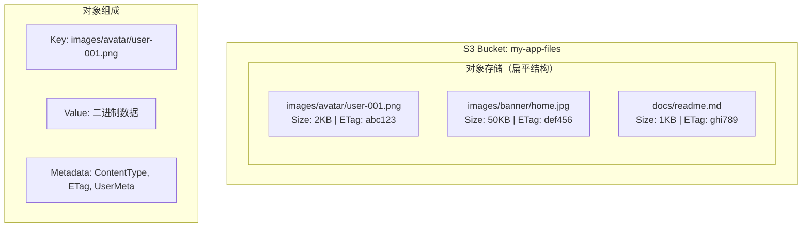
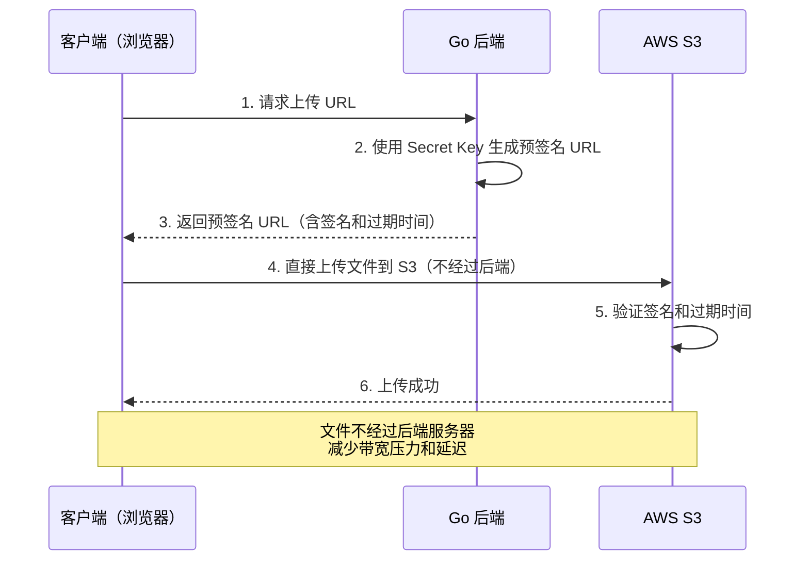
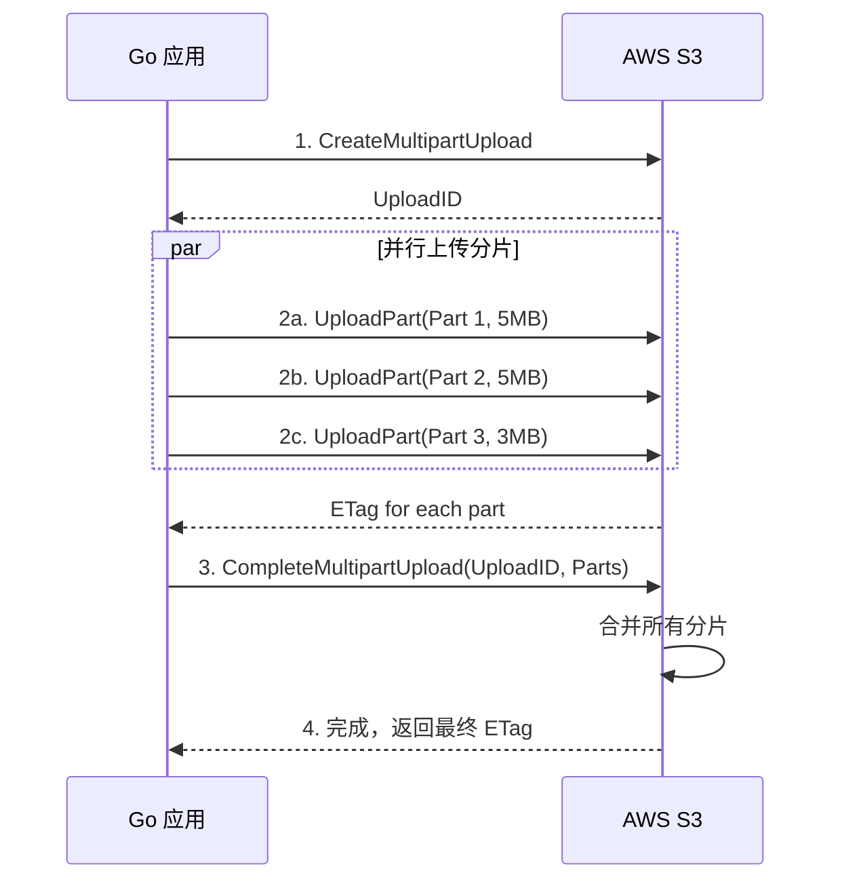

# S3 对象存储

## 概念说明

Amazon S3（Simple Storage Service）是 AWS 最核心的对象存储服务，提供无限容量、高可用（99.999999999% 持久性）的文件存储。S3 是事实上的对象存储标准，MinIO、阿里云 OSS 等都兼容 S3 API。

S3 的核心概念：
- **Bucket**：存储桶，类似文件系统的根目录，全球唯一命名
- **Object**：对象，由 Key（路径）+ Value（数据）+ Metadata（元数据）组成
- **预签名 URL**：临时授权 URL，允许未认证用户在有效期内上传/下载文件
- **分片上传**：大文件分成多个分片并行上传，支持断点续传

## 核心原理

### S3 数据模型



### 预签名 URL 工作流程



### 分片上传流程



## 标准库方案

Go 标准库不提供 S3 客户端。S3 基于 HTTP API，理论上可以用 `net/http` 调用，但需要实现 SigV4 签名，不推荐。

## 第三方库方案

### AWS SDK v2 S3 操作

```go
import (
    "github.com/aws/aws-sdk-go-v2/service/s3"
    "github.com/aws/aws-sdk-go-v2/service/s3/types"
)

// 创建 Bucket
client.CreateBucket(ctx, &s3.CreateBucketInput{
    Bucket: aws.String("my-bucket"),
})

// 上传对象
client.PutObject(ctx, &s3.PutObjectInput{
    Bucket:      aws.String("my-bucket"),
    Key:         aws.String("docs/readme.md"),
    Body:        strings.NewReader("Hello S3"),
    ContentType: aws.String("text/markdown"),
})

// 下载对象
output, _ := client.GetObject(ctx, &s3.GetObjectInput{
    Bucket: aws.String("my-bucket"),
    Key:    aws.String("docs/readme.md"),
})
defer output.Body.Close()
data, _ := io.ReadAll(output.Body)

// 预签名 URL
presignClient := s3.NewPresignClient(client)
presigned, _ := presignClient.PresignGetObject(ctx, &s3.GetObjectInput{
    Bucket: aws.String("my-bucket"),
    Key:    aws.String("docs/readme.md"),
}, s3.WithPresignExpires(15*time.Minute))
fmt.Println(presigned.URL)
```

### S3 与 MinIO 兼容性

S3 API 是对象存储的事实标准，MinIO 完全兼容 S3 API。同一套 Go 代码只需切换 Endpoint 即可在 S3 和 MinIO 之间切换：

| 配置项 | AWS S3 | MinIO | LocalStack |
|--------|--------|-------|------------|
| Endpoint | 默认（自动解析） | `localhost:9000` | `localhost:4566` |
| UsePathStyle | false | true | true |
| 凭证 | IAM/Access Key | minioadmin/minioadmin | test/test |

## 代码示例

> 💻 完整可运行代码：[code-examples/03-microservice/aws/s3/](https://github.com/skyhe58/guide-go/tree/main/code-examples/03-microservice/aws/s3/)
> 🏷️ Demo 模式：Part A（内存模拟 S3 操作）/ Part B（连接 LocalStack S3）

## 常见面试题

### Q1: S3 预签名 URL 的原理是什么？

**难度**：⭐⭐⭐ | **频率**：🔥🔥🔥

**答题思路**：

1. 签名算法（SigV4）
2. URL 组成部分
3. 安全性保证
4. 使用场景

**标准答案**：

预签名 URL 是通过 AWS SigV4 签名算法生成的临时授权 URL。URL 中包含 Access Key ID、签名、过期时间等参数。服务端使用 Secret Key 对请求参数（HTTP 方法、Bucket、Key、过期时间等）计算 HMAC-SHA256 签名。S3 收到请求后，用同样的算法验证签名，并检查是否过期。预签名 URL 的核心优势是文件直传——客户端直接与 S3 交互，不经过后端服务器，减少带宽压力。常用于前端直传文件、生成临时下载链接等场景。

**深入追问**：

- 预签名 URL 泄露了怎么办？
- 如何限制预签名 URL 的使用次数？

### Q2: S3 分片上传的优势和适用场景？

**难度**：⭐⭐⭐ | **频率**：🔥🔥

**答题思路**：

1. 分片上传流程
2. 优势（并行、断点续传）
3. 分片大小选择
4. 与普通上传的对比

**标准答案**：

分片上传将大文件分成多个分片（最小 5MB），各分片可并行上传，提高上传速度。如果某个分片失败，只需重传该分片，支持断点续传。分片上传适用于大于 100MB 的文件，AWS 建议超过 5GB 必须使用分片上传（单次上传限制 5GB）。流程：InitiateMultipartUpload 获取 UploadID → 并行 UploadPart → CompleteMultipartUpload 合并。注意：未完成的分片上传会占用存储空间，应配置生命周期规则自动清理。

**深入追问**：

- 分片大小如何选择？
- 如何处理分片上传中断？

## 常见陷阱

1. **Bucket 命名全球唯一**：S3 Bucket 名称在全球范围内唯一，创建前应检查是否已被占用
2. **未设置 ContentType**：上传文件时不设置 ContentType，下载时浏览器可能无法正确处理
3. **预签名 URL 过期时间过长**：预签名 URL 一旦生成无法撤销，过期时间应尽量短
4. **忘记关闭 GetObject 的 Body**：`GetObject` 返回的 `Body` 是 `io.ReadCloser`，必须 `defer Close()`

## 参考资料

- [AWS S3 官方文档](https://docs.aws.amazon.com/s3/)
- [AWS SDK for Go v2 S3](https://pkg.go.dev/github.com/aws/aws-sdk-go-v2/service/s3)
- [S3 预签名 URL](https://docs.aws.amazon.com/AmazonS3/latest/userguide/using-presigned-url.html)
