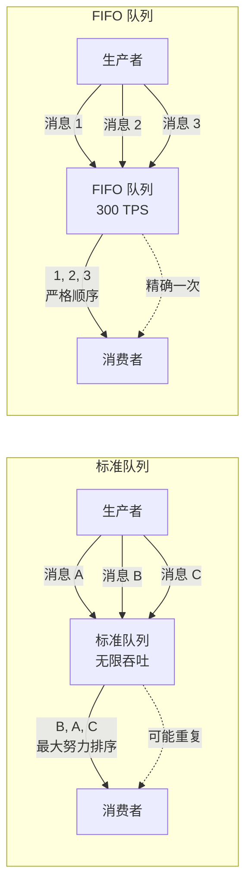
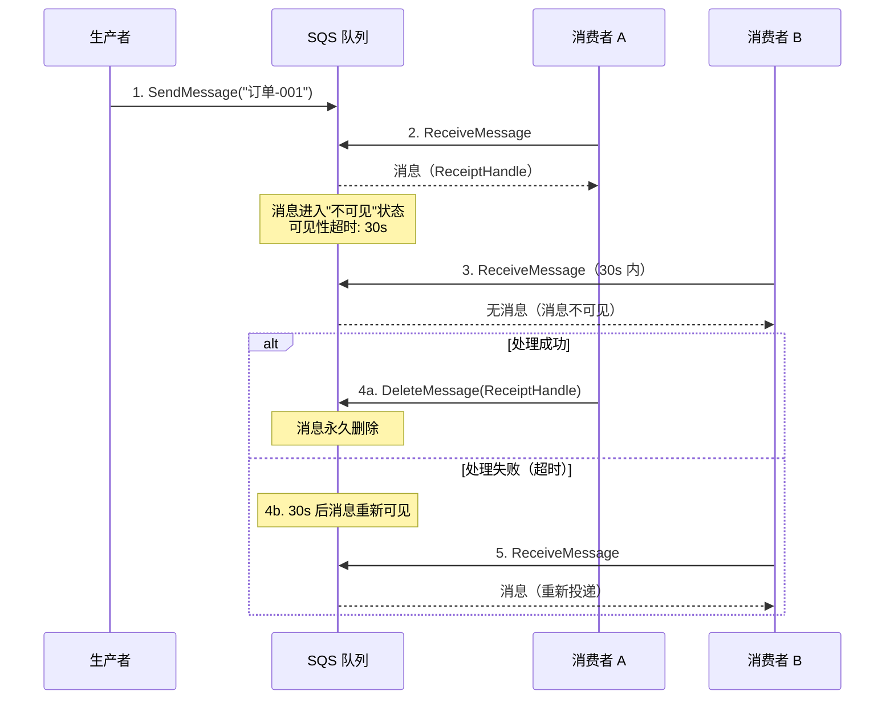
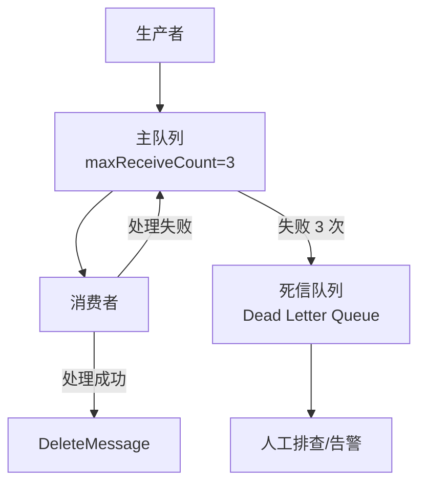

# SQS 消息队列

## 概念说明

Amazon SQS（Simple Queue Service）是 AWS 完全托管的消息队列服务，提供标准队列和 FIFO 队列两种类型。SQS 是最早的 AWS 服务之一（2004 年发布），以其简单、可靠、无需运维的特性广泛应用于异步解耦、削峰填谷等场景。

SQS 的核心概念：
- **标准队列**：近乎无限吞吐量，至少一次投递（可能重复），最大努力排序
- **FIFO 队列**：严格顺序，精确一次处理，吞吐量限制（300 TPS，批量 3000 TPS）
- **可见性超时**：消息被消费后在超时期间对其他消费者不可见，防止重复处理
- **死信队列**：处理失败超过阈值的消息自动转移到死信队列，便于排查
- **长轮询**：消费者等待消息到达，减少空轮询请求，降低成本

## 核心原理

### 标准队列 vs FIFO 队列



### 可见性超时机制



### 死信队列流程



## 标准库方案

Go 标准库不提供 SQS 客户端。SQS 基于 HTTP API，可以用 `net/http` 调用，但需要实现 SigV4 签名。

## 第三方库方案

### AWS SDK v2 SQS 操作

```go
import "github.com/aws/aws-sdk-go-v2/service/sqs"

// 创建标准队列
client.CreateQueue(ctx, &sqs.CreateQueueInput{
    QueueName: aws.String("my-queue"),
})

// 创建 FIFO 队列
client.CreateQueue(ctx, &sqs.CreateQueueInput{
    QueueName: aws.String("my-queue.fifo"),
    Attributes: map[string]string{
        "FifoQueue":                 "true",
        "ContentBasedDeduplication": "true",
    },
})

// 发送消息
client.SendMessage(ctx, &sqs.SendMessageInput{
    QueueUrl:    aws.String(queueURL),
    MessageBody: aws.String(`{"orderId":"001","amount":99.9}`),
})

// 接收消息（长轮询）
output, _ := client.ReceiveMessage(ctx, &sqs.ReceiveMessageInput{
    QueueUrl:            aws.String(queueURL),
    MaxNumberOfMessages: 10,
    WaitTimeSeconds:     20, // 长轮询
})

// 删除消息
client.DeleteMessage(ctx, &sqs.DeleteMessageInput{
    QueueUrl:      aws.String(queueURL),
    ReceiptHandle: output.Messages[0].ReceiptHandle,
})
```

## 代码示例

> 💻 完整可运行代码：[code-examples/03-microservice/aws/sqs/](https://github.com/your-repo/code-examples/03-microservice/aws/sqs/)
> 🏷️ Demo 模式：Part A（内存模拟消息队列）/ Part B（连接 LocalStack SQS）

## 常见面试题

### Q1: SQS 如何保证消息可靠性？

**难度**：⭐⭐⭐ | **频率**：🔥🔥🔥

**答题思路**：

1. 消息持久化
2. 可见性超时
3. 死信队列
4. 消息去重（FIFO）

**标准答案**：

SQS 通过多重机制保证消息可靠性：消息存储在多个可用区的冗余服务器上，确保持久性。可见性超时机制防止消息被重复处理——消费者接收消息后，消息在超时期间对其他消费者不可见，处理成功后显式删除，处理失败则超时后重新可见。死信队列收集处理失败超过阈值的消息，便于排查问题。FIFO 队列还提供消息去重（基于 MessageDeduplicationId 或内容哈希），确保精确一次处理。标准队列提供至少一次投递，消费者需要实现幂等性。

**深入追问**：

- 可见性超时设置多长合适？
- 如何处理死信队列中的消息？

### Q2: SQS 标准队列和 FIFO 队列如何选择？

**难度**：⭐⭐ | **频率**：🔥🔥🔥

**答题思路**：

1. 吞吐量需求
2. 顺序性需求
3. 去重需求
4. 成本考虑

**标准答案**：

标准队列适合高吞吐量、不要求严格顺序的场景（如日志收集、通知推送），吞吐量近乎无限。FIFO 队列适合需要严格顺序和精确一次处理的场景（如订单处理、金融交易），但吞吐量限制为 300 TPS（批量 3000 TPS）。选择标准：如果业务能容忍偶尔的消息重复和乱序，优先选标准队列；如果业务要求严格顺序或不能重复处理，选 FIFO 队列。FIFO 队列价格约为标准队列的 1.2 倍。

**深入追问**：

- FIFO 队列的 MessageGroupId 有什么作用？
- 如何在标准队列上实现幂等性？

## 常见陷阱

1. **忘记删除已处理的消息**：消费者处理完消息后必须调用 `DeleteMessage`，否则消息会在可见性超时后重新出现
2. **可见性超时过短**：如果处理时间超过可见性超时，消息会被重复投递，应根据实际处理时间设置
3. **FIFO 队列名称必须以 .fifo 结尾**：这是 AWS 的硬性要求
4. **未使用长轮询**：短轮询会产生大量空请求，增加成本，建议设置 `WaitTimeSeconds` 为 10-20 秒

## 参考资料

- [AWS SQS 官方文档](https://docs.aws.amazon.com/sqs/)
- [AWS SDK for Go v2 SQS](https://pkg.go.dev/github.com/aws/aws-sdk-go-v2/service/sqs)
- [SQS 最佳实践](https://docs.aws.amazon.com/AWSSimpleQueueService/latest/SQSDeveloperGuide/sqs-best-practices.html)
