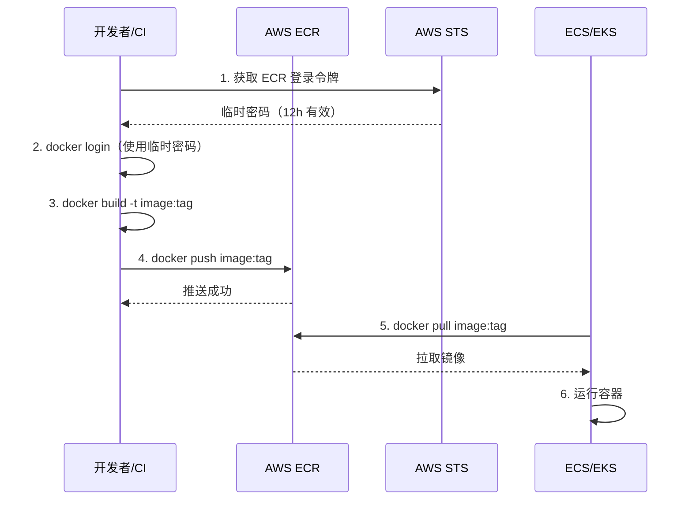

# ECR 容器镜像仓库

## 概念说明

Amazon ECR（Elastic Container Registry）是 AWS 完全托管的 Docker 容器镜像仓库服务。ECR 与 ECS、EKS、Lambda 等 AWS 计算服务深度集成，是 AWS 生态中存储和分发容器镜像的标准方案。

ECR 的核心特性：
- **完全托管**：无需自建镜像仓库，自动扩展存储
- **安全**：镜像静态加密，通过 IAM 控制访问权限
- **镜像扫描**：内置漏洞扫描，发现安全问题
- **生命周期策略**：自动清理旧镜像，节省存储成本
- **跨区域复制**：支持镜像跨 Region 复制

## 核心原理

### ECR 工作流程



### ECR 镜像地址格式

```
{account_id}.dkr.ecr.{region}.amazonaws.com/{repository}:{tag}

示例：
123456789012.dkr.ecr.us-east-1.amazonaws.com/my-go-app:v1.0.0
```

## 标准库方案

Go 标准库不提供 ECR 客户端。ECR 操作主要通过 Docker CLI 和 AWS CLI 完成，Go 代码中通过 AWS SDK 获取登录令牌。

## 第三方库方案

### AWS CLI 操作 ECR

```bash
# 获取 ECR 登录令牌并登录 Docker
aws ecr get-login-password --region us-east-1 | \
  docker login --username AWS --password-stdin \
  123456789012.dkr.ecr.us-east-1.amazonaws.com

# 创建仓库
aws ecr create-repository --repository-name my-go-app

# 构建并推送镜像
docker build -t my-go-app:v1.0.0 .
docker tag my-go-app:v1.0.0 123456789012.dkr.ecr.us-east-1.amazonaws.com/my-go-app:v1.0.0
docker push 123456789012.dkr.ecr.us-east-1.amazonaws.com/my-go-app:v1.0.0
```

### Go SDK 获取登录令牌

```go
import "github.com/aws/aws-sdk-go-v2/service/ecr"

client := ecr.NewFromConfig(cfg)
output, _ := client.GetAuthorizationToken(ctx, &ecr.GetAuthorizationTokenInput{})
// output.AuthorizationData[0].AuthorizationToken 是 Base64 编码的 "AWS:password"
```

### GitHub Actions CI/CD 集成

```yaml
- name: Login to Amazon ECR
  uses: aws-actions/amazon-ecr-login@v2

- name: Build and push
  run: |
    docker build -t $ECR_REGISTRY/$ECR_REPOSITORY:$IMAGE_TAG .
    docker push $ECR_REGISTRY/$ECR_REPOSITORY:$IMAGE_TAG
```

## 代码示例

> 💻 ECR 操作主要通过 Docker CLI 和 AWS CLI 完成，Go 代码示例见 STS 模块中的凭证获取部分
> 🏷️ 参考：[code-examples/03-microservice/aws/sts/](https://github.com/your-repo/code-examples/03-microservice/aws/sts/)

## 常见面试题

### Q1: ECR 和 Docker Hub 的区别？

**难度**：⭐⭐ | **频率**：🔥🔥

**答题思路**：

1. 访问控制
2. 与 AWS 生态集成
3. 安全扫描
4. 成本

**标准答案**：

ECR 通过 IAM 控制访问权限，与 AWS 计算服务（ECS/EKS/Lambda）深度集成，拉取镜像无需额外认证配置。Docker Hub 是公共镜像仓库，私有仓库需要付费。ECR 内置镜像漏洞扫描，Docker Hub 需要付费版。ECR 按存储量和数据传输计费，同区域 ECS/EKS 拉取免费；Docker Hub 免费版有拉取频率限制（100 次/6h）。生产环境使用 AWS 服务时，推荐 ECR。

**深入追问**：

- ECR 的生命周期策略如何配置？
- 如何实现 ECR 镜像跨区域复制？

## 常见陷阱

1. **登录令牌过期**：ECR 登录令牌有效期 12 小时，CI/CD 中每次构建都应重新获取
2. **忘记创建仓库**：推送镜像前必须先创建 ECR 仓库，否则推送失败
3. **镜像标签覆盖**：默认允许覆盖同名标签，生产环境建议开启镜像标签不可变性
4. **未配置生命周期策略**：不清理旧镜像会持续产生存储费用

## 参考资料

- [AWS ECR 官方文档](https://docs.aws.amazon.com/ecr/)
- [ECR 与 GitHub Actions 集成](https://github.com/aws-actions/amazon-ecr-login)
