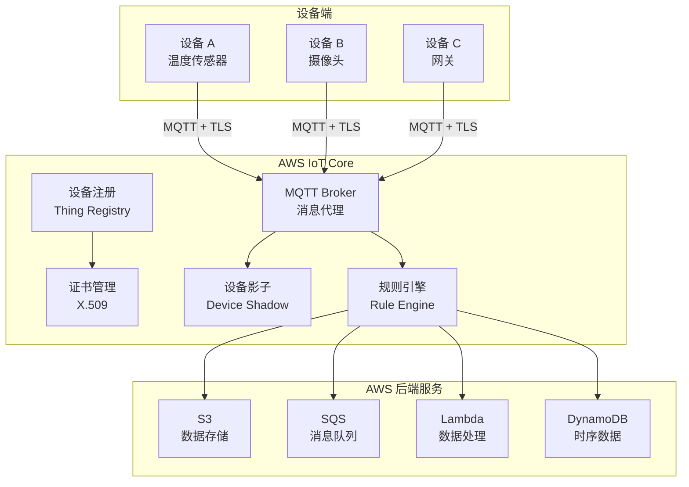
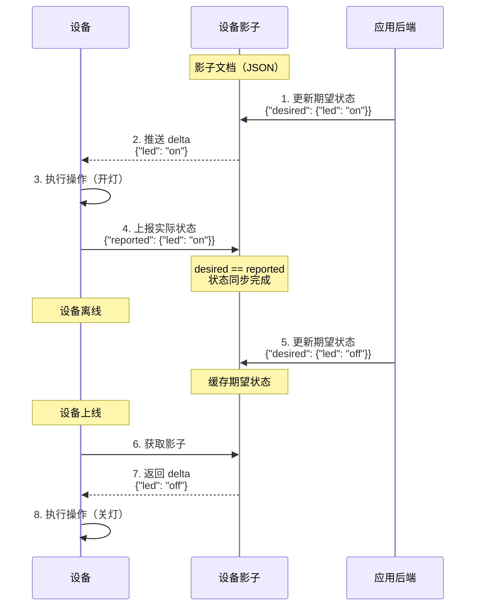

# IoT Core 物联网通信

## 概念说明

AWS IoT Core 是 AWS 的物联网通信平台，支持数十亿设备安全连接到云端。IoT Core 基于 MQTT 协议（轻量级发布/订阅消息协议），提供设备注册、证书管理、消息路由、设备影子等核心功能。

IoT Core 的核心概念：
- **Thing（设备）**：IoT Core 中的设备实体，每个设备有唯一标识
- **证书**：X.509 证书用于设备身份认证，比用户名/密码更安全
- **MQTT**：轻量级消息协议，支持 QoS 0/1，适合低带宽、高延迟网络
- **设备影子（Device Shadow）**：设备状态的 JSON 文档，支持离线状态同步
- **规则引擎（Rule Engine）**：基于 SQL 的消息路由，将设备数据转发到 S3/SQS/Lambda 等

## 核心原理

### IoT Core 架构



### 设备影子（Device Shadow）



### MQTT QoS 级别

| QoS | 名称 | 说明 | 适用场景 |
|-----|------|------|---------|
| 0 | 最多一次 | 不保证送达，无确认 | 传感器高频数据（丢失可接受） |
| 1 | 至少一次 | 保证送达，可能重复 | 控制指令（需幂等处理） |

> 注意：AWS IoT Core 不支持 QoS 2（精确一次），EMQX 等开源 Broker 支持。

## 标准库方案

Go 标准库不提供 MQTT 客户端。MQTT 通信通过 `github.com/eclipse/paho.mqtt.golang` 库实现。

## 第三方库方案

### paho.mqtt.golang 基本使用

```go
import mqtt "github.com/eclipse/paho.mqtt.golang"

opts := mqtt.NewClientOptions().
    AddBroker("tls://xxx.iot.us-east-1.amazonaws.com:8883").
    SetClientID("my-device-001").
    SetTLSConfig(tlsConfig) // X.509 证书

client := mqtt.NewClient(opts)
token := client.Connect()
token.Wait()

// 发布消息
client.Publish("devices/001/telemetry", 1, false, `{"temp":25.5}`)

// 订阅消息
client.Subscribe("devices/001/commands", 1, func(c mqtt.Client, m mqtt.Message) {
    fmt.Printf("收到指令: %s\n", m.Payload())
})
```

## 代码示例

> 💻 完整可运行代码：[code-examples/03-microservice/aws/iot-core/](https://github.com/your-repo/code-examples/03-microservice/aws/iot-core/)
> 🏷️ Demo 模式：纯 Go（模拟 IoT 设备注册、MQTT 通信、设备影子）

## 常见面试题

### Q1: IoT Core 的设备影子有什么作用？

**难度**：⭐⭐⭐ | **频率**：🔥🔥

**答题思路**：

1. 离线状态同步
2. desired/reported 模型
3. delta 机制
4. 与直接 MQTT 通信的区别

**标准答案**：

设备影子是设备状态的云端 JSON 副本，解决设备离线时的状态同步问题。影子包含 desired（期望状态）和 reported（实际状态）两部分。应用后端更新 desired，设备上线后获取 delta（desired 与 reported 的差异），执行操作后更新 reported。这样即使设备离线，应用也能"预设"操作，设备上线后自动执行。与直接 MQTT 通信相比，设备影子提供了状态持久化和离线同步能力。

**深入追问**：

- 设备影子的大小限制是多少？
- 如何处理多个应用同时更新设备影子的冲突？

## 常见陷阱

1. **证书管理不当**：设备证书应安全存储，不要硬编码在代码中，生产环境使用 HSM 或安全存储
2. **Topic 命名不规范**：建议使用层级结构如 `devices/{deviceId}/telemetry`，便于规则引擎过滤
3. **未处理 MQTT 断连重连**：网络不稳定时 MQTT 连接可能断开，应配置自动重连和消息缓存
4. **QoS 选择不当**：控制指令应使用 QoS 1 保证送达，高频遥测数据可使用 QoS 0

## 参考资料

- [AWS IoT Core 官方文档](https://docs.aws.amazon.com/iot/)
- [paho.mqtt.golang](https://github.com/eclipse/paho.mqtt.golang)
- [MQTT 协议规范](https://mqtt.org/mqtt-specification/)
