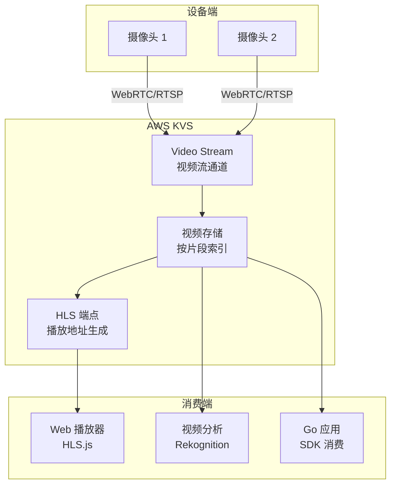
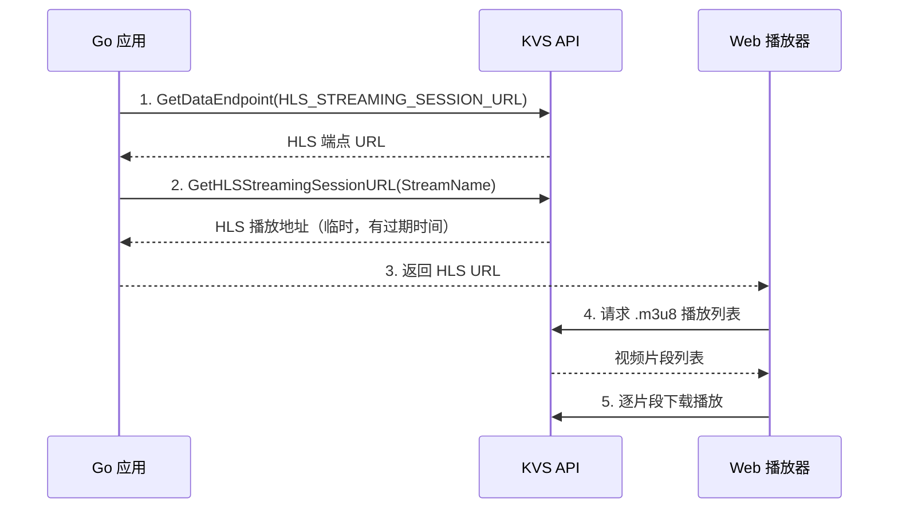

# KVS 视频流

## 概念说明

Amazon Kinesis Video Streams（KVS）是 AWS 的视频流接入和处理服务，支持从数百万设备安全地将视频流传输到 AWS 云端，用于存储、分析和播放。KVS 常与 IoT Core 配合使用，构建智能安防、远程监控等 IoT 视频场景。

KVS 的核心概念：
- **Video Stream**：视频流通道，每个设备对应一个 Stream
- **Producer**：视频生产者（设备端），将视频帧推送到 KVS
- **Consumer**：视频消费者（应用端），从 KVS 拉取视频
- **HLS（HTTP Live Streaming）**：通过 HLS 协议在浏览器中播放视频
- **Fragment**：视频片段，KVS 按片段存储和索引视频数据

## 核心原理

### KVS 架构



### HLS 播放地址生成流程



## 标准库方案

Go 标准库不提供 KVS 客户端。KVS 操作通过 AWS SDK v2 的 `service/kinesisvideo` 包实现。

## 第三方库方案

### Go SDK 获取 HLS 播放地址

```go
import (
    "github.com/aws/aws-sdk-go-v2/service/kinesisvideo"
    kvsam "github.com/aws/aws-sdk-go-v2/service/kinesisvideoarchivedmedia"
)

// 1. 获取 HLS 数据端点
kvsClient := kinesisvideo.NewFromConfig(cfg)
epOutput, _ := kvsClient.GetDataEndpoint(ctx, &kinesisvideo.GetDataEndpointInput{
    StreamName: aws.String("my-camera-stream"),
    APIName:    types.APINameGetHlsStreamingSessionUrl,
})

// 2. 创建 Archived Media 客户端（使用数据端点）
amClient := kvsam.NewFromConfig(cfg, func(o *kvsam.Options) {
    o.BaseEndpoint = epOutput.DataEndpoint
})

// 3. 获取 HLS 播放地址
hlsOutput, _ := amClient.GetHLSStreamingSessionURL(ctx, &kvsam.GetHLSStreamingSessionURLInput{
    StreamName:             aws.String("my-camera-stream"),
    PlaybackMode:           amtypes.HLSPlaybackModeLive,
    HLSFragmentSelector:    &amtypes.HLSFragmentSelector{...},
    Expires:                aws.Int32(300), // 5 分钟有效
})
fmt.Println(*hlsOutput.HLSStreamingSessionURL)
```

## 代码示例

> 💻 KVS 需要真实 AWS 环境和视频设备，本模块代码示例以 IoT Core MQTT 通信为主
> 🏷️ 参考：[code-examples/03-microservice/aws/iot-core/](https://github.com/your-repo/code-examples/03-microservice/aws/iot-core/)

## 常见面试题

### Q1: KVS 的 HLS 播放地址是如何生成的？

**难度**：⭐⭐⭐ | **频率**：🔥

**答题思路**：

1. 两步获取流程
2. 数据端点概念
3. 播放模式（Live/On-Demand）
4. 地址有效期

**标准答案**：

KVS 的 HLS 播放地址生成分两步：首先调用 `GetDataEndpoint` 获取 HLS 数据端点（每个 Stream 的数据端点不同），然后使用该端点创建 Archived Media 客户端，调用 `GetHLSStreamingSessionURL` 获取临时 HLS 播放地址。播放地址有过期时间（默认 300 秒），支持 Live（实时）和 On-Demand（回放）两种模式。前端使用 HLS.js 等播放器加载该 URL 即可播放视频。

**深入追问**：

- KVS 支持哪些视频编码格式？
- 如何实现视频回放（指定时间范围）？

## 常见陷阱

1. **数据端点不是固定的**：每次获取 HLS URL 前都应重新获取数据端点
2. **HLS URL 有过期时间**：默认 300 秒，前端应在过期前刷新
3. **视频编码格式限制**：KVS 主要支持 H.264 视频编码，其他格式可能不兼容
4. **跨区域访问**：KVS Stream 和消费者必须在同一 Region

## 参考资料

- [AWS Kinesis Video Streams 官方文档](https://docs.aws.amazon.com/kinesisvideostreams/)
- [KVS HLS 播放](https://docs.aws.amazon.com/kinesisvideostreams/latest/dg/hls-playback.html)
