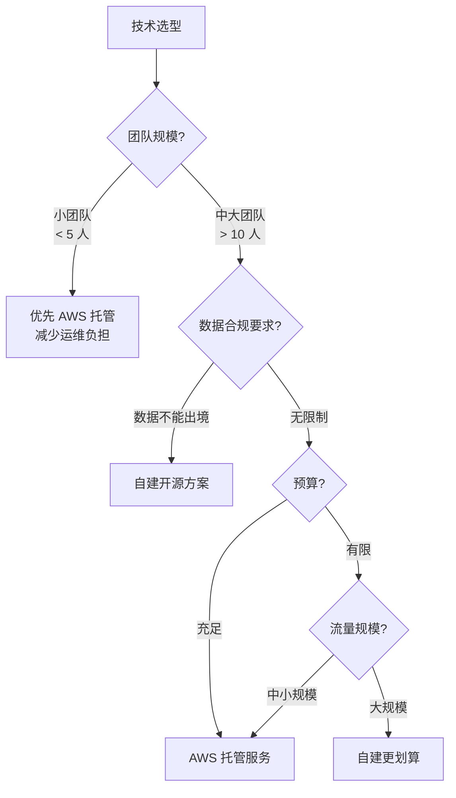
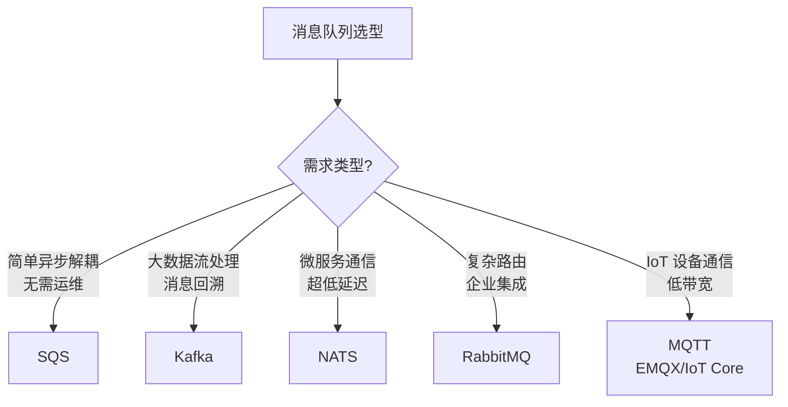

# AWS 服务与开源替代方案对比

## 概念说明

在技术选型时，开发者经常面临"使用 AWS 托管服务"还是"自建开源方案"的抉择。两种方案各有优劣：AWS 托管服务免运维、高可用，但有厂商锁定和成本问题；开源方案灵活可控，但需要自行运维。

本文从功能、性能、成本、运维复杂度等维度，对比 AWS 核心服务与主流开源替代方案。

## 核心原理

### 选型决策框架



## 对象存储：S3 vs MinIO

| 维度 | AWS S3 | MinIO |
|------|--------|-------|
| **部署方式** | 完全托管 | 自建部署 |
| **API 兼容性** | S3 原生 | 完全兼容 S3 API |
| **持久性** | 99.999999999%（11 个 9） | 取决于部署架构 |
| **可用性** | 99.99% | 取决于部署架构 |
| **存储容量** | 无限 | 取决于硬件 |
| **预签名 URL** | ✅ 支持 | ✅ 支持 |
| **分片上传** | ✅ 支持 | ✅ 支持 |
| **版本控制** | ✅ 支持 | ✅ 支持 |
| **生命周期策略** | ✅ 丰富 | ✅ 基础 |
| **成本** | 按量付费（$0.023/GB/月） | 硬件 + 运维成本 |
| **运维复杂度** | 零运维 | 需要运维团队 |
| **Go SDK** | `aws-sdk-go-v2/service/s3` | `minio-go/v7` |
| **代码迁移** | — | 切换 Endpoint 即可 |
| **适用场景** | 生产环境、大规模存储 | 私有云、数据合规、本地开发 |

### 代码兼容性示例

```go
// 同一套代码，切换 Endpoint 即可在 S3 和 MinIO 之间切换
// AWS S3
client := s3.NewFromConfig(cfg)

// MinIO（S3 兼容）
client := s3.NewFromConfig(cfg, func(o *s3.Options) {
    o.BaseEndpoint = aws.String("http://localhost:9000")
    o.UsePathStyle = true
})
```

## 消息队列：SQS vs Kafka vs NATS vs RabbitMQ

| 维度 | AWS SQS | Kafka | NATS | RabbitMQ |
|------|---------|-------|------|----------|
| **部署方式** | 完全托管 | 自建/MSK | 自建 | 自建 |
| **消息模型** | 队列（点对点） | 日志（发布/订阅） | 发布/订阅 | 队列 + 交换机 |
| **消息顺序** | FIFO 队列支持 | 分区内有序 | 不保证 | 不保证 |
| **消息持久化** | ✅ 自动 | ✅ 磁盘 | JetStream 支持 | ✅ 磁盘 |
| **消息回溯** | ❌ 不支持 | ✅ 支持 | JetStream 支持 | ❌ 不支持 |
| **吞吐量** | 标准队列无限 | 百万级/秒 | 千万级/秒 | 万级/秒 |
| **延迟** | 毫秒级 | 毫秒级 | 微秒级 | 毫秒级 |
| **死信队列** | ✅ 内置 | 需自行实现 | 需自行实现 | ✅ 内置 |
| **消息大小** | 256KB | 1MB（可配置） | 1MB（可配置） | 无硬限制 |
| **运维复杂度** | 零运维 | 高（ZooKeeper/KRaft） | 低 | 中 |
| **成本** | 按请求付费 | 硬件 + 运维 | 硬件 + 运维 | 硬件 + 运维 |
| **Go 客户端** | `aws-sdk-go-v2` | `sarama`/`confluent` | `nats.go` | `amqp091-go` |
| **适用场景** | 简单异步解耦 | 大数据流处理 | 微服务通信 | 企业消息集成 |

### 选型建议



## IoT 通信：IoT Core vs EMQX

| 维度 | AWS IoT Core | EMQX |
|------|-------------|------|
| **部署方式** | 完全托管 | 自建/EMQX Cloud |
| **协议支持** | MQTT 3.1.1/5.0, WebSocket | MQTT 3.1/3.1.1/5.0, WebSocket, CoAP |
| **QoS 支持** | QoS 0, 1 | QoS 0, 1, 2 |
| **设备认证** | X.509 证书, IAM | 用户名/密码, X.509, JWT |
| **设备影子** | ✅ 内置 | 需自行实现 |
| **规则引擎** | ✅ SQL 规则 → AWS 服务 | ✅ SQL 规则 → Webhook/数据库 |
| **设备管理** | ✅ Thing Registry | 需自行实现 |
| **连接数** | 无限（按连接计费） | 取决于部署规模 |
| **运维复杂度** | 零运维 | 中等 |
| **成本** | 按连接和消息计费 | 开源免费 + 硬件 |
| **适用场景** | AWS 生态 IoT 项目 | 私有部署、高 QoS 需求 |

## 代码示例

> 💻 完整可运行代码：[code-examples/03-microservice/aws/](https://github.com/your-repo/code-examples/03-microservice/aws/)
> 🏷️ 对比 MinIO 示例：[code-examples/02-web-data/object-storage/minio/](https://github.com/your-repo/code-examples/02-web-data/object-storage/minio/)

## 常见面试题

### Q1: 什么时候选择 AWS 托管服务，什么时候自建？

**难度**：⭐⭐⭐ | **频率**：🔥🔥🔥

**答题思路**：

1. 团队规模和运维能力
2. 数据合规要求
3. 成本分析
4. 厂商锁定风险

**标准答案**：

选择 AWS 托管服务的场景：小团队无专职运维、需要快速上线、对可用性要求极高、已深度使用 AWS 生态。选择自建的场景：数据合规要求（数据不能出境）、大规模使用时成本更低、需要深度定制、避免厂商锁定。折中方案：使用 S3 兼容 API（如 MinIO），代码层面保持可迁移性；使用 Terraform 等 IaC 工具管理基础设施，降低迁移成本。

**深入追问**：

- 如何评估 AWS 服务的总拥有成本（TCO）？
- 如何设计代码架构以降低云厂商锁定风险？

## 常见陷阱

1. **低估运维成本**：自建方案的硬件、人力、故障处理成本往往被低估
2. **忽视厂商锁定**：深度使用 AWS 特有功能（如 IoT Core 规则引擎）会增加迁移难度
3. **盲目追求自建**：小团队自建 Kafka 集群的运维成本可能远超 SQS 费用
4. **未做成本预估**：AWS 按量付费在大规模使用时可能比自建更贵，应提前做成本模型

## 参考资料

- [AWS 定价计算器](https://calculator.aws/)
- [MinIO 官方文档](https://min.io/docs/minio/linux/index.html)
- [EMQX 官方文档](https://www.emqx.io/docs/zh/latest/)
