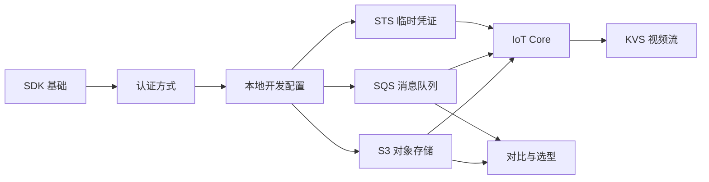
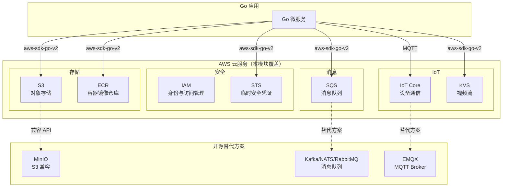

# 云服务集成（AWS）

> **前置依赖：** [Go 基础语法](/1-go-core/1.1-go-basics/) | [网络编程与 Web 框架](/2-web-data/2.1-web-framework/)

## 模块概述

AWS（Amazon Web Services）是全球最大的云计算平台，Go 语言凭借其高性能、低资源占用和单一二进制部署的特性，成为 AWS 云原生开发的理想选择。AWS 官方提供了 **AWS SDK for Go v2**，支持所有 AWS 服务的 API 调用。

本模块系统讲解 AWS SDK for Go v2 的核心架构、认证方式、本地开发配置，以及 S3（对象存储）、SQS（消息队列）、ECR（容器镜像仓库）、STS（临时安全凭证）、IoT Core（物联网通信）、KVS（视频流）等核心服务在 Go 项目中的集成方式。同时提供 AWS 服务与开源替代方案的对比分析，帮助开发者理解云服务与自建方案的取舍。

## 知识点索引

### SDK 基础与认证

| 序号 | 知识点 | 难度 | 面试频率 | 预计时间 |
|------|--------|------|---------|---------|
| 01 | [AWS SDK for Go v2 基础](./01-sdk-basics.md) | ⭐⭐ | 🔥🔥 | 40min |
| 02 | [认证方式](./02-auth.md) | ⭐⭐⭐ | 🔥🔥🔥 | 45min |
| 03 | [本地开发配置](./03-local-dev.md) | ⭐⭐ | 🔥 | 30min |

### 核心服务集成

| 序号 | 知识点 | 难度 | 面试频率 | 预计时间 |
|------|--------|------|---------|---------|
| 04 | [S3 对象存储](./04-s3.md) | ⭐⭐⭐ | 🔥🔥🔥 | 60min |
| 05 | [SQS 消息队列](./05-sqs.md) | ⭐⭐⭐ | 🔥🔥🔥 | 55min |
| 06 | [ECR 容器镜像仓库](./06-ecr.md) | ⭐⭐ | 🔥🔥 | 35min |
| 07 | [STS 临时安全凭证](./07-sts.md) | ⭐⭐⭐ | 🔥🔥🔥 | 45min |

### IoT 与流媒体

| 序号 | 知识点 | 难度 | 面试频率 | 预计时间 |
|------|--------|------|---------|---------|
| 08 | [IoT Core 物联网通信](./08-iot-core.md) | ⭐⭐⭐ | 🔥🔥 | 60min |
| 09 | [KVS 视频流](./09-kvs.md) | ⭐⭐⭐ | 🔥 | 40min |

### 对比与面试

| 序号 | 知识点 | 难度 | 面试频率 | 预计时间 |
|------|--------|------|---------|---------|
| 10 | [AWS 服务与开源替代方案对比](./10-comparison.md) | ⭐⭐⭐ | 🔥🔥🔥 | 40min |
| 📝 | [面试指南](./interview.md) | - | 🔥🔥🔥 | 60min |

## 代码示例

> 💻 完整可运行代码：[code-examples/03-microservice/aws/](https://github.com/your-repo/code-examples/03-microservice/aws/)

| 示例目录 | 对应知识点 | 运行方式 | Demo 模式 |
|---------|-----------|---------|----------|
| `s3/` | S3 文件操作（上传/下载/预签名/分片上传） | `go run ./s3/` | 混合（Part A + Part B） |
| `sqs/` | SQS 消息收发（标准队列 + FIFO） | `go run ./sqs/` | 混合（Part A + Part B） |
| `sts/` | STS AssumeRole 临时凭证获取 | `go run ./sts/` | 纯 Go |
| `iot-core/` | IoT Core 设备 MQTT 通信模拟 | `go run ./iot-core/` | 纯 Go |

### Docker 启动命令

```bash
# LocalStack（模拟 AWS S3/SQS）
docker compose -f docker/docker-compose.localstack.yml up -d

# 健康检查
curl http://localhost:4566/_localstack/health
```

## 学习路径建议



1. **先学 SDK 基础**：理解 aws.Config、Credentials Provider、Region 配置和 Retry 策略
2. **掌握认证方式**：IAM 角色、Access Key、STS 临时凭证是 AWS 安全的核心
3. **配置本地开发**：使用 LocalStack 在本地模拟 AWS 服务，无需真实 AWS 账号
4. **学习核心服务**：S3（对象存储）和 SQS（消息队列）是最常用的 AWS 服务
5. **深入 STS**：理解临时凭证和跨账号访问，这是生产环境的安全最佳实践
6. **IoT 与流媒体**：IoT Core 和 KVS 是物联网和视频场景的核心服务
7. **对比选型**：理解 AWS 服务与开源替代方案的取舍

## AWS 服务全景图


