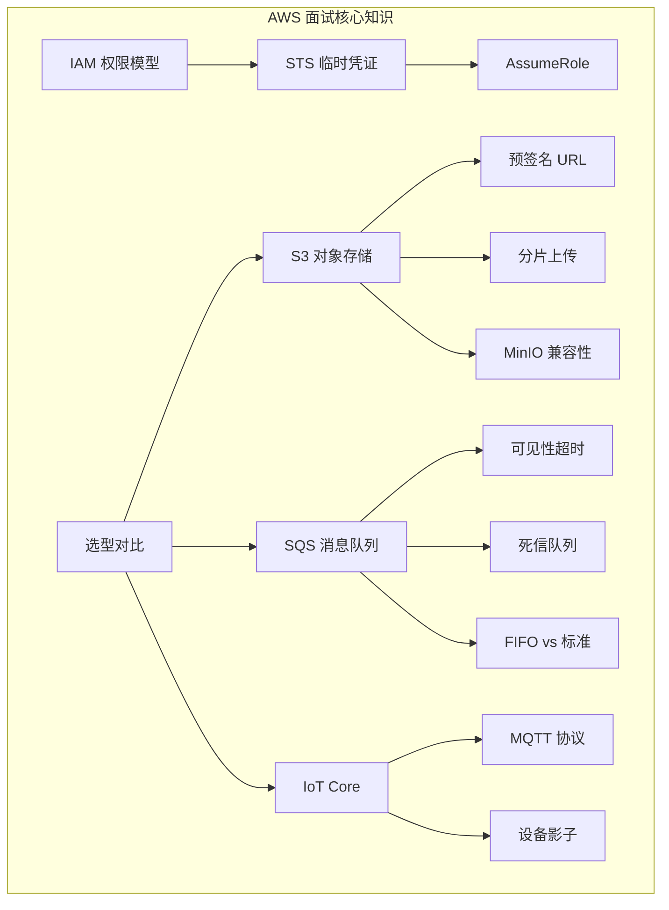

# AWS 云服务集成面试指南

## 面试概览

AWS 相关面试题在以下场景中高频出现：
- **云原生后端岗位**：S3/SQS/IAM 是必考内容
- **IoT 方向岗位**：IoT Core/MQTT/设备影子是核心考点
- **架构设计面试**：AWS 服务选型和成本优化
- **安全相关岗位**：IAM 权限模型、STS 临时凭证

## 高频面试题

### Q1: S3 预签名 URL 的原理和使用场景

**难度**：⭐⭐⭐ | **频率**：🔥🔥🔥

**答题思路**：

1. 签名算法（SigV4）
2. URL 组成和验证流程
3. 安全性保证
4. 典型使用场景

**标准答案**：

预签名 URL 通过 AWS SigV4 签名算法生成，URL 中包含 Access Key ID、签名（HMAC-SHA256）、过期时间等参数。生成过程：后端使用 Secret Key 对请求参数（HTTP 方法、Bucket、Key、过期时间、Region 等）计算签名。S3 收到请求后，用同样的参数和密钥重新计算签名进行验证，同时检查是否过期。

核心优势是**文件直传**——客户端直接与 S3 交互，不经过后端服务器，减少带宽压力和延迟。典型场景：前端直传头像/文件到 S3、生成临时下载链接分享给用户、移动端大文件上传。

安全注意事项：URL 泄露后在有效期内任何人都可使用，因此过期时间应尽量短（通常 5-15 分钟）；可通过 Bucket Policy 限制来源 IP。

**深入追问**：

- 预签名 URL 能否限制上传文件的大小和类型？
- 如何撤销一个已生成的预签名 URL？（答：无法撤销，只能等过期或删除对象）

---

### Q2: SQS 消息可靠性保证机制

**难度**：⭐⭐⭐ | **频率**：🔥🔥🔥

**答题思路**：

1. 消息持久化
2. 可见性超时
3. 死信队列
4. FIFO 去重
5. 消费者幂等性

**标准答案**：

SQS 通过多层机制保证消息可靠性：

**持久化**：消息存储在多个可用区的冗余服务器上，确保不丢失。

**可见性超时**：消费者接收消息后，消息在超时期间（默认 30s）对其他消费者不可见。处理成功后调用 DeleteMessage 永久删除；处理失败或超时，消息重新变为可见，被其他消费者重新处理。

**死信队列**：配置 maxReceiveCount（如 3），消息被接收超过该次数仍未删除，自动转移到死信队列，便于人工排查。

**FIFO 去重**：FIFO 队列通过 MessageDeduplicationId 在 5 分钟窗口内去重，防止生产者重复发送。

**消费者幂等性**：标准队列可能重复投递，消费者必须实现幂等处理（如基于消息 ID 的去重表）。

**深入追问**：

- 可见性超时设置多长合适？（答：略大于消息平均处理时间，如处理需 10s 则设 15-30s）
- 死信队列中的消息如何处理？（答：告警 → 人工排查 → 修复后重新投递到主队列）

---

### Q3: IAM 权限模型和最小权限原则

**难度**：⭐⭐⭐ | **频率**：🔥🔥🔥

**答题思路**：

1. IAM 实体（User/Role/Group）
2. Policy 结构（Effect/Action/Resource/Condition）
3. 权限评估逻辑
4. 最小权限实践

**标准答案**：

IAM 权限模型基于策略（Policy）文档，核心元素：
- **Effect**：Allow 或 Deny
- **Action**：API 操作（如 `s3:GetObject`）
- **Resource**：资源 ARN（如 `arn:aws:s3:::my-bucket/*`）
- **Condition**：条件（如限制 IP、时间、MFA）

权限评估逻辑：显式 Deny > 显式 Allow > 默认 Deny（隐式拒绝）。

最小权限原则实践：
1. 使用 IAM Role 而非 User（临时凭证，自动轮换）
2. 精确指定 Action 和 Resource，避免 `*` 通配符
3. 使用 Condition 限制访问条件
4. 定期审计权限，使用 IAM Access Analyzer 发现过度权限
5. 使用 SCP（Service Control Policy）在组织层面限制权限边界

**深入追问**：

- 什么是权限边界（Permission Boundary）？
- 如何排查 IAM 权限拒绝问题？（答：CloudTrail 日志 + IAM Policy Simulator）

---

### Q4: STS AssumeRole 的工作原理和使用场景

**难度**：⭐⭐⭐ | **频率**：🔥🔥

**答题思路**：

1. AssumeRole 流程
2. 信任策略
3. 临时凭证组成
4. 使用场景

**标准答案**：

AssumeRole 流程：调用者使用自身凭证向 STS 发起 AssumeRole 请求，指定目标角色 ARN。STS 验证调用者身份，检查目标角色的信任策略（Trust Policy）是否允许该调用者，验证通过后返回临时凭证（AccessKeyId + SecretAccessKey + SessionToken + Expiration）。

信任策略定义了"谁可以扮演这个角色"，是角色安全的关键。临时凭证有效期 15 分钟到 12 小时，过期后需要重新 AssumeRole。

使用场景：跨账号访问（账号 A 访问账号 B 的资源）、临时提权（低权限用户临时获取高权限）、第三方访问（通过 ExternalId 防止混淆代理攻击）、K8s Pod 身份（IRSA，通过 Web Identity 获取凭证）。

**深入追问**：

- 什么是混淆代理问题？如何防范？
- AssumeRole 链式调用有什么限制？

---

### Q5: 如何在本地开发环境中测试 AWS 集成代码？

**难度**：⭐⭐ | **频率**：🔥🔥

**答题思路**：

1. LocalStack 模拟器
2. 环境变量切换
3. 接口抽象
4. CI/CD 集成

**标准答案**：

推荐使用 LocalStack 在本地 Docker 中模拟 AWS 服务（S3/SQS/STS 等），通过环境变量控制 SDK 端点：开发环境指向 LocalStack（localhost:4566），生产环境使用 AWS 默认端点。代码中通过接口抽象 AWS 操作，单元测试使用 Mock 实现。CI/CD 中可以使用 LocalStack Docker 容器运行集成测试。LocalStack 社区版免费支持大部分常用服务。

**深入追问**：

- LocalStack 和真实 AWS 有哪些行为差异？
- 如何在 CI/CD 中使用 LocalStack 运行集成测试？

---

### Q6: AWS 服务选型：什么时候用托管服务，什么时候自建？

**难度**：⭐⭐⭐ | **频率**：🔥🔥🔥

**答题思路**：

1. 团队规模和运维能力
2. 数据合规要求
3. 成本分析（TCO）
4. 厂商锁定风险
5. 可迁移性设计

**标准答案**：

选择 AWS 托管服务：小团队无专职运维、需要快速上线、对可用性要求极高（SLA 保证）、已深度使用 AWS 生态。选择自建：数据合规要求（数据不能出境）、大规模使用时自建成本更低、需要深度定制功能、避免厂商锁定。

折中策略：使用 S3 兼容 API（MinIO），代码层面保持可迁移性；通过接口抽象隔离 AWS SDK 调用；使用 Terraform 管理基础设施，降低迁移成本。成本评估应考虑 TCO（总拥有成本），包括硬件、人力、故障处理、安全合规等隐性成本。

**深入追问**：

- 如何设计代码架构以降低云厂商锁定风险？
- 如何评估 AWS 服务的 TCO？

## 面试知识图谱

## 参考资料

- [AWS 架构最佳实践](https://aws.amazon.com/architecture/well-architected/)
- [AWS 安全最佳实践](https://docs.aws.amazon.com/IAM/latest/UserGuide/best-practices.html)
