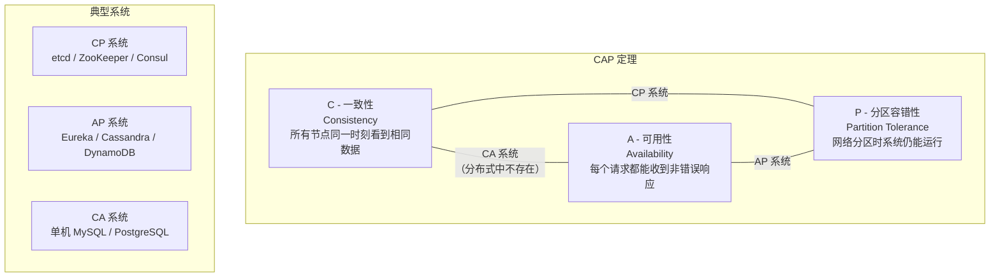
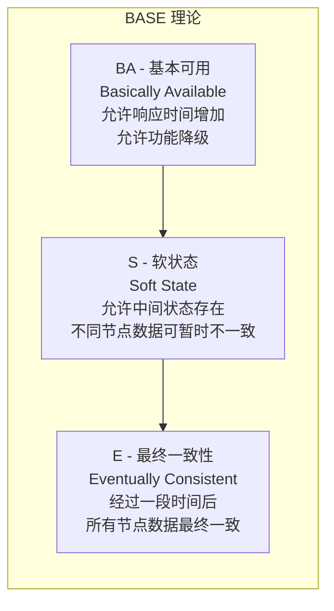

# CAP 理论与 BASE 理论

## 概念说明

CAP 理论和 BASE 理论是分布式系统设计的两大理论基石。理解它们是做出正确架构决策的前提——为什么 etcd 选择 CP？为什么 Eureka 选择 AP？为什么最终一致性在大多数业务场景下是可接受的？这些问题的答案都源于 CAP 和 BASE。

**CAP 定理**（2000 年由 Eric Brewer 提出）指出：在一个分布式系统中，一致性（Consistency）、可用性（Availability）、分区容错性（Partition Tolerance）三者不可能同时满足，最多只能同时满足其中两个。

**BASE 理论**是对 CAP 中 AP 方案的延伸，是大规模互联网系统的实践指导：基本可用（Basically Available）、软状态（Soft State）、最终一致性（Eventually Consistent）。

## 核心原理

### CAP 三要素



| 属性 | 含义 | 通俗解释 |
|------|------|----------|
| **C（一致性）** | 所有节点在同一时刻看到相同的数据 | 写入成功后，任何节点读到的都是最新值 |
| **A（可用性）** | 每个请求都能在合理时间内收到非错误响应 | 系统始终可以响应请求，不会超时或报错 |
| **P（分区容错性）** | 网络分区发生时，系统仍能继续运行 | 节点之间网络断开，系统不会整体崩溃 |

### 为什么三者不可兼得？

在分布式系统中，网络分区（P）是不可避免的现实——网络延迟、丢包、节点故障随时可能发生。因此 P 是必选项，实际的选择是在 C 和 A 之间做取舍：

- **选择 CP**：网络分区时，为了保证一致性，系统可能拒绝部分请求（牺牲可用性）
- **选择 AP**：网络分区时，为了保证可用性，系统可能返回旧数据（牺牲一致性）

### 一致性级别

| 级别 | 说明 | 典型场景 |
|------|------|----------|
| **强一致性** | 写入后立即可读到最新值 | 银行转账、库存扣减 |
| **弱一致性** | 写入后不保证能立即读到最新值 | 社交媒体点赞数 |
| **最终一致性** | 写入后经过一段时间，最终所有节点数据一致 | 电商商品信息、DNS |
| **因果一致性** | 有因果关系的操作保证顺序 | 评论和回复 |
| **读己之写** | 自己写入的数据自己能立即读到 | 用户修改个人资料 |

### BASE 理论

BASE 理论是 CAP 中 AP 方案的实践延伸，核心思想是"牺牲强一致性，换取高可用性"：



| 属性 | 含义 | 实际案例 |
|------|------|----------|
| **基本可用** | 系统出现故障时，允许损失部分功能，但核心功能可用 | 双 11 大促时关闭退款功能，保证下单功能 |
| **软状态** | 允许系统中的数据存在中间状态，不同节点的数据副本可以暂时不一致 | 订单状态从"已支付"到"已发货"之间的处理中状态 |
| **最终一致性** | 经过一段时间后，所有数据副本最终达到一致状态 | 电商商品价格修改后，各缓存节点逐步更新 |

### ACID vs BASE 对比

| 维度 | ACID（传统数据库） | BASE（分布式系统） |
|------|-------------------|-------------------|
| 一致性 | 强一致性 | 最终一致性 |
| 可用性 | 可能因锁等待降低 | 高可用 |
| 适用场景 | 单机数据库、金融交易 | 大规模分布式系统 |
| 代表系统 | MySQL、PostgreSQL | Cassandra、DynamoDB |
| 设计哲学 | 宁可不可用，也要数据正确 | 宁可数据暂时不一致，也要系统可用 |

## 标准库方案

CAP 和 BASE 是理论层面的知识，Go 标准库没有直接对应的实现。但 Go 标准库的 `context` 包和 `net` 包为构建分布式系统提供了基础设施：

```go
// 使用 context 实现超时控制（可用性保障）
ctx, cancel := context.WithTimeout(context.Background(), 3*time.Second)
defer cancel()

// 使用 select 实现请求超时降级（基本可用）
select {
case result := <-doWork(ctx):
    return result, nil
case <-ctx.Done():
    return fallbackResult, nil // 降级返回
}
```

## 第三方库方案

Go 生态中的分布式系统组件体现了不同的 CAP 选择：

| 组件 | CAP 选择 | Go 客户端 | 说明 |
|------|---------|----------|------|
| etcd | CP | `go.etcd.io/etcd/client/v3` | Raft 一致性，强一致读写 |
| Consul | CP | `github.com/hashicorp/consul/api` | Raft 一致性，支持 stale 读（AP 模式） |
| Redis Sentinel | AP | `github.com/redis/go-redis/v9` | 异步复制，可能丢数据 |
| Cassandra | AP | `github.com/gocql/gocql` | 可调一致性级别 |

## 代码示例

> 💻 完整可运行代码：[code-examples/04-distributed/distributed/](https://github.com/your-repo/code-examples/04-distributed/distributed/)
> 🏷️ CAP/BASE 是理论知识，代码示例体现在后续的分布式锁、限流、熔断等实践模块中

## 常见面试题

### Q1: 请解释 CAP 定理，为什么三者不可兼得？

**难度**：⭐⭐⭐ | **频率**：🔥🔥🔥

**答题思路**：

1. 先解释 C、A、P 三个属性的含义
2. 说明 P 在分布式系统中是必选项（网络分区不可避免）
3. 用具体场景说明 CP 和 AP 的取舍
4. 举例说明 etcd（CP）和 Eureka（AP）的选择

**标准答案**：

CAP 定理指出分布式系统中一致性、可用性、分区容错性三者最多满足两个。由于网络分区在分布式环境中不可避免，P 是必选项，实际选择是在 C 和 A 之间取舍。CP 系统（如 etcd）在网络分区时优先保证数据一致性，可能拒绝部分请求；AP 系统（如 Eureka）优先保证可用性，可能返回旧数据。选择取决于业务场景：金融交易选 CP，社交媒体选 AP。

**深入追问**：

- CAP 中的 C 和 ACID 中的 C 有什么区别？
- 什么是"网络分区"？举一个实际的网络分区场景
- etcd 是 CP 系统，那它的可用性如何保证？

### Q2: BASE 理论是什么？和 ACID 有什么区别？

**难度**：⭐⭐⭐ | **频率**：🔥🔥🔥

**答题思路**：

1. 解释 BASE 三个属性
2. 与 ACID 做对比
3. 说明 BASE 的适用场景

**标准答案**：

BASE 是 Basically Available（基本可用）、Soft State（软状态）、Eventually Consistent（最终一致性）的缩写，是对 CAP 中 AP 方案的延伸。与 ACID 追求强一致性不同，BASE 允许数据暂时不一致，通过最终一致性保证数据正确性。ACID 适用于单机数据库和金融交易场景，BASE 适用于大规模分布式系统，如电商、社交等互联网业务。

**深入追问**：

- 最终一致性的"最终"是多久？如何保证？
- 举一个实际业务中使用 BASE 理论的例子
- 如何在 BASE 系统中实现"读己之写"一致性？

### Q3: 如何选择 CP 还是 AP？

**难度**：⭐⭐⭐ | **频率**：🔥🔥

**答题思路**：

1. 分析业务对一致性和可用性的要求
2. 举例说明不同场景的选择
3. 说明实际系统中的折中方案

**标准答案**：

选择 CP 还是 AP 取决于业务场景对数据一致性的容忍度。金融转账、库存扣减等场景必须选 CP，因为数据不一致会导致资金损失；社交媒体点赞、商品浏览量等场景可以选 AP，短暂的数据不一致不影响核心业务。实际系统中往往不是非此即彼，而是针对不同数据采用不同策略——核心数据用 CP，非核心数据用 AP。

**深入追问**：

- Consul 既是 CP 系统，又支持 stale 读（AP 模式），这是怎么做到的？
- 如何在 AP 系统中尽量减少数据不一致的窗口？

## 常见陷阱

1. **误以为 CA 系统在分布式中存在**：在分布式环境中，网络分区不可避免，CA 系统只存在于单机场景（如单机 MySQL）
2. **混淆 CAP 的 C 和 ACID 的 C**：CAP 的 C 是线性一致性（所有节点看到相同数据），ACID 的 C 是事务一致性（数据满足约束条件）
3. **认为 CP 系统完全不可用**：CP 系统在网络分区时只是部分不可用（少数派节点），多数派节点仍然可以正常服务
4. **忽视最终一致性的时间窗口**：BASE 的最终一致性需要明确"最终"的时间上限，否则可能导致业务问题

## 参考资料

- [Brewer's CAP Theorem (2000)](https://users.ece.cmu.edu/~adrian/731-sp04/readings/GL-cap.pdf)
- [CAP Twelve Years Later: How the "Rules" Have Changed](https://www.infoq.com/articles/cap-twelve-years-later-how-the-rules-have-changed/)
- [BASE: An Acid Alternative](https://queue.acm.org/detail.cfm?id=1394128)
- [Go 官方文档](https://go.dev/doc/)
