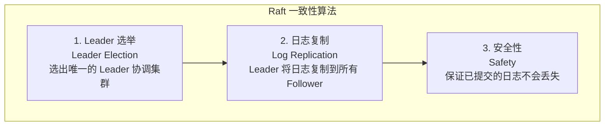
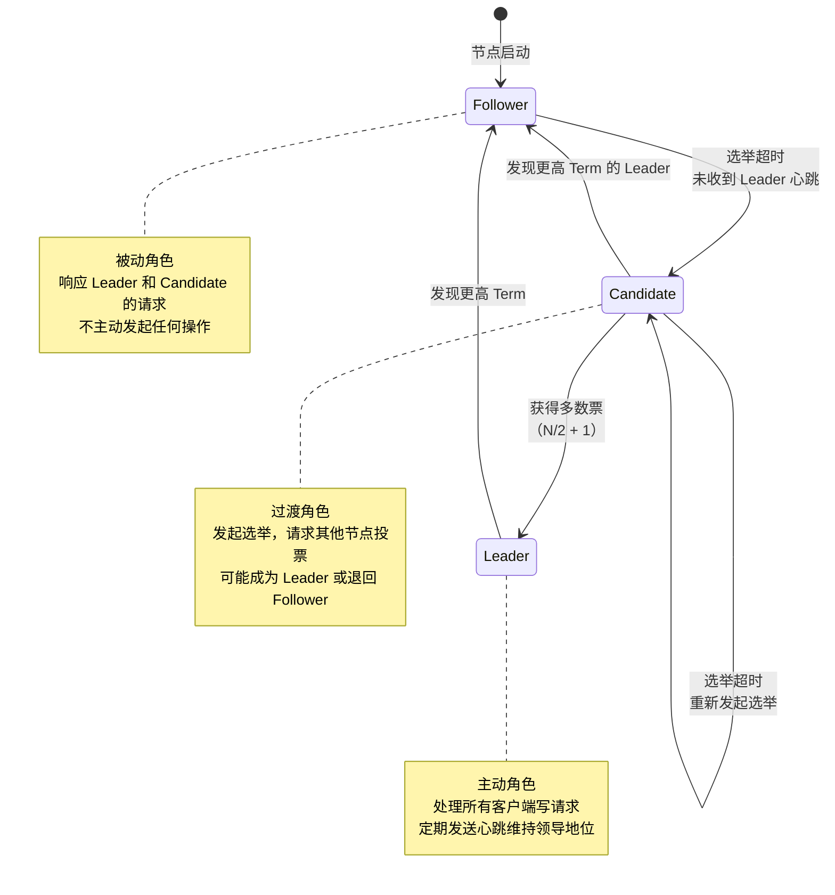
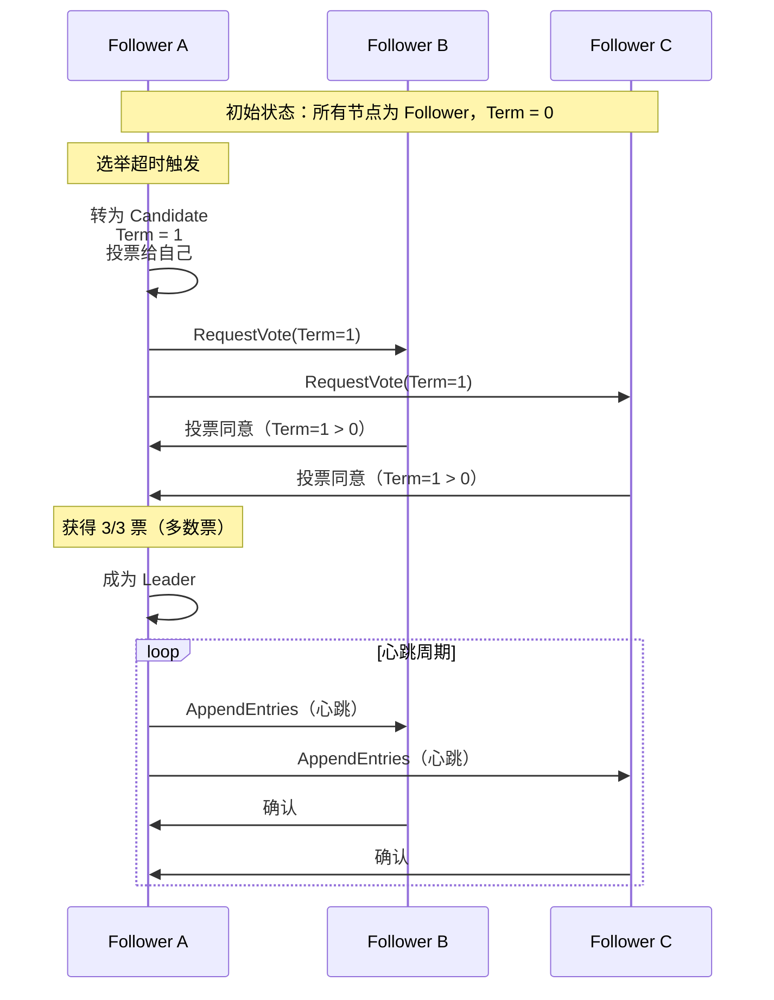
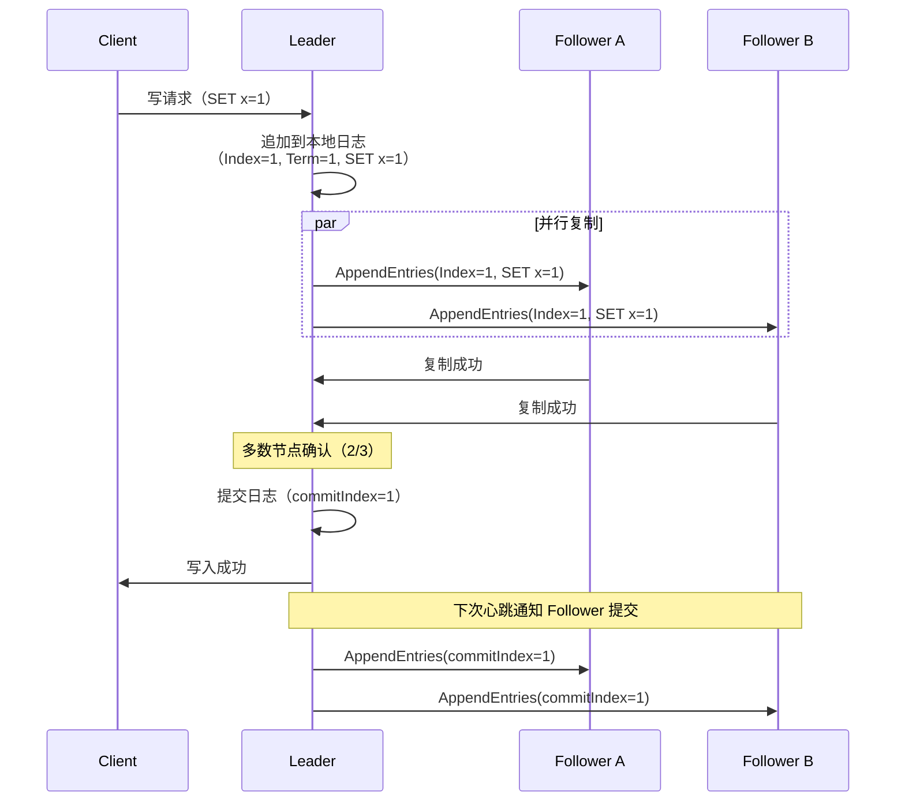
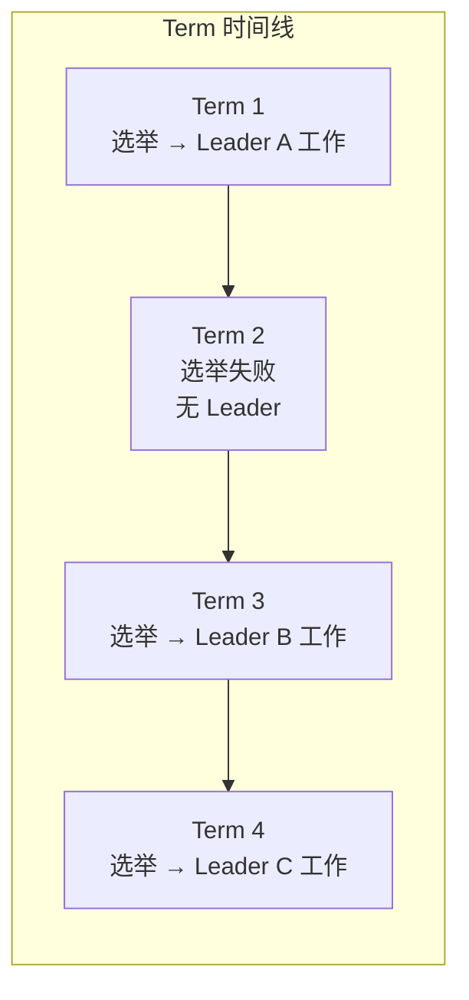

# Raft 一致性算法

## 概念说明

Raft 是一种分布式一致性算法，由 Diego Ongaro 和 John Ousterhout 在 2014 年提出，目标是提供一种比 Paxos 更易理解的一致性算法。Raft 的核心思想是"将复杂问题分解为可独立理解的子问题"。

在分布式系统中，多个节点需要对同一份数据达成共识。Raft 通过选举一个 Leader 来协调所有写操作，保证所有节点的数据最终一致。etcd、Consul、CockroachDB 等知名分布式系统都使用 Raft 作为底层一致性算法。

Go 生态中，HashiCorp 提供了 `hashicorp/raft` 库，是 Raft 算法最成熟的 Go 实现，被 Consul、Nomad 等生产级系统使用。

## 核心原理

### Raft 三大子问题

Raft 将一致性问题分解为三个相对独立的子问题：



### 节点角色与状态转换

Raft 集群中的每个节点在任意时刻处于以下三种角色之一：



| 角色 | 职责 | 状态转换条件 |
|------|------|-------------|
| **Follower** | 被动响应请求，不主动发起操作 | 选举超时 → Candidate |
| **Candidate** | 发起选举，请求投票 | 获得多数票 → Leader；发现更高 Term → Follower |
| **Leader** | 处理写请求，复制日志，发送心跳 | 发现更高 Term → Follower |

### Leader 选举流程



**选举规则**：
1. 每个 Term（任期）内，每个节点最多投一票（先到先得）
2. Candidate 必须获得多数票（N/2 + 1）才能成为 Leader
3. 如果 Candidate 的日志不如投票者新，投票者拒绝投票（安全性保证）
4. 选举超时时间随机化（150ms~300ms），避免多个节点同时发起选举

### 日志复制流程



**日志复制规则**：
1. 客户端写请求只发送到 Leader
2. Leader 将操作追加到本地日志，然后并行复制到所有 Follower
3. 多数节点确认后，Leader 提交该日志条目
4. 已提交的日志条目保证不会丢失（安全性）

### 安全性保证

Raft 通过以下机制保证安全性：

| 机制 | 说明 |
|------|------|
| **选举限制** | Candidate 的日志必须至少和投票者一样新，才能获得投票 |
| **Leader 完整性** | 已提交的日志条目一定存在于后续所有 Leader 的日志中 |
| **日志匹配** | 如果两个日志在相同 Index 和 Term 的条目相同，则该 Index 之前的所有条目也相同 |
| **Leader 只追加** | Leader 不会覆盖或删除自己的日志，只会追加新条目 |

### Term（任期）机制

Term 是 Raft 的逻辑时钟，用于检测过期信息：



- 每次选举 Term 加 1
- 节点发现更高 Term 时，立即退回 Follower
- 拒绝 Term 小于自己的请求

## 标准库方案

Go 标准库没有 Raft 实现，但提供了构建 Raft 所需的基础设施：

```go
// 使用 channel 模拟节点间通信
type RaftNode struct {
    voteCh    chan VoteRequest
    appendCh  chan AppendRequest
    commitCh  chan LogEntry
}

// 使用 sync.Mutex 保护共享状态
type NodeState struct {
    mu          sync.Mutex
    currentTerm int
    votedFor    int
    log         []LogEntry
}

// 使用 time.Timer 实现选举超时
timer := time.NewTimer(randomElectionTimeout())
```

## 第三方库方案

### hashicorp/raft

`hashicorp/raft` 是 Go 生态中最成熟的 Raft 实现，被 Consul、Nomad 等生产级系统使用。

```go
import "github.com/hashicorp/raft"

// 创建 Raft 节点
config := raft.DefaultConfig()
config.LocalID = raft.ServerID("node1")

// 创建日志存储和快照存储
logStore := raft.NewInmemStore()
stableStore := raft.NewInmemStore()
snapshotStore := raft.NewDiscardSnapshotStore()

// 创建传输层
transport, _ := raft.NewTCPTransport("127.0.0.1:0", nil, 3, 10*time.Second, os.Stderr)

// 创建 Raft 实例
r, _ := raft.NewRaft(config, fsm, logStore, stableStore, snapshotStore, transport)

// 引导集群
configuration := raft.Configuration{
    Servers: []raft.Server{
        {ID: "node1", Address: transport.LocalAddr()},
    },
}
r.BootstrapCluster(configuration)
```

**hashicorp/raft 核心接口**：

| 接口 | 说明 |
|------|------|
| `FSM` | 有限状态机，用户实现 Apply/Snapshot/Restore 方法 |
| `LogStore` | 日志存储接口，持久化 Raft 日志 |
| `StableStore` | 稳定存储接口，持久化 Term 和 VotedFor |
| `SnapshotStore` | 快照存储接口，用于日志压缩 |
| `Transport` | 传输层接口，节点间通信 |

## 代码示例

> 💻 完整可运行代码：[code-examples/04-distributed/distributed/raft-example/](https://github.com/skyhe58/guide-go/tree/main/code-examples/04-distributed/distributed/raft-example/)
> 🏷️ Demo 模式：纯 Go（模拟 Raft Leader 选举和日志复制）

## 常见面试题

### Q1: 请简述 Raft 算法的核心思想

**难度**：⭐⭐⭐ | **频率**：🔥🔥🔥

**答题思路**：

1. Raft 将一致性问题分解为三个子问题
2. 通过选举 Leader 来协调写操作
3. 日志复制保证数据一致性
4. 安全性机制保证已提交数据不丢失

**标准答案**：

Raft 是一种分布式一致性算法，核心思想是将复杂的一致性问题分解为 Leader 选举、日志复制和安全性三个子问题。集群通过选举产生唯一的 Leader，所有写请求由 Leader 处理并复制到 Follower。当多数节点确认后，日志被提交。通过选举限制和日志匹配等机制，保证已提交的日志不会丢失。

**深入追问**：

- Raft 和 Paxos 的区别是什么？
- 如果 Leader 宕机，已提交但未通知客户端的请求怎么办？
- Raft 如何处理脑裂（Split Brain）问题？

### Q2: Raft 的 Leader 选举过程是怎样的？

**难度**：⭐⭐⭐ | **频率**：🔥🔥🔥

**答题思路**：

1. 描述选举触发条件
2. 说明投票规则
3. 解释 Term 机制
4. 说明随机超时的作用

**标准答案**：

当 Follower 在选举超时时间内未收到 Leader 心跳时，转为 Candidate，递增 Term 并发起选举。Candidate 先投票给自己，然后向其他节点发送 RequestVote 请求。每个节点在同一 Term 内只能投一票（先到先得），且只投给日志不比自己旧的 Candidate。获得多数票（N/2+1）的 Candidate 成为 Leader。选举超时时间随机化（如 150ms~300ms），避免多个节点同时发起选举导致活锁。

**深入追问**：

- 如果两个 Candidate 同时发起选举怎么办？
- 为什么选举超时要随机化？
- 什么情况下会出现选举失败？

### Q3: etcd 是如何使用 Raft 的？

**难度**：⭐⭐⭐ | **频率**：🔥🔥

**答题思路**：

1. etcd 的架构与 Raft 的关系
2. 读写请求的处理流程
3. Lease 和 Watch 如何与 Raft 配合

**标准答案**：

etcd 使用 Raft 算法保证集群中所有节点的数据一致性。写请求由 Leader 处理，通过 Raft 日志复制到多数节点后提交。读请求默认走 Leader（线性一致读），也可以配置为 Serializable 读（可能读到旧数据但性能更好）。etcd 的 Lease（租约）和 Watch（监听）机制都建立在 Raft 之上——Lease 的创建和续约是 Raft 日志条目，Watch 监听的是 Raft 提交后的状态变更。

**深入追问**：

- etcd 的线性一致读是如何实现的？
- etcd 集群推荐几个节点？为什么？
- etcd 的快照机制是什么？为什么需要？

## 常见陷阱

1. **误以为 Raft 保证强一致读**：Raft 只保证写入的一致性，读请求需要额外机制（如 ReadIndex）才能保证线性一致读
2. **忽视网络分区下的行为**：网络分区时，少数派的 Leader 会继续接受写请求但无法提交，客户端会超时
3. **集群节点数选择错误**：Raft 集群推荐奇数节点（3/5/7），偶数节点不会提高容错能力反而增加选举冲突概率
4. **日志无限增长**：生产环境必须配置快照（Snapshot）机制，定期压缩日志

## 参考资料

- [Raft 论文 (In Search of an Understandable Consensus Algorithm)](https://raft.github.io/raft.pdf)
- [Raft 可视化演示](https://raft.github.io/)
- [hashicorp/raft GitHub](https://github.com/hashicorp/raft)
- [etcd Raft 实现](https://github.com/etcd-io/raft)
- [Go 官方文档](https://go.dev/doc/)
